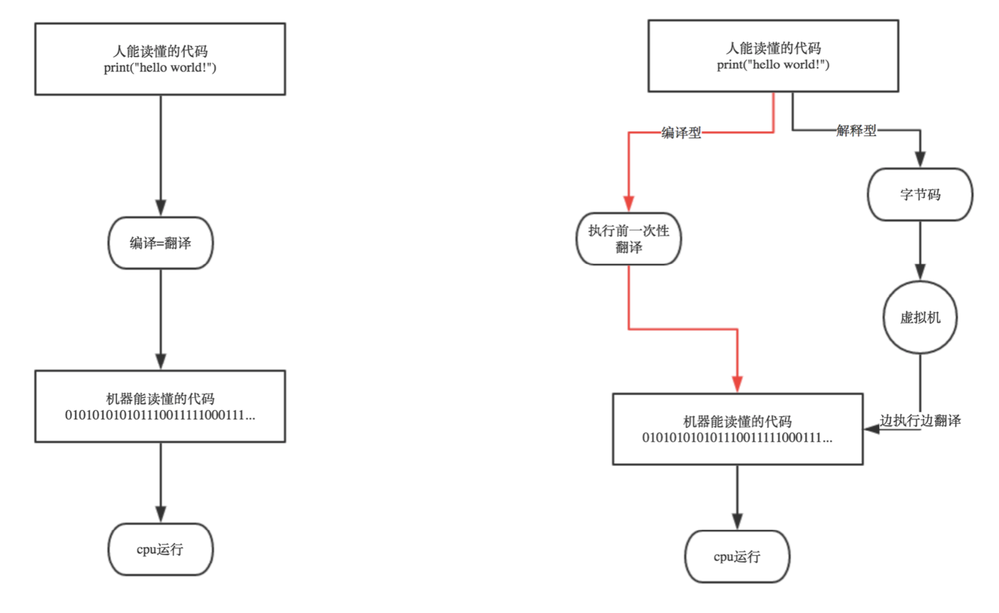
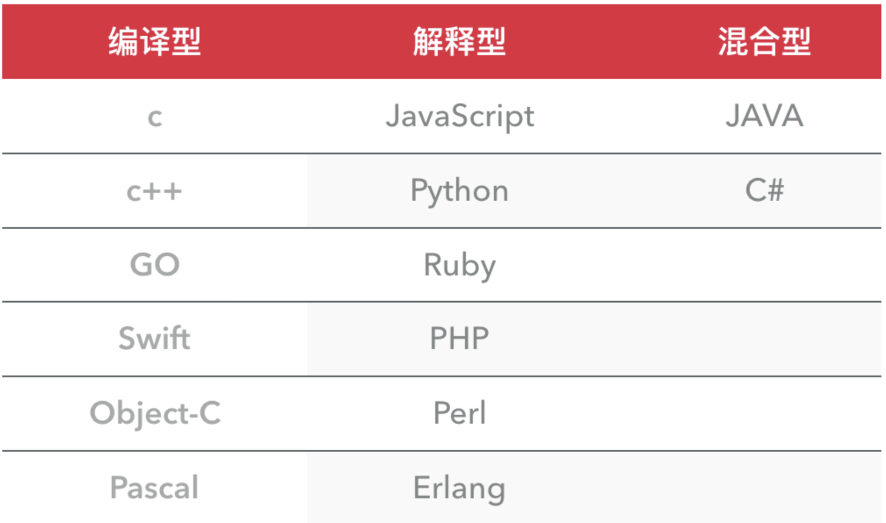

## Python 介绍

- python的创始人为吉多·范罗苏姆(Guido van Rossum)

- 主要应用领域

  **云计算**: 云计算最火的语言， 典型应⽤OpenStack

  **WEB开发**: 众多优秀的WEB框架，众多⼤型⽹站均为Python开发，Youtube, Dropbox, ⾖瓣， 典型WEB框架有Django

  **科学运算、⼈工智能**: 典型库NumPy, SciPy, Matplotlib, Enthought, librarys,pandas

  **系统运维**: 运维人员必备语⾔言

  **金融**:量化交易，金融分析，在⾦融⼯程领域，Python不但在用，且用的最多，⽽且重要性逐年提高。

  原因:作为动态语⾔的Python，语⾔结构清晰简单，库丰富，成熟稳定，科学计算和统计分析都很牛逼，⽣产效率远远⾼高于c,c++,java,尤其擅⻓策略回测

  **图形GUI**: PyQT, WxPython,TkInter

## Python 语言

### 编译器与解释器

**编译器**是把源程序的每一条语句都编译成机器语言,并保存成二进制文件,这样运行时, 计算机可以直接以机器语⾔来运行此程序,速度很快

**解释器**则是只在执行程序时,才一条一条的解释成机器语⾔给计算机来执行,所以运行速度是不如编译后的程序运⾏的快的



### 编译型与解释型



编译型

- 优点:编译器一般会有预编译的过程对代码进行优化。因为编译只做⼀次，运行时不需要编译，所以编译型语⾔的程序执行效率高。可以脱离语言环境独立运⾏
- 缺点:编译之后如果需要修改就需要整个模块重新编译。编译的时候根据对应的运行环境⽣成机器码，不同的操作系统之间移植就会有问题，需要根据运行的操作系统环境编译不同的可执⾏文件

解释型

- 优点:有良好的平台兼容性，在任何环境中都可以运⾏，前提是安装了解释器(虚拟机)。灵活，修改代码的时候直接修改就可以，可以快速部署，不用停机维护
- 缺点:每次运行的时候都要解释⼀遍，性能上不如编译型语言

### Python 优缺点

优点

1. Python的定位是**“**优雅**”**、**“**明确**”**、**“**简单**”**，所以Python程序看上去总是简单易懂，初学者学Python，不但⼊入⻔容易，而且将来深入下去，可以编写那些非常复杂的程序 

2. 开发效率⾮常高，Python有⾮常强大的第三方库，基本上你想通过计算机实现的任何功能，Python官方库里都有相应的模块进⾏支持，直接下载调⽤后，在基础库的基础上再进⾏开发，⼤大降低开发周期, 避免重复造轮⼦

3. 高级语言

   当你用Python语言编写程序的时候，你⽆需考虑诸如何管理你的程序使⽤的内存的底层细节

4. 可移植性

   由于它的开源本质，Python已经被移植在许多平台上(经过改动使它能够⼯作在不同平台上)。如果你⼩心地避免使⽤依赖于系统的特性，那么你的所有Python程序⽆需修改就⼏乎可以在市场上所有的系统平台上运行

5. 可扩展性

   如果你需要你的一段关键代码运⾏得更快或者希望某些算法不公开，你可以把你的部分程序⽤C或C++编写，然后在你的Python程序中使⽤它们 

6. 可嵌⼊性

   你可以把Python嵌⼊你的C/C++程序，从而向你的程序用户提供脚本功能 

缺点

1. 速度慢

   Python 的运⾏速度相比C语⾔确实慢很多，跟JAVA相比也要慢一些，因此 这也是很多所谓的⼤牛不不屑于使用Python的主要原因，其实在⼤多数情况下Python已经完全可以满足你对程序速度的要求，除⾮你要写对速度要求极高的搜索引擎等，这种情况下，当然还是建议你⽤C去实现的 

2. 代码不能加密

   因为PYTHON是解释性语言，它的源码都是以明文形式存放的，如果你的项目要求源代码必须是加密的，那你⼀开始就不应该⽤Python来去实现 

3. 线程不能利⽤多CPU

   这是Python被⼈诟病最多的一个缺点，GIL即全局解释器锁(Global Interpreter Lock)，是计算机程序设计语言解释器⽤于同步线程的工具，使得任何时刻仅有⼀个线程在执行，Python的线程是操作系统的原生线程。 在Linux上为pthread，在Windows上为Win thread，完全由操作系统调度线程执⾏。⼀个python解释器进程内有一条主线程，以及多条用户程序的执行线程。即使在多核CPU平台上，由于GIL的存在，所以禁⽌多线程的并行执⾏

## 第一个Python程序

注意: python2中的中⽂编码会有问题. Python2使⽤的是ASCII码编码. 处理理不了中文.

我们需要替换成utf-8编码

```python
# -*- encoding:utf-8 -*-
```

##  变量

- 命名规则
  1. 变量由字母, 数字,下划线搭配组合而成
  2. 不可以⽤数字开头
  3. 不能为Python关键字

- 命名规范

  1. 不要用中文

  2. 命名要有意义

  3. 不要太长

  4. 区分大小写

  5. 推荐驼峰命名或下划线命名

     ```python
     dayOfMonth = 1
     day_of_month = 1
     ```

## 常量

python中不存在绝对的常量. 约定俗成, 所有字⺟⼤写就是常量

```python
PI = 3.14
```

## 注释

- 单行注释

  ```python
  # 注释内容
  ```

- 多行注释

  ```python
  """
  注释内容
  """
  ```

  ```python
  '''
  注释内容
  '''
  ```

## 数据类型

### 整数 int

### 字符串 str

- 定义

  ```python
  # 单行字符串
  s1 = "aa"
  s2 = 'aa'
  
  # 多行字符串
  s3 = """aa"""
  s4 = '''aa'''
  
  s5 = """aa
  bb"""
  
  s6 = '''aa
  bb'''
  ```

- 运算

  ```python
  s1 = "aa" + "bb"	
  # aabb
  ```

  **注意: 字符串的相加只针对于前后都是字符串, 如果前后存在一个不是字符串类型, 则直接报错**

  ```python
  s1 = "a" * 3
  # aaa
  ```

### 布尔型

True 真

False 假

## 用户交互

无论用户输入的是什么数据, 返回的都是一个字符串

```python
value = input("请输入数据: ")
print(value)

# 查看数据类型 type()
print(type(value))
```

## 流程控制if语句

- 用法1

  ```
  if 条件:
  	结果
  ```

- 用法2

  ```
  if 条件:
  	结果1
  else:
  	结果2
  ```

- 用法3

  ```
  if 条件1:
  	结果1
  elif 条件2:
  	结果2
  else:
  	结果3
  ```

- 用法4

  ```
  if 条件1:
  	结果1
  	if 条件2:
  		结果2
  	else:
  		结果3
  else:
  	结果4
  ```


