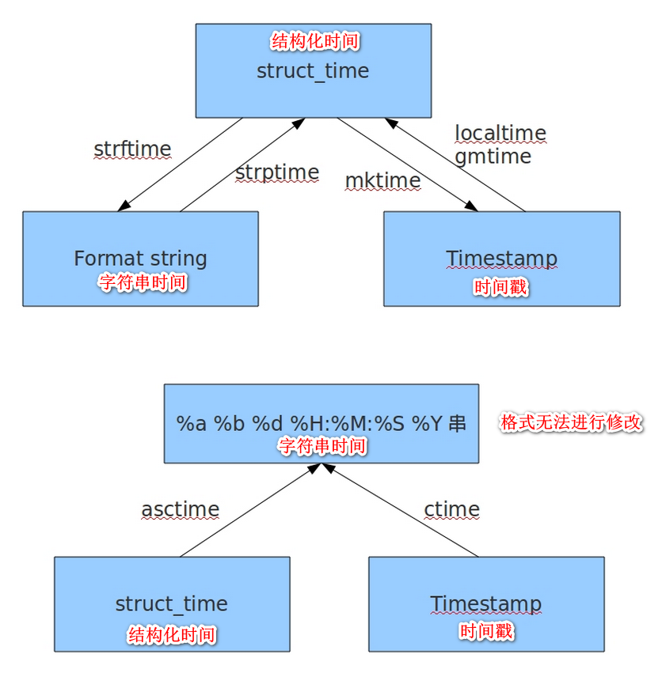
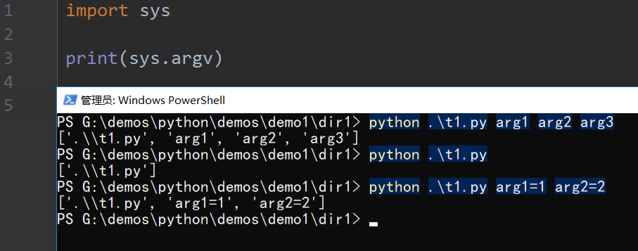

# 常用模块

## random模块

### 取小数

- random 取0-1之间的小数

  ```python
  import random
  
  res = random.random()
  ```

- uniform 取指定区间范围的小数

  ```python
  import random
  
  res = random.uniform(10, 20)
  ```

### 取整数

- 取指定范围的整数

  randint 的取值包括前后区间

  randrange 的取值不包括后面的区间, 但 randrange 可以指定取值区间中的范围

  ```python
  import random
  
  # 取值区间 [1, 2] 包括了2
  res = random.randint(1, 2)
  ```

  ```python
  import random
  
  # 取值区间 [1, 2) 不包括2
  res = random.randrange(1, 2)
  ```

  ```python
  import random
  
  # 取值区间 [10, 20) 的偶数, 不包括 20
  res = random.randrange(10, 20, 2)
  print(res)
  ```

### 从列表中取数据

- choice 选一个值

  ```python
  import random
  
  data_list = [1, "2", (3,), [4], {5: 6}]
  
  res = random.choice(data_list)
  print(res)
  ```

- sample  选多个值

  ```python
  import random
  
  data_list = [1, "2", (3,), [4], {5: 6}]
  
  # 随机抽取2个值
  # 返回的值是一个列表
  res = random.sample(data_list, 2)
  print(res)
  ```

### 打乱顺序

- shuffle

  ```python
  import random
  
  data_list = [1, "2", (3,), [4], {5: 6}]
  
  # 直接在原列表中进行修改
  random.shuffle(data_list)
  print(data_list)
  ```

### 案例

- 验证码

  ```python
  import random
  
  
  def get_num_code(length=4):
      """
      数字验证码
      :param length: 长度
      :return: 验证码
      """
      res = ""
      for item in range(length):
          res = f'{res}{random.randrange(0, 9)}'
      return res
  
  
  def get_alpha_num_code(length=4):
      """
      数字+字母验证码
      :param length: 长度
      :return: 验证码
      """
      data = list()
      for item_num in range(0, 10):
          data.append(item_num)
  
      for item_alpha_upper in range(65, 90):
          data.append(chr(item_alpha_upper))
  
      for item_alpha_lower in range(97, 112):
          data.append(chr(item_alpha_lower))
  
      res = ""
      for item in range(length):
          res = f'{res}{random.choice(data)}'
      return res
  
  
  if __name__ == '__main__':
      res_data = get_num_code(4)
      print(res_data)
  
      res_data = get_alpha_num_code(6)
      print(res_data)
  ```

## time模块

### 表示时间的三种方式

#### 时间戳(timestamp) 

- 通常来说，时间戳表示的是从1970年1月1日00:00:00开始按秒计算的偏移量。我们运行“type(time.time())”，返回的是float类型 

```python
import time

# 时间戳
# 返回一个秒值
print(time.time())
# 1538054432.2160265
```

#### 格式化的时间字符串(Format String)

```
%y 两位数的年份表示（00-99）
%Y 四位数的年份表示（000-9999）
%m 月份（01-12）
%d 月内中的一天（0-31）
%H 24小时制小时数（0-23）
%I 12小时制小时数（01-12）
%M 分钟数（00=59）
%S 秒（00-59）
%a 本地简化星期名称
%A 本地完整星期名称
%b 本地简化的月份名称
%B 本地完整的月份名称
%c 本地相应的日期表示和时间表示
%j 年内的一天（001-366）
%p 本地A.M.或P.M.的等价符
%U 一年中的星期数（00-53）星期天为星期的开始
%w 星期（0-6），星期天为星期的开始
%W 一年中的星期数（00-53）星期一为星期的开始
%x 本地相应的日期表示
%X 本地相应的时间表示
%Z 当前时区的名称
%% %号本身
```

```python
import time

local_time = time.localtime(time.time())
str_time = time.strftime('%Y-%m-%d %X', local_time)
print(str_time)
# 2018-09-27 21:25:21
```

#### 结构化时间(struct_time) 

- struct_time元组共有9个元素共九个元素:(年，月，日，时，分，秒，一年中第几周，一年中第几天等） 

| 索引（Index） | 属性（Attribute）         | 值（Values）       |
| ------------- | ------------------------- | ------------------ |
| 0             | tm_year（年）             | 比如2011           |
| 1             | tm_mon（月）              | 1 - 12             |
| 2             | tm_mday（日）             | 1 - 31             |
| 3             | tm_hour（时）             | 0 - 23             |
| 4             | tm_min（分）              | 0 - 59             |
| 5             | tm_sec（秒）              | 0 - 60             |
| 6             | tm_wday（weekday）        | 0 - 6（0表示周一） |
| 7             | tm_yday（一年中的第几天） | 1 - 366            |
| 8             | tm_isdst（是否是夏令时）  | 默认为0            |

```python
import time

local_time = time.localtime(time.time())
print(local_time)
# time.struct_time(tm_year=2018, tm_mon=9, tm_mday=27, tm_hour=21, tm_min=23, tm_sec=0, tm_wday=3, tm_yday=270, tm_isdst=0)

print(local_time.tm_year)
print(local_time.tm_mon)

# 2018
# 9
```

### 时间转换



### 时间戳与结构化时间的转换

```python
import time

time_stamp = time.time()
stime = time.localtime(time_stamp)
str_time = time.strftime('%Y-%m-%d %X', stime)
print(stime)
print(str_time)

# time.struct_time(tm_year=2018, tm_mon=9, tm_mday=27, tm_hour=21, tm_min=46, tm_sec=44, tm_wday=3, tm_yday=270, tm_isdst=0)
# 2018-09-27 21:46:44

stime = time.gmtime(time_stamp)
str_time = time.strftime('%Y-%m-%d %X', stime)
print(stime)
print(str_time)

# time.struct_time(tm_year=2018, tm_mon=9, tm_mday=27, tm_hour=13, tm_min=46, tm_sec=44, tm_wday=3, tm_yday=270, tm_isdst=0)
# 2018-09-27 13:46:44
```

```python
import time

str_time = '2018-10-01'
stime = time.strptime(str_time, '%Y-%m-%d')
timestamp = time.mktime(stime)
print(timestamp)
# 1538323200.0
```

### 结构化时间与字符串时间的转换

```python
import time

stime = time.localtime(1538323200)
str_time = time.strftime('%Y-%m-%d %X', stime)
print(str_time)
```

```python
import time

str_time = '01/10/2018 10:30:00'
stime = time.strptime(str_time, '%d/%m/%Y %X')
print(stime)
print(stime.tm_year)
print(stime.tm_mon)

# time.struct_time(tm_year=2018, tm_mon=10, tm_mday=1, tm_hour=10, tm_min=30, tm_sec=0, tm_wday=0, tm_yday=274, tm_isdst=-1)
# 2018
# 10
```

### ctime asctime

```python
import time

str_time = time.ctime(time.time())
print(str_time)
# Thu Sep 27 22:15:13 2018
```

```python
import time

str_time = time.asctime(time.localtime(time.time()))
print(str_time)
# Thu Sep 27 22:16:17 2018
```

### 计算时间差

```python
import time

s1_time = '2018-10-01 17:00:00'
s2_time = '2018-10-02 09:30:00'

stime1 = time.strptime(s1_time, '%Y-%m-%d %X')
stime2 = time.strptime(s2_time, '%Y-%m-%d %X')

waste_time = time.mktime(stime2) - time.mktime(stime1)
waste_stime = time.gmtime(waste_time)
print('%d年%d月%d日%d时%d分%d秒' % (
    waste_stime.tm_year - 1970, waste_stime.tm_mon - 1, waste_stime.tm_mday - 1, waste_stime.tm_hour,
    waste_stime.tm_min,
    waste_stime.tm_sec))

# 0年0月0日16时30分0秒
```

## datetime模块

### 介绍

datetime模块用于是date和time模块的合集，datetime有两个常量，MAXYEAR和MINYEAR，分别是9999和1.

datetime模块定义了5个类，分别是

1. datetime.date：表示日期的类

2. datetime.datetime：表示日期时间的类

3. datetime.time：表示时间的类

4. datetime.timedelta：表示时间间隔，即两个时间点的间隔

5. datetime.tzinfo：时区的相关信息

### datetime.date类

date类有三个参数,datetime.date(year,month,day)，返回year-month-day

方法：

1. datetime.date.ctime()

   返回格式如 Sun Apr 16 00:00:00 2017

   ```python
   import datetime
   
   if __name__ == '__main__':
       print(datetime.date(2019, 1, 10).ctime())
       # Thu Jan 10 00:00:00 2019
   ```

2. datetime.date.fromtimestamp(timestamp)

   根据给定的时间戮，返回一个date对象；datetime.date.today()作用相同

   ```python
   import datetime
   import time
   
   if __name__ == '__main__':
       time_str = '2019-01-10'
       time_struct = time.strptime(time_str, '%Y-%m-%d')
       time_stamp = time.mktime(time_struct)
   
       print(datetime.date.fromtimestamp(time_stamp))
       # 2019-01-10
   ```

3. datetime.date.isocalendar(): 

   返回iso格式年月日封装的元祖, 如(year，month，day)的元组,(2017, 15, 6)

   ```python
   import datetime
   
   if __name__ == '__main__':
       print(datetime.date(2019, 1, 10).isocalendar())
       # (2019, 2, 4)
   ```

4. datetime.date.isoformat()：

   返回格式如YYYY-MM-DD

   ```python
   import datetime
   
   if __name__ == '__main__':
       print(datetime.date(2019, 1, 10).isoformat())
       # 2019-01-10
   ```

5. datetime.date.isoweekday()：

   返回给定日期的星期（0-6），星期一=0，星期日=6

   ```python
   import datetime
   
   if __name__ == '__main__':
       print(datetime.date(2019, 1, 10).isoweekday())
       # 4
   ```

6. datetime.date.replace(year,month,day)：

   替换给定日期，但不改变原日期

   ```python
   import datetime
   
   if __name__ == '__main__':
       print(datetime.date(2019, 1, 10).replace(2018, 2, 14))
       # 2018-02-14
   ```

7. datetime.date.strftime(format):

   把日期时间按照给定的format进行格式化

   ```python
   import datetime
   
   if __name__ == '__main__':
       print(datetime.date(2019, 1, 10).strftime('%Y-%m-%d %X'))
       # 2019-01-10 00:00:00
   ```

8. datetime.date.timetuple()：

   返回日期对应的time.struct_time对象

   time.struct_time(tm_year=2017, tm_mon=4, tm_mday=15, tm_hour=0, tm_min=0, tm_sec=0, tm_wday=5, tm_yday=105, tm_isdst=-1)

   ```python
   import datetime
   
   if __name__ == '__main__':
       print(datetime.date(2019, 1, 10).timetuple())
       # time.struct_time(tm_year=2019, tm_mon=1, tm_mday=10, tm_hour=0, tm_min=0, tm_sec=0, tm_wday=3, tm_yday=10, tm_isdst=-1)
   ```

9. datetime.date.weekday()：

   返回日期的星期（0-6），星期一=0，星期日=6

   ```python
   import datetime
   
   if __name__ == '__main__':
       print(datetime.date(2019, 1, 7).weekday())
       # 0
   
       print(datetime.date(2019, 1, 10).weekday())
       # 3
   
       print(datetime.date(2019, 1, 13).weekday())
       # 6
   ```

10. python中时间日期格式化符号：

  | 符号 | 功能                                      |
  | ---- | ----------------------------------------- |
  | %y   | 两位数的年份表示（00-99）                 |
  | %Y   | 四位数的年份表示（000-9999）              |
  | %m   | 月份（01-12）                             |
  | %d   | 月内中的一天（0-31）                      |
  | %H   | 24小时制小时数（0-23）                    |
  | %I   | 12小时制小时数（01-12）                   |
  | %M   | 分钟数（00-59）                           |
  | %S   | 秒（00-59）                               |
  | %a   | 本地简化星期名称                          |
  | %A   | 本地完整星期名称                          |
  | %b   | 本地简化的月份名称                        |
  | %B   | 本地完整的月份名称                        |
  | %c   | 本地相应的日期表示和时间表示              |
  | %j   | 年内的一天（001-366）                     |
  | %p   | 本地A.M.或P.M.的等价符                    |
  | %U   | 一年中的星期数（00-53）星期天为星期的开始 |
  | %w   | 星期（0-6），星期天为星期的开始           |
  | %W   | 一年中的星期数（00-53）星期一为星期的开始 |
  | %x   | 本地相应的日期表示                        |
  | %X   | 本地相应的时间表示                        |
  | %Z   | 当前时区的名称                            |
  | %%   | %号本身                                   |

### datetime的time类

time类有5个参数，datetime.time(hour,minute,second,microsecond,tzoninfo), 返回08:29:30

1. datetime.time.replace()

   时间替换

   ```python
   import datetime
   
   if __name__ == '__main__':
       print(datetime.time(10, 0, 0).replace(9, 30, 0))
       # 09:30:00
   ```

2. datetime.time.strftime(format):

   按照format格式返回时间

   ```python
   import datetime
   
   if __name__ == '__main__':
       print(datetime.time(10, 0, 0).strftime('%p %X'))
       # AM 10:00:00
   ```

3. datetime.time.tzname()：

   返回时区名字

4. datetime.time.utcoffset()：

   返回时区的时间偏移量

### datetime的datetime类

datetime类有很多参数，datetime(year, month, day[, hour[, minute[, second[, microsecond[,tzinfo]]]]])，返回年月日，时分秒

1. datetime.datetime.ctime()

   ```python
   import datetime
   
   if __name__ == '__main__':
       print(datetime.datetime.now().ctime())
       # Thu Jan 10 17:41:32 2019
   ```

2. datetime.datetime.now().date()：

   返回当前日期时间的日期部分

   ```python
   import datetime
   
   if __name__ == '__main__':
       print(datetime.datetime.now().date())
       # 2019-01-10
   ```

3. datetime.datetime.now().time()：

   返回当前日期时间的时间部分

   ```python
   import datetime
   
   if __name__ == '__main__':
       print(datetime.datetime.now().time())
       # 17:43:19.789280
   ```

4. datetime.datetime.fromtimestamp()

   ```python
   import datetime
   import time
   
   if __name__ == '__main__':
       print(datetime.datetime.fromtimestamp(time.time()))
       # 2019-01-10 17:45:01.953088
   ```

5. datetime.datetime.now()：

   返回当前系统时间

   ```python
   import datetime
   
   if __name__ == '__main__':
       print(datetime.datetime.now())
       # 2019-01-10 17:45:40.452549
   ```

6. datetime.datetime.replace()

   ```python
   import datetime
   
   if __name__ == '__main__':
       print(datetime.datetime.now().replace(2019, 2, 1, 10, 0, 0, 0))
       # 2019-02-01 10:00:00
   ```

7. datetime.datetime.strftime()：

   由日期格式转化为字符串格式

   ```python
   import datetime
   
   if __name__ == '__main__':
       print(datetime.datetime.now().strftime('%Y-%m-%d %p %X'))
       # 2019-01-10 PM 17:48:52
   ```

8. datetime.datetime.strptime()

   由字符串格式转化为日期格式

   ```python
   import datetime
   
   if __name__ == '__main__':
       time_str = '2019-01-10 PM 17:48:52'
       print(datetime.datetime.strptime(time_str, '%Y-%m-%d %p %X'))
       # 2019-01-10 17:48:52
   ```

### datetime的timedelta类

用于计算两个日期之间的差值

```python
import datetime

if __name__ == '__main__':
    time_start = '2019-01-01 10:00:00'
    time_end = '2019-01-03 10:00:30'

    datetime_start = datetime.datetime.strptime(time_start, '%Y-%m-%d %X')
    datetime_end = datetime.datetime.strptime(time_end, '%Y-%m-%d %X')

    # 日期差
    print((datetime_end - datetime_start).days)
    # 2

    # 秒差(只对秒数进行比较)
    print((datetime_end - datetime_start).seconds)
    # 30

    # 秒差(对日期和秒数进行比较)
    print((datetime_end - datetime_start).total_seconds())
    # 172830.0

    # 毫秒差
    print((datetime_end - datetime_start).microseconds)
    # 0
```

## sys模块

- 与python解释器交互的一个接口

```
sys.argv           命令行参数List，第一个元素是程序本身路径
sys.exit(n)        退出程序，正常退出时exit(0),错误退出sys.exit(1)
sys.version        获取Python解释程序的版本信息
sys.path           返回模块的搜索路径，初始化时使用PYTHONPATH环境变量的值
sys.platform       返回操作系统平台名称
```



## os模块

- 是与操作系统交互的一个接口 

```
可生成多层递归目录
os.makedirs('dirname1/dirname2')
若目录为空，则删除，并递归到上一级目录，如若也为空，则删除，依此类推
os.removedirs('dirname1')    
生成单级目录；相当于shell中mkdir dirname
os.mkdir('dirname')    
删除单级空目录，若目录不为空则无法删除，报错；相当于shell中rmdir dirname
os.rmdir('dirname')    
列出指定目录下的所有文件和子目录，包括隐藏文件，并以列表方式打印
os.listdir('dirname')    
删除一个文件
os.remove()  
重命名文件/目录
os.rename("oldname","newname")  
获取文件/目录信息
os.stat('path/filename')  

运行shell命令，直接显示
os.system("bash command")  
运行shell命令，获取执行结果
os.popen("bash command).read()  
获取当前工作目录，即当前python脚本工作的目录路径
os.getcwd() 
改变当前脚本工作目录；相当于shell下cd
os.chdir("dirname")  

os.path
返回path规范化的绝对路径
os.path.abspath(path)
将path分割成目录和文件名二元组返回 
os.path.split(path) 
返回path的目录。其实就是os.path.split(path)的第一个元素 
os.path.dirname(path) 
返回path最后的文件名。如path以／或\结尾,那么就会返回空值。即os.path.split(path)的第二个元素
os.path.basename(path)
如果path存在，返回True；如果path不存在，返回False
os.path.exists(path) 
如果path是绝对路径，返回True
os.path.isabs(path)  
如果path是一个存在的文件，返回True。否则返回False
os.path.isfile(path) 
如果path是一个存在的目录，则返回True。否则返回False 
os.path.isdir(path)  
将多个路径组合后返回，第一个绝对路径之前的参数将被忽略
os.path.join(path1[, path2[, ...]])  
返回path所指向的文件或者目录的最后访问时间
os.path.getatime(path)  
返回path所指向的文件或者目录的最后修改时间
os.path.getmtime(path)
返回path的大小
os.path.getsize(path) 
```

```
获取文件/目录信息 的结构说明
os.stat('path/filename')

stat 结构:

st_mode: inode 保护模式
st_ino: inode 节点号。
st_dev: inode 驻留的设备。
st_nlink: inode 的链接数。
st_uid: 所有者的用户ID。
st_gid: 所有者的组ID。
st_size: 普通文件以字节为单位的大小；包含等待某些特殊文件的数据。
st_atime: 上次访问的时间。
st_mtime: 最后一次修改的时间。
st_ctime: 由操作系统报告的"ctime"。在某些系统上（如Unix）是最新的元数据更改的时间，在其它系统上（如Windows）是创建时间（详细信息参见平台的文档）
```

- 其他属性

```
os.sep    输出操作系统特定的路径分隔符，win下为"\\",Linux下为"/"
os.linesep    输出当前平台使用的行终止符，win下为"\r\n",Linux下为"\n"
os.pathsep    输出用于分割文件路径的字符串 win下为;,Linux下为:
os.name    输出字符串指示当前使用平台。win->'nt'; Linux->'posix'
```

