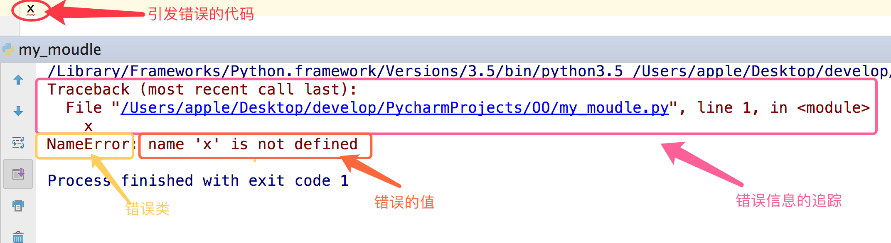

# Python的异常与异常处理

## 异常

### 异常和错误

- 程序中难免出现错误，而错误分成两种
  1. 语法错误（这种错误，根本过不了python解释器的语法检测，必须在程序执行前就改正）
  2. 逻辑错误（逻辑错误）

### 定义

- 异常就是程序运行时发生错误的信号，在python中,错误触发的异常如下

  

### 异常种类

- 常见异常

  ```
  AttributeError 试图访问一个对象没有的树形，比如foo.x，但是foo没有属性x
  IOError 输入/输出异常；基本上是无法打开文件
  ImportError 无法引入模块或包；基本上是路径问题或名称错误
  IndentationError 语法错误（的子类） ；代码没有正确对齐
  IndexError 下标索引超出序列边界，比如当x只有三个元素，却试图访问x[5]
  KeyError 试图访问字典里不存在的键
  KeyboardInterrupt Ctrl+C被按下
  NameError 使用一个还未被赋予对象的变量
  SyntaxError Python代码非法，代码不能编译(个人认为这是语法错误，写错了）
  TypeError 传入对象类型与要求的不符合
  UnboundLocalError 试图访问一个还未被设置的局部变量，基本上是由于另有一个同名的全局变量，导致你以为正在访问它
  ValueError 传入一个调用者不期望的值，即使值的类型是正确的
  ```

- 更多异常

  ```
  ArithmeticError
  AssertionError
  AttributeError
  BaseException
  BufferError
  BytesWarning
  DeprecationWarning
  EnvironmentError
  EOFError
  Exception
  FloatingPointError
  FutureWarning
  GeneratorExit
  ImportError
  ImportWarning
  IndentationError
  IndexError
  IOError
  KeyboardInterrupt
  KeyError
  LookupError
  MemoryError
  NameError
  NotImplementedError
  OSError
  OverflowError
  PendingDeprecationWarning
  ReferenceError
  RuntimeError
  RuntimeWarning
  StandardError
  StopIteration
  SyntaxError
  SyntaxWarning
  SystemError
  SystemExit
  TabError
  TypeError
  UnboundLocalError
  UnicodeDecodeError
  UnicodeEncodeError
  UnicodeError
  UnicodeTranslateError
  UnicodeWarning
  UserWarning
  ValueError
  Warning
  ZeroDivisionError
  ```

### 异常处理

 **首先须知，异常是由程序的错误引起的，语法上的错误跟异常处理无关，必须在程序运行前就修正**

  #### if 条件判断

  ```python
  import re
  
  input_str = input('请输入年龄')
  
  age_li = re.findall(r'^\d+$', input_str)
  
  if not age_li:
      print('输入的不是一个数字')
  else:
      age = int(input_str)
      if age < 0 or age > 150:
          print('数字超出范围')
      else:
          print(f'年龄为 {age}')
  ```

  #### try except

  ```
  try:
       被检测的代码块
  except 异常类型：
       try中一旦检测到异常，就执行这个位置的逻辑
  ```

  ```python
  input_str = input('请输入年龄')
  
  try:
      age = int(input_str)
      if age > 150:
          raise Exception('数字超出范围')
      print(f'年龄为 {age}')
  except Exception as ex:
      print(ex)
  ```

  #### except 多分支使用方式

  ```python
  try:
      pass
  except ValueError as error:
      print(error)
  except IndexError as error:
      print(error)
  except Exception as ex:
      print(ex)
  ```

类型的合并

```python
  try:
      pass
  except (ValueError, IndexError) as error:
    	# 既能捕获 ValueError 异常, 又能捕获 IndexError 异常
      print(error)
  except Exception as ex:
      print(ex)
```

  #### 万能异常

  ```python
  try:
      pass
  except Exception as ex:
      print(ex)
  ```

  #### try except else

  ```python
  try:
      pass
  except Exception as ex:
      print(f'程序发生异常执行 {ex}')
  else:
      print('没有异常时执行')
  ```

  #### try except finally

  ```python
  try:
      pass
  except Exception as ex:
      print(f'程序发生异常执行 {ex}')
  else:
      print('没有异常时执行')
  finally:
      print('不管是否发生异常,最后都会执行')
  ```

### 抛出异常

```python
try:
    # 抛出异常
    raise Exception('异常的说明')
except Exception as ex:
    print(f'程序发生异常执行 {ex}')
else:
    print('没有异常时执行')
finally:
    print('不管是否发生异常,最后都会执行')
```

### 自定义异常

```python
# 所有的异常必须继承自 BaseException
class MyException(BaseException):
    def __init__(self, msg):
        self.msg = msg

    def __str__(self):
        return self.msg


try:
    raise MyException('无法找到文件')
except MyException as ex:
    print(ex)
```

