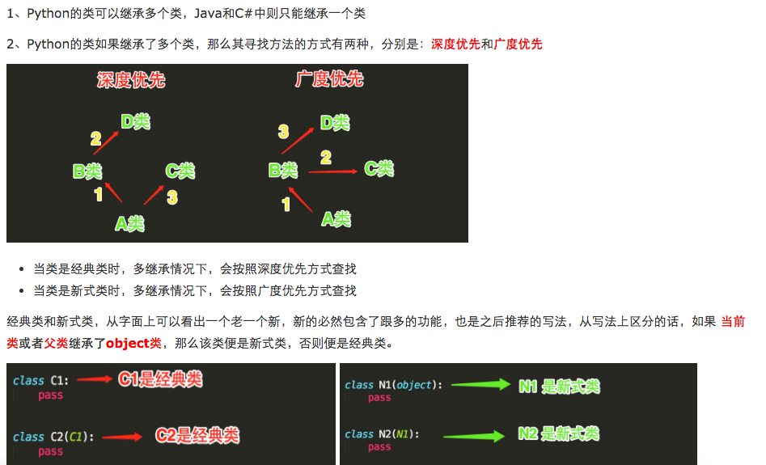

# 面向对象

## 面向过程与面向对象

### 面向过程

- 优点是：极大的降低了写程序的复杂度，只需要顺着要执行的步骤，堆叠代码即可
- 缺点是：一套流水线或者流程就是用来解决一个问题，代码牵一发而动全身

### 面向对象

- 优点是：解决了程序的扩展性。对某一个对象单独修改，会立刻反映到整个体系中，如对游戏中一个人物参数的特征和技能修改都很容易
- 缺点：可控性差，无法向面向过程的程序设计流水线式的可以很精准的预测问题的处理流程与结果，面向对象的程序一旦开始就由对象之间的交互解决问题**，**即便是上帝也无法预测最终结果。于是我们经常看到一个游戏人某一参数的修改极有可能导致阴霸的技能出现，一刀砍死3个人，这个游戏就失去平衡

## 类的声明

```python
# 类
class Person:
    # 静态属性/类属性
    COUNTRY = '中国'

    # 初始化方法
    def __init__(self, name, age):
        # 实例属性
        self.name = name
        self.age = age

    # 类方法/方法
    def print_info(self):
        print(f'名字:{self.name} , 年龄:{self.age}')


# 创建对象/创建实例
p1 = Person('aa', 20)
# 获取实例属性
print(p1.name)
# 调用类方法
p1.print_info()

print(p1.__dict__)
# {'name': 'aa', 'age': 20}
print(Person.__dict__)
# {'__module__': '__main__', 'COUNTRY': '中国', '__init__': <function Person.__init__ at 0x000002A823AA8D90>, 'print_info': <function Person.print_info at 0x000002A823AF91E0>, '__dict__': <attribute '__dict__' of 'Person' objects>, '__weakref__': <attribute '__weakref__' of 'Person' objects>, '__doc__': None}
```

### 实例化

- 就是用类来创建对象的过程
- 每个对象的创建, 会调用类的 **\_\_init\_\_()** 方法

### 调用实例属性和类方法的其他方式

```python
class Person:
    # 静态属性/类属性
    COUNTRY = '中国'

    def __init__(self, name, age):
        self.name = name
        self.age = age

    def print_info(self):
        print(f'名字:{self.name} , 年龄:{self.age}')


p1 = Person('aa', 20)

# 实例属性的两种获取方式
print(p1.name)
print(p1.__dict__['name'])

# 调用类方法的几种方式
p1.print_info()
Person.print_info(p1)
Person.__dict__['print_info'](p1)
```

### 实例属性的修改

```python
class Person:
    # 静态属性/类属性
    COUNTRY = '中国'

    def __init__(self, name, age):
        self.name = name
        self.age = age

    def print_info(self):
        print(f'名字:{self.name} , 年龄:{self.age}')


p1 = Person('aa', 20)

print(p1.name)
print(p1.__dict__['name'])
# aa
# aa

p1.name = 'bb'
print(p1.name)
print(p1.__dict__['name'])
# bb
# bb

p1.__dict__['name'] = 'cc'
print(p1.name)
print(p1.__dict__['name'])
# cc
# cc
```

- **注意点: 不要通过类的字典方式修改类属性**

  ```python
  class Person:
      # 静态属性/类属性
      COUNTRY = '中国'
  
      def __init__(self, name, age):
          self.name = name
          self.age = age
  
  
  print(Person.COUNTRY)
  
  # 程序报错
  Person.__dict__['COUNTRY'] = '美国'
  print(Person.COUNTRY)
  
  # Traceback (most recent call last):
  #   File "G:/demos/python/demos/demo1/dir3/t1.py", line 11, in <module>
  #     Person.__dict__['COUNTRY'] = '美国'
  # TypeError: 'mappingproxy' object does not support item assignment
  ```

  **正确修改方式**

  ```python
  class Person:
      # 静态属性/类属性
      COUNTRY = '中国'
  
      def __init__(self, name, age):
          self.name = name
          self.age = age
  
  
  p1 = Person('aa', 10)
  print(p1.COUNTRY)
  # 中国
  
  Person.COUNTRY = '美国'
  print(Person.COUNTRY)
  # 美国
  
  print(p1.COUNTRY)
  # 美国
  
  p2 = Person('aa', 10)
  print(p2.COUNTRY)
  # 美国
  ```

## 使用嵌套函数模拟面向对象

```python
def Person(name, age):
    self = {}

    def __init__(name_params, age_params):
        self['name'] = name_params
        self['age'] = age_params
        return self

    def print_info():
        print(f'名字:{self["name"]} , 年龄:{self["age"]}')

    self['print_info'] = print_info

    p = __init__(name, age)
    return p


p1 = Person('aa', 20)
print(p1['name'])
p1['print_info']()
```

## 类属性

```
类名.__dict__ # 查出的是一个字典，key为属性名，value为属性值
类名.__name__ # 类的名字(字符串)
类名.__doc__ # 类的文档字符串
类名.__base__ # 类的第一个父类(在讲继承时会讲)
类名.__bases__ # 类所有父类构成的元组(在讲继承时会讲)
类名.__dict__ # 类的字典属性
类名.__module__ # 类定义所在的模块
类名.__class__ # 实例对应的类(仅新式类中)
```

## 继承

### 定义

- python 支持单继承与多继承

```python
class A:
    pass


# 单继承
class B(A):
    pass


class C:
    pass


# 多继承
class D(B, C):
    pass


# __bases__
# 查看当前类的上层基类

print(A.__bases__)
# (<class 'object'>,)

print(B.__bases__)
# (<class '__main__.A'>,)

print(C.__bases__)
# (<class 'object'>,)

print(D.__bases__)
# (<class '__main__.B'>, <class '__main__.C'>)
```

- python3 中所有的类都属于 **新式类** , 默认继承自 **object** 

### 继承的好处

- 省略重复的代码

  ```python
  class Animal:
      def __init__(self, name, age):
          self.name = name
          self.age = age
  
  
  class Person(Animal):
      def __init__(self, name, age, sex):
          super().__init__(name, age)
          self.sex = sex
  
  
  class Dog(Animal):
      pass
  ```

## 派生

- 父类中没有的属性,在子类中出现,叫做**派生属性**
- 父类中没有的方法,在子类中出现,叫做**派生方法**

```python
class Animal:
    def __init__(self, name):
        self.name = name


class Person(Animal):
    def __init__(self, name, age):
        super().__init__(name)
        # 派生属性
        self.age = age

    # 派生方法
    def talk(self, msg):
        print(f'说话: {msg}')


p = Person('aa', 10)
p.talk('哈哈')
```

- 只要是子类的对象调用,子类中有的名字 一定用子类的,子类中没有才找父类的,如果父类也没有报错

```python
class Animal:
    def __init__(self, name):
        self.name = name

    def talk(self):
        print('Animal talk')


class Person(Animal):
    def __init__(self, name, age):
        super().__init__(name)
        self.age = age

    def talk(self):
        print('Person talk')


p = Person('aa', 10)
p.talk()
# Person talk
```

- 子类调用父类方法的两种方式

  - 通过类进行调用

    ```python
    class Animal:
        def __init__(self, name):
            self.name = name
    
        def talk(self):
            print('Animal talk')
    
    
    class Person(Animal):
        def __init__(self, name, age):
            super().__init__(name)
            self.age = age
    
        def talk(self):
            Animal.talk(self)
            print('Person talk')
    
    
    p = Person('aa', 10)
    p.talk()
    # Animal talk
    # Person talk
    ```

  - super

    ```python
    class Animal:
        def __init__(self, name):
            self.name = name
    
        def talk(self):
            print('Animal talk')
    
    
    class Person(Animal):
        def __init__(self, name, age):
            super().__init__(name)
            self.age = age
    
        def talk(self):
            super().talk()
            print('Person talk')
    
    
    p = Person('aa', 10)
    p.talk()
    # Animal talk
    # Person talk
    ```

    ```python
    class Animal:
        def __init__(self, name):
            self.name = name
    
        def talk(self):
            print('Animal talk')
    
    
    class Person(Animal):
        def __init__(self, name, age):
            super().__init__(name)
            self.age = age
    
        def talk(self):
            super().talk()
            print('Person talk')
    
    
    p = Person('aa', 10)
    
    # 调用父类的方法
    super(Person, p).talk()
    # Animal talk
    ```

## 多继承

### 继承顺序



### 广度优先与深度优先

```python
class A(object):
    def test(self):
        print('from A')


class B(A):
    def test(self):
        print('from B')


class C(A):
    def test(self):
        print('from C')


class D(B):
    def test(self):
        print('from D')


class E(C):
    def test(self):
        print('from E')


class F(D, E):
    def test(self):
        print('from F')


f1 = F()

f1.test()
# from F

# 只有新式类才有这个属性可以查看线性列表，经典类没有这个属性
print(F.__mro__)
# 新式类打印结果
# (<class '__main__.F'>, <class '__main__.D'>, <class '__main__.B'>, <class '__main__.E'>, <class '__main__.C'>, <class '__main__.A'>, <class 'object'>)

# 新式类继承顺序:F->D->B->E->C->A
# 经典类继承顺序:F->D->B->A->E->C
# python3中统一都是新式类
# python2中才分新式类与经典类
```

### 继承原理

- 每一个类，python会计算出一个方法解析顺序(MRO)列表，这个MRO列表就是一个简单的所有基类的**线性顺序列表**

  ```
  F.mro() # 等同于F.__mro__
  [<class '__main__.F'>, <class '__main__.D'>, <class '__main__.B'>, <class '__main__.E'>, <class '__main__.C'>, <class '__main__.A'>, <class 'object'>]
  ```

  为了实现继承,python会在MRO列表上从左到右开始查找基类,直到找到第一个匹配这个属性的类为止

- 父类的MRO列表并遵循如下三条准则

  1. 子类会先于父类被检查
  2. 多个父类会根据它们在列表中的顺序被检查
  3. 如果对下一个类存在两个合法的选择,选择第一个父类

## super的本质

- 不是单纯找父类, 而是根据调用者的节点位置的**广度优先顺序(python3)**来的

  ```python
  class A(object):
      def func(self):
          print('A')
  
  
  class B(A):
      def func(self):
          super().func()
          print('B')
  
  
  class C(A):
      def func(self):
          super().func()
          print('C')
  
  
  class D(B, C):
      def func(self):
          super().func()
          print('D')
  
  
  b = D()
  b.func()
  
  # A
  # C
  # B
  # D
  
  print(D.mro())
  # [<class '__main__.D'>, <class '__main__.B'>, <class '__main__.C'>, <class '__main__.A'>, <class 'object'>]
  ```

## 多态

- 多态指的是一类事物有多种形态

- **python** 本身支持多态

  ```python
  import abc
  
  
  class Animal(metaclass=abc.ABCMeta):  # 同一类事物:动物
      @abc.abstractmethod
      def talk(self):
          pass
  
  
  class People(Animal):  # 动物的形态之一:人
      def talk(self):
          print('say hello')
  
  
  class Dog(Animal):  # 动物的形态之二:狗
      def talk(self):
          print('say wangwang')
  
  
  class Pig(Animal):  # 动物的形态之三:猪
      def talk(self):
          print('say aoao')
  ```

  ```python
  import abc
  
  
  class File(metaclass=abc.ABCMeta):  # 同一类事物:文件
      @abc.abstractmethod
      def click(self):
          pass
  
  
  class Text(File):  # 文件的形态之一:文本文件
      def click(self):
          print('open file')
  
  
  class ExeFile(File):  # 文件的形态之二:可执行文件
      def click(self):
          print('execute file')
  ```

### 与 Java 的不同

- Java 的多态

  需要依靠抽象类或者接口

  ```java
  public interface File {
      void click();
  }
  
  public class Text implements File {
      @Override
      public void click() {
          System.out.println("open file");
      }
  }
  
  public class ExeFile implements File {
      @Override
      public void click() {
          System.out.println("execute file");
      }
  }
  
  public class Test {
      // 类型必须声明为 接口类型
      public void click_file(File file) {
          file.click();
      }
  }
  ```

- python 的多态

  不需要依赖抽象类或者接口

  ```python
  import abc
  
  
  class File(metaclass=abc.ABCMeta):
      @abc.abstractmethod
      def click(self):
          pass
  
  
  class Text(File):
      def click(self):
          print('open file')
  
  
  class ExeFile(File):
      def click(self):
          print('execute file')
  
  
  # 没有类型的限制
  def click_file(file):
      file.click()
  
  
  f1 = Text()
  f2 = ExeFile()
  
  click_file(f1)
  click_file(f2)
  ```

### 鸭子类型

- python程序员通常根据这种行为来编写程序。例如，如果想编写现有对象的自定义版本，可以继承该对象, 也可以创建一个外观和行为像，但与它无任何关系的全新对象，后者通常用于保存程序组件的松耦合度
- 序列类型有多种形态：字符串，列表，元组，但他们直接没有直接的继承关系

```python
class MyList:
    def __len__(self):
        print('MyList len')


class MyTuple:
    def __len__(self):
        print('MyTuple len')

# 鸭子模型:
# 两个类的结构类型, 但并不是兄弟之间的关系

# 虽然 MyList 和 MyTuple 都有 __len__ 方法
# 但是由于一些其他的原因, 不需要将 __len__ 方法抽离变为一个抽象方法或者接口
```

## 封装

- 隐藏对象的属性和实现细节，仅对外提供公共访问方式

### 优点

1. 将变化隔离

2. 便于使用

3. 提高复用性 

4. 提高安全性

### 封装原则

1. 将不需要对外提供的内容都隐藏起来

2. 把属性都隐藏，提供公共方法对其访问

### 私有变量和私有方法

- 在python中用 **双下划线开头** 的方式将属性隐藏起来(设置成私有的)

```python
# 其实这仅仅这是一种变形操作
# 类中所有双下划线开头的名称如__x都会自动变形成：_类名__x的形式：

class A:
    # 类的数据属性就应该是共享的,但是语法上是可以把类的数据属性设置成私有的如__N,会变形为_A__N
    __N = 0

    def __init__(self):
        # 变形为self._A__X
        self.__X = 10

    # 变形为_A__foo
    def __foo(self):
        print('from A')

    def bar(self):
        # 只有在类内部才可以通过__foo的形式访问到
        self.__foo()


a = A()
print(A.__dict__)
# {'__module__': '__main__', '_A__N': 0, '__init__': <function A.__init__ at 0x000001DC20C08D90>, '_A__foo': <function A.__foo at 0x000001DC20C591E0>, 'bar': <function A.bar at 0x000001DC20FBC730>, '__dict__': <attribute '__dict__' of 'A' objects>, '__weakref__': <attribute '__weakref__' of 'A' objects>, '__doc__': None}
print(a.__dict__)
# {'_A__X': 10}

# A._A__N是可以访问到的,即这种操作并不是严格意义上的限制外部访问,仅仅只是一种语法意义上的变形
print(A._A__N)
# 0

print(a._A__X)
# 10

a._A__foo()
# from A
```

```python
# 只有双下划线才起私有的作用

class Person:
    _num1 = 1
    __num2 = 2

    def __init__(self):
        self._num3 = 3
        self.__num4 = 4

    def _func1(self):
        print('_func1')

    def __func2(self):
        print('__func2')


p = Person()
print(Person.__dict__)
# {'__module__': '__main__', '_num1': 1, '_Person__num2': 2, '__init__': <function Person.__init__ at 0x0000014BE9018D90>, '_func1': <function Person._func1 at 0x0000014BE90691E0>, '_Person__func2': <function Person.__func2 at 0x0000014BE93BC730>, '__dict__': <attribute '__dict__' of 'Person' objects>, '__weakref__': <attribute '__weakref__' of 'Person' objects>, '__doc__': None}
print(p.__dict__)
# {'_num3': 3, '_Person__num4': 4}

print(Person._num1)
print(Person._Person__num2)
print(p._num3)
print(p._Person__num4)
p._func1()
p._Person__func2()
```

### 自动变形的特点

- 类中定义的 \_\_x 只能在内部使用，如 self.\_\_x ，引用的就是变形的结果
- 这种变形其实正是针对外部的变形，在外部是无法通过 \_\_x 这个名字访问到的
- 在子类定义的 \_\_x 不会覆盖在父类定义的 \_\_x ，因为子类中变形成了：\_子类名\_\_x, 而父类中变形成了：\_父类名\_\_x，即双下滑线开头的属性在继承给子类时，子类是无法覆盖的

#### 注意点

- 这种机制也并没有真正意义上限制我们从外部直接访问属性，知道了类名和属性名就可以拼出名字：\_类名\_\_属性，然后就可以访问了，如a.\_A\_\_N
- 变形的过程只在类的内部生效,在定义后的赋值操作，不会变形