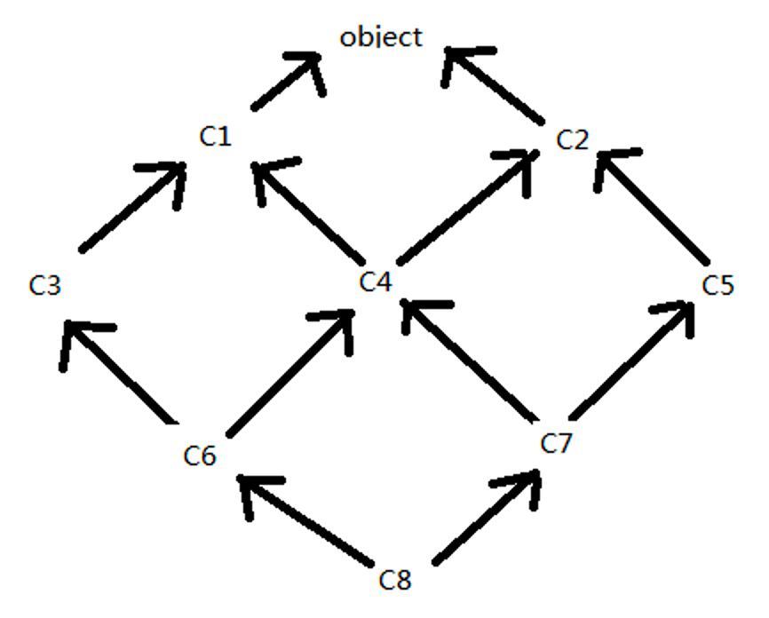
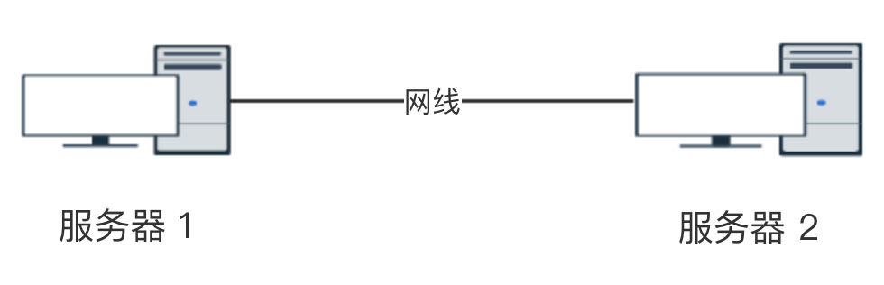
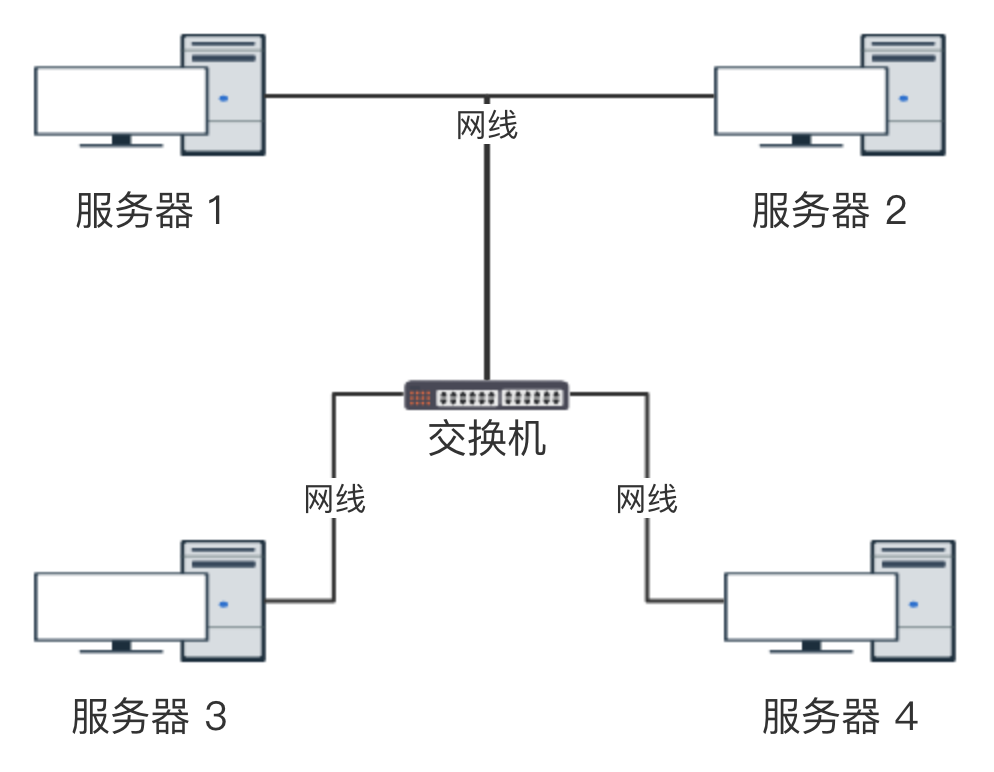
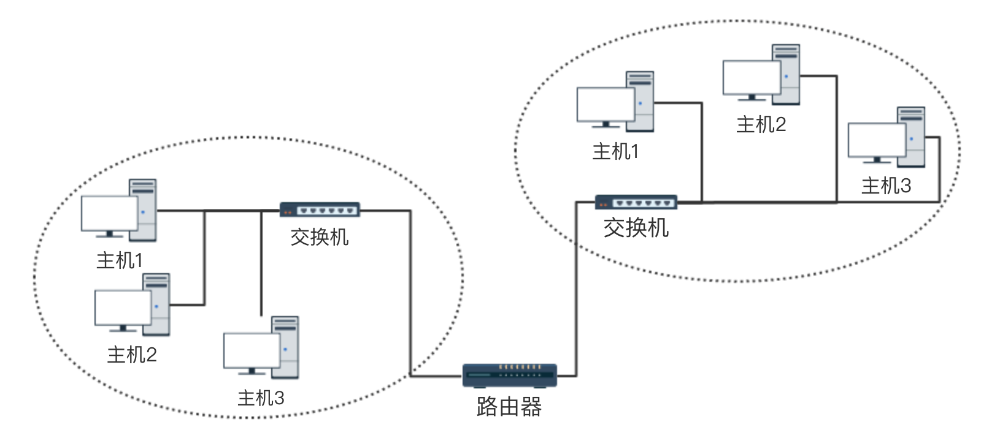
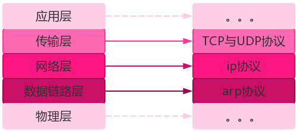
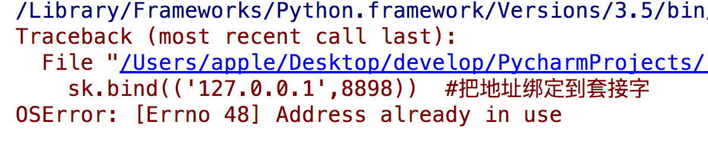

# 面向对象, 网络编程

## 多继承中类的查找顺序

### Python2与Python3的区别

- Python2中类分为经典类与新式类, 经典类查找的算法为深度优先算法, (一条路走到底)
- Python中类只有新式类, 类查找的算法为广度优先算法, 其实准确的来说是使用 C3 算法

### \_\_mro\_\_

- 在Python3中, 可以通过类调用 \_\_mro\_\_ 方法来查看类的查找顺序

  ```python
  class C1:
      pass
  
  
  class C2:
      pass
  
  
  class C3(C1):
      pass
  
  
  class C4(C3, C2):
      pass
  
  
  if __name__ == '__main__':
      print(C1.mro())
      # [<class '__main__.C1'>, <class 'object'>]
  
      print(C2.mro())
      # [<class '__main__.C2'>, <class 'object'>]
  
      print(C3.mro())
      # [<class '__main__.C3'>, <class '__main__.C1'>, <class 'object'>]
  
      print(C4.mro())
      # [<class '__main__.C4'>, <class '__main__.C3'>, <class '__main__.C1'>, <class '__main__.C2'>, <class 'object'>]
  ```

### TypeError: Cannot create a consistent method resolution

- 对于类的继承中, 如果有一个类与父类继承的类重复, 就会报这个异常

  ```python
  class C1:
      pass
  
  
  class C2(C1):
      pass
  
  
  # Python 解释器解释到 C3 类直接报错
  # TypeError: Cannot create a consistent method resolution
  # 由于 C2 本身继承于 C1, C3 类就不能同时在继承于 C1 和 C2
  class C3(C1, C2):
      pass
  ```

### C3算法

- 对于复杂的继承结构无法直观的观察出查找顺序的情况下, 可以通过 C3 算法来计算出类的查找顺序

- 示例

  ```python
  class C1:
      pass
  
  
  class C2:
      pass
  
  
  class C3(C1):
      pass
  
  
  class C4(C1, C2):
      pass
  
  
  class C5(C2):
      pass
  
  
  class C6(C3, C4):
      pass
  
  
  class C7(C4, C5):
      pass
  
  
  class C8(C6, C7):
      pass
  ```
  
  
  
  - 从上图可以看出
  
    C1的查找顺序: [C1, object]
  
    C2的查找顺序: [C2, object]
  
    C3的查找顺序: [C3, C1, object]
  
    C5的查找顺序: [C5, C2, object]
  
  - 计算 C4 查找顺序
  
    ```
    C4 = C1 + C2
       = (C1, object) + (C2, object)
       = C1, C2, object
       
    分析步骤:
    1. 先将第一项的第一个元素 C1 取出, 比较其他项除第一个元素外的其他元素, 发现没有与 C1 相同的类, 所以先找 C1
    
    2. 此时的结构为 (object) + (C2, object)
    
    3. 先将第一项的第一个元素 object 取出, 比较其他项除第一个元素外的其他元素, 发现有第二项中除第一个元素外的其他元素存在 object , 则对 object 不动
    
    4. 由于没有取到元素, 从下一项(此时为第二项)开始, 取出第一个元素 C2, 比较其他项除第一个元素外的其他元素, 发现没有与 C2 相同的类, 所以第二个查找的顺序为 C2, 此时查找顺序为 C1, C2
    
    5. 此时的结构 (object) + (object)
    
    6. 先将第一项的第一个元素 object 取出, 比较其他项除第一个元素外的其他元素, 发现没有与 object 相同的类, 所以第三个查找的顺序为 object, 此时查找顺序为 C1, C2, object
    
    7. 此时的结构都为空, 停止查找
       
    8. 由于 C4 类优先会从当前类进行查找
    所以 C4 类的最后查找顺序为 C4, C1, C2, object
    ```
  
  - 计算 C6的查找顺序
  
    ```
    C6 = C3 + C4
       = (C3, C1, object) + (C4, C1, C2, object)
       = C3, C4, C1, C2, object
       
    分析步骤:
    1. 先将第一项的第一个元素 C3 取出, 比较其他项除第一个元素外的其他元素, 发现没有与 C3 相同的类, 所以先找 C3
    
    2. 此时的结构为 (C1, object) + (C4, C1, C2, object)
    
    3. 先将第一项的第一个元素 C1 取出, 比较其他项除第一个元素外的其他元素, 发现有第二项中除第一个元素外的其他元素存在 C1 , 则对 C1 不动
    
    4. 由于没有取到元素, 从下一项(此时为第二项)开始, 取出第一个元素 C4, 比较其他项除第一个元素外的其他元素, 发现没有与 C4 相同的类, 所以第二个查找的顺序为 C4, 此时查找顺序为 C3, C4
    
    5. 此时的结构为 (C1, object) + (C1, C2, object)
    
    6. 先将第一项的第一个元素 C1 取出, 比较其他项除第一个元素外的其他元素, 发现没有与 C1 相同的类, 所以第三个查找顺序为C1, 此时查找的顺序为 C3, C4, C1
    
    7. 此时的结构为 (object) + (C2, object)
    
    8. 先将第一项的第一个元素 object 取出, 比较其他项除第一个元素外的其他元素, 发现有第二项中除第一个元素外的其他元素存在 object , 则对 object 不动
    
    9. 由于没有取到元素, 从下一项(此时为第二项)开始, 取出第一个元素 C2, 比较其他项除第一个元素外的其他元素, 发现没有与 C2 相同的类, 所以第四个查找的顺序为 C2, 此时查找顺序为 C3, C4, C1, C2
    
    10. 此时的结构 (object) + (object)
    
    11. 先将第一项的第一个元素 object 取出, 比较其他项除第一个元素外的其他元素, 发现没有与 object 相同的类, 所以第五个查找的顺序为 object, 此时查找顺序为 C3, C4, C1, C2, object
    
    12. 此时的结构为空, 停止查找
    
    13. 由于 C6 类优先会从当前类进行查找
    所以 C6 类的最后查找顺序为 C6, C3, C4, C1, C2, object
    ```
  
  - 计算 C7 的查找顺序
  
    ```
    C7 = C4 + C5
       = (C4, C1, C2, object) + (C5, C2, object)
       = C4, C1, C5, C2, object
       
    分析的过程与上述类似
    最后由于先找当前类, 所以 C7 类的查找顺序为 C7, C4, C1, C5, C2, object
    ```
  
  - 计算 C8 的查找顺序
  
    ```
    C8 = C6 + C7
       = (C6, C3, C4, C1, C2, object) + (C7, C4, C1, C5, C2, object)
       = C6, C3, C7, C4, C1, C5, C2, object
       
    分析的过程与上述类似
    最后由于先找当前类, 所以 C8 类的查找顺序为 C8, C6, C3, C7, C4, C1, C5, C2, object
    ```
  
- C3算法总结

  对于复杂的继承关系, 先找其父类的继承关系, 最后根据C3算法, 每次从第一项的第一个元素开始查找, 比较其他项除第一个元素外的所有元素, 如果没有发现相同项, 那么当前的查找顺序就是这个类, 如果发现相同项, 则从下一项开始, 取出第一个元素开始比较, 依次类推, 每当找到一个查找顺序后, 下一次都需要从第一项从头开始进行寻找, 直到最后为空为止

## 计算机网络

### 早期: 联机



### 以太网: 局域网和交换机



#### 广播

主机之间“一对所有”的通讯模式，网络对其中每一台主机发出的信号都进行无条件复制并转发，所有主机都可以接收到所有信息（不管你是否需要），由于其不用路径选择，所以其网络成本可以很低廉。有线电视网就是典型的广播型网络，我们的电视机实际上是接受到所有频道的信号，但只将一个频道的信号还原成画面。在数据网络中也允许广播的存在，但其被限制在二层交换机的局域网范围内，禁止广播数据穿过路由器，防止广播数据影响大面积的主机

#### ip地址与ip协议

- 规定网络地址的协议叫ip协议，它定义的地址称之为ip地址，广泛采用的v4版本即ipv4，它规定网络地址由32位2进制表示
- 范围0.0.0.0-255.255.255.255
- 一个ip地址通常写成四段十进制数，例：172.16.10.1

#### mac地址

- head中包含的源和目标地址由来：ethernet规定接入internet的设备都必须具备网卡，发送端和接收端的地址便是指网卡的地址，即mac地址
- 每块网卡出厂时都被烧制上一个 **世界唯一的mac地址** ，长度为48位2进制，通常由12位16进制数表示（前六位是厂商编号，后六位是流水线号）

#### arp协议 

- **作用: 查询IP地址和MAC地址的对应关系**
- 地址解析协议，即ARP（Address Resolution Protocol），是根据IP地址获取物理地址的一个TCP/IP协议
- 主机发送信息时将包含目标IP地址的ARP请求广播到网络上的所有主机，并接收返回消息，以此确定目标的物理地址
- 收到返回消息后将该IP地址和物理地址存入本机ARP缓存中并保留一定时间，下次请求时直接查询ARP缓存以节约资源
- 地址解析协议是建立在网络中各个主机互相信任的基础上的，网络上的主机可以自主发送ARP应答消息，其他主机收到应答报文时不会检测该报文的真实性就会将其记入本机ARP缓存；由此攻击者就可以向某一主机发送伪ARP应答报文，使其发送的信息无法到达预期的主机或到达错误的主机，这就构成了一个ARP欺骗。ARP命令可用于查询本机ARP缓存中IP地址和MAC地址的对应关系、添加或删除静态对应关系等。相关协议有RARP、代理ARP。NDP用于在IPv6中代替地址解析协议

### 广域网与路由器



#### 路由器

- 路由器（Router），是连接因特网中各局域网、广域网的设备，它会根据信道的情况自动选择和设定路由，以最佳路径，按前后顺序发送信号。 路由器是互联网络的枢纽，"交通警察"。目前路由器已经广泛应用于各行各业，各种不同档次的产品已成为实现各种骨干网内部连接、骨干网间互联和骨干网与互联网互联互通业务的主力军。路由和交换机之间的主要区别就是交换机发生在OSI参考模型第二层（数据链路层），而路由发生在第三层，即网络层。这一区别决定了路由和交换机在移动信息的过程中需使用不同的控制信息，所以说两者实现各自功能的方式是不同的
- 路由器（Router）又称网关设备（Gateway）是用于连接多个逻辑上分开的网络，所谓逻辑网络是代表一个单独的网络或者一个子网。当数据从一个子网传输到另一个子网时，可通过路由器的路由功能来完成。因此，路由器具有判断网络地址和选择IP路径的功能，它能在多网络互联环境中，建立灵活的连接，可用完全不同的数据分组和介质访问方法连接各种子网，路由器只接受源站或其他路由器的信息，属网络层的一种互联设备

#### 局域网

局域网（Local Area Network，LAN）是指在某一区域内由多台计算机互联成的计算机组。一般是方圆几千米以内。局域网可以实现文件管理、应用软件共享、打印机共享、工作组内的日程安排、电子邮件和传真通信服务等功能。局域网是封闭型的，可以由办公室内的两台计算机组成，也可以由一个公司内的上千台计算机组成

#### 子网掩码

- 所谓”子网掩码”，就是表示子网络特征的一个参数。它在形式上等同于IP地址，也是一个32位二进制数字，它的网络部分全部为1，主机部分全部为0。比如，IP地址172.16.10.1，如果已知网络部分是前24位，主机部分是后8位，那么子网络掩码就是11111111.11111111.11111111.00000000，写成十进制就是255.255.255.0

- **知道”子网掩码”，我们就能判断，任意两个IP地址是否处在同一个子网络**。方法是将两个IP地址与子网掩码分别进行AND运算（两个数位都为1，运算结果为1，否则为0），然后比较结果是否相同，如果是的话，就表明它们在同一个子网络中，否则就不是

  ```
  比如，已知IP地址 172.16.10.1 和 172.16.10.2 的子网掩码都是255.255.255.0
  请问它们是否在同一个子网络？
  
  两者与子网掩码分别进行AND运算，
  172.16.10.1：10101100.00010000.00001010.000000001
  255255.255.255.0:11111111.11111111.11111111.00000000
  AND运算得网络地址结果：10101100.00010000.00001010.000000001 -> 172.16.10.0
  
  172.16.10.2：10101100.00010000.00001010.000000010
  255255.255.255.0:11111111.11111111.11111111.00000000
  AND运算得网络地址结果：10101100.00010000.00001010.000000001 -> 172.16.10.0
  结果都是172.16.10.0，因此它们在同一个子网络
  ```

#### ip协议作用

- 为每一台计算机分配IP地址
- 确定哪些地址在同一个子网络

#### tcp与udp协议

- 端口

  一台拥有IP地址的主机可以提供许多服务，比如Web服务、FTP服务、SMTP服务等，这些服务完全可以通过1个IP地址来实现。那么，主机是怎样区分不同的网络服务呢？显然不能只靠IP地址，因为IP 地址与网络服务的关系是一对多的关系。实际上是通过“IP地址+端口号”来区分不同的服务的

- tcp协议

  - 当应用程序希望通过 TCP 与另一个应用程序通信时，它会发送一个通信请求。这个请求必须被送到一个确切的地址。在双方“握手”之后，TCP 将在两个应用程序之间建立一个**全双工 (full-duplex) 的通信**
  - 这个全双工的通信将占用两个计算机之间的通信线路，直到它被一方或双方关闭为止

  

#### 三次握手

TCP是因特网中的传输层协议，使用三次握手协议建立连接。当主动方发出SYN连接请求后，等待对方回答SYN+ACK[1]，并最终对对方的 SYN 执行 ACK 确认。这种建立连接的方法可以防止产生错误的连接

TCP三次握手的过程如下：

- 客户端发送SYN（SEQ=x）报文给服务器端，进入SYN_SEND状态。
- 服务器端收到SYN报文，回应一个SYN （SEQ=y）ACK(ACK=x+1）报文，进入SYN_RECV状态。
- 客户端收到服务器端的SYN报文，回应一个ACK(ACK=y+1）报文，进入Established状态。
- 三次握手完成，TCP客户端和服务器端成功地建立连接，可以开始传输数据了

#### 四次挥手

建立一个连接需要三次握手，而终止一个连接要经过四次握手，这是由TCP的半关闭（half-close）造成的。
(1) 某个应用进程首先调用close，称该端执行“主动关闭”（active close）。该端的TCP于是发送一个FIN分节，表示数据发送完毕。
(2) 接收到这个FIN的对端执行 “被动关闭”（passive close），这个FIN由TCP确认。
注意：FIN的接收也作为一个文件结束符（end-of-file）传递给接收端应用进程，放在已排队等候该应用进程接收的任何其他数据之后，因为，FIN的接收意味着接收端应用进程在相应连接上再无额外数据可接收。
(3) 一段时间后，接收到这个文件结束符的应用进程将调用close关闭它的套接字。这导致它的TCP也发送一个FIN。
(4) 接收这个最终FIN的原发送端TCP（即执行主动关闭的那一端）确认这个FIN。
既然每个方向都需要一个FIN和一个ACK，因此通常需要4个分节。
注意：
(1) “通常”是指，某些情况下，步骤1的FIN随数据一起发送，另外，步骤2和步骤3发送的分节都出自执行被动关闭那一端，有可能被合并成一个分节。
(2) 在步骤2与步骤3之间，从执行被动关闭一端到执行主动关闭一端流动数据是可能的，这称为“半关闭”（half-close）。
(3) 当一个Unix进程无论自愿地（调用exit或从main函数返回）还是非自愿地（收到一个终止本进程的信号）终止时，所有打开的描述符都被关闭，这也导致仍然打开的任何TCP连接上也发出一个FIN。
无论是客户还是服务器，任何一端都可以执行主动关闭。通常情况是，客户执行主动关闭，但是某些协议，例如，HTTP/1.0却由服务器执行主动关闭。

#### udp协议

  - 当应用程序希望通过UDP与一个应用程序通信时，传输数据之前源端和终端不建立连接
  - 当它想传送时就简单地去抓取来自应用程序的数据，并尽可能快地把它扔到网络上

#### tcp与udp的对比

  TCP---传输控制协议,提供的是面向连接、可靠的字节流服务。当客户和服务器彼此交换数据前，必须先在双方之间建立一个TCP连接，之后才能传输数据。TCP提供超时重发，丢弃重复数据，检验数据，流量控制等功能，保证数据能从一端传到另一端

  UDP---用户数据报协议，是一个简单的面向数据报的运输层协议。UDP不提供可靠性，它只是把应用程序传给IP层的数据报发送出去，但是并不能保证它们能到达目的地。由于UDP在传输数据报前不用在客户和服务器之间建立一个连接，且没有超时重发等机制，故而传输速度很快

  ```
  现在Internet上流行的协议是TCP/IP协议，该协议中对低于1024的端口都有确切的定义，他们对应着Internet上一些常见的服务。这些常见的服务可以分为使用TCP端口（面向连接）和使用UDP端口（面向无连接）两种。 
  
  说到TCP和UDP,首先要明白“连接”和“无连接”的含义，他们的关系可以用一个形象地比喻来说明，就是打电话和写信。两个人如果要通话，首先要建立连接——即打电话时的拨号，等待响应后——即接听电话后，才能相互传递信息，最后还要断开连接——即挂电话。写信就比较简单了，填写好收信人的地址后将信投入邮筒，收信人就可以收到了。从这个分析可以看出，建立连接可以在需要痛心地双方建立一个传递信息的通道，在发送方发送请求连接信息接收方响应后，由于是在接受方响应后才开始传递信息，而且是在一个通道中传送，因此接受方能比较完整地收到发送方发出的信息，即信息传递的可靠性比较高。但也正因为需要建立连接，使资源开销加大（在建立连接前必须等待接受方响应，传输信息过程中必须确认信息是否传到及断开连接时发出相应的信号等），独占一个通道，在断开连接钱不能建立另一个连接，即两人在通话过程中第三方不能打入电话。而无连接是一开始就发送信息（严格说来，这是没有开始、结束的），只是一次性的传递，是先不需要接受方的响应，因而在一定程度上也无法保证信息传递的可靠性了，就像写信一样，我们只是将信寄出去，却不能保证收信人一定可以收到。 
  
  TCP是面向连接的，有比较高的可靠性， 一些要求比较高的服务一般使用这个协议，如FTP、Telnet、SMTP、HTTP、POP3等。
  
  而UDP是面向无连接的，使用这个协议的常见服务有DNS、SNMP、QQ等。对于QQ必须另外说明一下，QQ2003以前是只使用UDP协议的，其服务器使用8000端口，侦听是否有信息传来，客户端使用4000端口，向外发送信息（这也就不难理解在一般的显IP的QQ版本中显示好友的IP地址信息中端口常为4000或其后续端口的原因了），即QQ程序既接受服务又提供服务，在以后的QQ版本中也支持使用TCP协议了
  ```

### 互联网协议与osi七层模型

- 互联网协议按照功能不同分为osi七层或tcp/ip五层或tcp/ip四层

  

- 每层运行常见物理设备

  

- 每层运行常见的协议

  

## socket编程

### 定义


### 发展史

- 套接字起源于 20 世纪 70 年代加利福尼亚大学伯克利分校版本的 Unix,即人们所说的 BSD Unix。 因此,有时人们也把套接字称为“伯克利套接字”或“BSD 套接字”。一开始,套接字被设计用在同 一台主机上多个应用程序之间的通讯。这也被称进程间通讯,或 IPC。套接字有两种（或者称为有两个种族）,分别是基于文件型的和基于网络型的

### 基于文件类型的套接字家族

- 套接字家族的名字：AF_UNIX
- unix一切皆文件，基于文件的套接字调用的就是底层的文件系统来取数据，两个套接字进程运行在同一机器，可以通过访问同一个文件系统间接完成通信

### 基于网络类型的套接字家族

- 套接字家族的名字：AF_INET
- (还有AF_INET6被用于ipv6，还有一些其他的地址家族，不过，他们要么是只用于某个平台，要么就是已经被废弃，或者是很少被使用，或者是根本没有实现，所有地址家族中，AF_INET是使用最广泛的一个，python支持很多种地址家族，但是由于我们只关心网络编程，所以大部分时候我么只使用AF_INET)

### tcp 与 udp 协议

- **TCP**（Transmission Control Protocol）可靠的、面向连接的协议（eg:打电话）、传输效率低全双工通信（发送缓存&接收缓存）、面向字节流。使用TCP的应用：Web浏览器；电子邮件、文件传输程序
- **UDP**（User Datagram Protocol）不可靠的、无连接的服务，传输效率高（发送前时延小），一对一、一对多、多对一、多对多、面向报文，尽最大努力服务，无拥塞控制。使用UDP的应用：域名系统 (DNS)；视频流；IP语音(VoIP)


### socket 的使用

#### 基于tcp的socket

- 服务端

  ```python
  import socket
  
  # 创建socket对象
  sk = socket.socket()
  
  # 为了防止断开后无法重新复用端口
  sk.setsockopt(socket.SOL_SOCKET, socket.SO_REUSEADDR, 1)
  
  # 绑定ip和端口
  ip_port = ('127.0.0.1', 8080)
  sk.bind(ip_port)
  
  # 设置最大监听数目
  sk.listen(10)
  
  print('服务端启动成功, 等待客户端连接')
  # 等待客户端连接
  client_conn, client_addr = sk.accept()
  print(f'客户端地址 {client_addr}')
  
  # 接收客户端发送的数据
  buffer_size = 1024
  data = client_conn.recv(buffer_size).decode(encoding='utf-8')
  print(f'接收客户端发送的数据 {data}')
  
  # 向客户端发送数据
  client_conn.send(bytes('我是服务端', 'utf-8'))
  
  # 关闭客户端对象
  client_conn.close()
  
  # 关闭服务端对象
  sk.close()
  ```

- 客户端

  ```python
  import socket
  
  # 创建socket对象
  sk = socket.socket()
  
  # 连接服务端
  ip_port = ('127.0.0.1', 8080)
  sk.connect(ip_port)
  
  # 客户端向服务端发送数据
  sk.send(bytes('我是客户端', 'utf-8'))
  
  # 接收服务端向客户端发送的数据
  buffer_size = 1024
  data = sk.recv(buffer_size).decode(encoding='utf-8')
  print(f'接收服务端发送的数据 {data}')
  
  sk.close()
  ```

- 常见问题

  

  ```python
  # 加入一条socket配置，重用ip和端口
  import socket
  from socket import SOL_SOCKET,SO_REUSEADDR
  sk = socket.socket()
  
  # 关键代码
  sk.setsockopt(SOL_SOCKET,SO_REUSEADDR,1) # 就是它，在bind前加
  
  sk.bind(('127.0.0.1',8898))  # 把地址绑定到套接字
  sk.listen()          # 监听链接
  conn,addr = sk.accept() # 接受客户端链接
  ret = conn.recv(1024)   # 接收客户端信息
  print(ret)              # 打印客户端信息
  conn.send(b'hi')        # 向客户端发送信息
  conn.close()       # 关闭客户端套接字
  sk.close()        # 关闭服务器套接字(可选)
  ```

#### 基于udp的socket

- 服务端

  ```python
  import socket
  
  # 创建socket对象
  udp_sk = socket.socket(type=socket.SOCK_DGRAM)
  # 设置服务端端口
  udp_sk.bind(('127.0.0.1', 9000))
  
  # 等待客户端发送数据
  msg, addr = udp_sk.recvfrom(1024)
  print(msg)
  
  # 向客户端发送数据
  udp_sk.sendto(bytes('我是服务端', 'utf-8'), addr)
  
  # 关闭socket
  udp_sk.close()
  ```

- 客户端

  ```python
  import socket
  
  ip_port = ('127.0.0.1', 9000)
  # 创建socket对象
  udp_sk = socket.socket(type=socket.SOCK_DGRAM)
  
  # 向服务端发送数据
  udp_sk.sendto(bytes('我是客户端', 'utf-8'), ip_port)
  
  # 接收服务端发送的数据
  back_msg, addr = udp_sk.recvfrom(1024)
  print(back_msg.decode('utf-8'), addr)
  ```

### socket参数详解

```python
socket.socket(family=AF_INET, type=SOCK_STREAM, proto=0, fileno=None)
```

| 属性       | 说明                                                         |
| ---------- | ------------------------------------------------------------ |
| **family** | 地址系列应为AF_INET(默认值),AF_INET6,AF_UNIX,AF_CAN或AF_RDS。 （AF_UNIX 域实际上是使用本地 socket 文件来通信） |
| **type**   | 套接字类型应为SOCK_STREAM(默认值),SOCK_DGRAM,SOCK_RAW或其他SOCK_常量之一。 **SOCK_STREAM** 是基于TCP的，有保障的（即能保证数据正确传送到对方）面向连接的SOCKET，多用于资料传送。  **SOCK_DGRAM** 是基于UDP的，无保障的面向消息的socket，多用于在网络上发广播信息。 |
| **proto**  | 协议号通常为零,可以省略,或者在地址族为AF_CAN的情况下,协议应为CAN_RAW或CAN_BCM之一。 |
| **fileno** | 如果指定了fileno,则其他参数将被忽略,导致带有指定文件描述符的套接字返回。 与socket.fromfd()不同,fileno将返回相同的套接字,而不是重复的。 这可能有助于使用socket.close()关闭一个独立的插座。 |