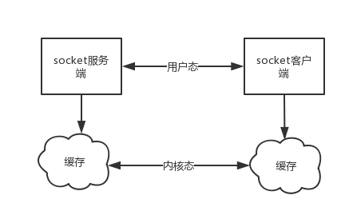

# 网络编程

## 黏包

- **只有TCP才会黏包, UDP不会黏包**

### 黏包原因

#### TCP协议的数据传递

- **tcp协议的拆包机制**

  ```
  当发送端缓冲区的长度大于网卡的MTU时，tcp会将这次发送的数据拆成几个数据包发送出去。 
  MTU是Maximum Transmission Unit的缩写。意思是网络上传送的最大数据包。MTU的单位是字节。 大部分网络设备的MTU都是1500。如果本机的MTU比网关的MTU大，大的数据包就会被拆开来传送，这样会产生很多数据包碎片，增加丢包率，降低网络速度
  ```

- **面向流的通信特点和Nagle算法**

  ```
  TCP（transport control protocol，传输控制协议）是面向连接的，面向流的，提供高可靠性服务。
  收发两端（客户端和服务器端）都要有一一成对的socket，因此，发送端为了将多个发往接收端的包，更有效的发到对方，使用了优化方法（Nagle算法），将多次间隔较小且数据量小的数据，合并成一个大的数据块，然后进行封包。
  这样，接收端，就难于分辨出来了，必须提供科学的拆包机制。 即面向流的通信是无消息保护边界的。 
  对于空消息：tcp是基于数据流的，于是收发的消息不能为空，这就需要在客户端和服务端都添加空消息的处理机制，防止程序卡住，而udp是基于数据报的，即便是你输入的是空内容（直接回车），也可以被发送，udp协议会帮你封装上消息头发送过去。 
  可靠黏包的tcp协议：tcp的协议数据不会丢，没有收完包，下次接收，会继续上次继续接收，己端总是在收到ack时才会清除缓冲区内容。数据是可靠的，但是会粘包
  ```

- **基于tcp协议特点的黏包现象成因**

  

  ```
  发送端可以是一K一K地发送数据，而接收端的应用程序可以两K两K地提走数据，当然也有可能一次提走3K或6K数据，或者一次只提走几个字节的数据。
  也就是说，应用程序所看到的数据是一个整体，或说是一个流（stream），一条消息有多少字节对应用程序是不可见的，因此TCP协议是面向流的协议，这也是容易出现粘包问题的原因。
  而UDP是面向消息的协议，每个UDP段都是一条消息，应用程序必须以消息为单位提取数据，不能一次提取任意字节的数据，这一点和TCP是很不同的。
  怎样定义消息呢？可以认为对方一次性write/send的数据为一个消息，需要明白的是当对方send一条信息的时候，无论底层怎样分段分片，TCP协议层会把构成整条消息的数据段排序完成后才呈现在内核缓冲区
  
  例如基于tcp的套接字客户端往服务端上传文件，发送时文件内容是按照一段一段的字节流发送的，在接收方看了，根本不知道该文件的字节流从何处开始，在何处结束
  
  此外，发送方引起的粘包是由TCP协议本身造成的，TCP为提高传输效率，发送方往往要收集到足够多的数据后才发送一个TCP段。若连续几次需要send的数据都很少，通常TCP会根据优化算法把这些数据合成一个TCP段后一次发送出去，这样接收方就收到了粘包数据
  ```

#### UDP协议的数据传递

- **UDP不会发生黏包**

  ```
  UDP（user datagram protocol，用户数据报协议）是无连接的，面向消息的，提供高效率服务。 
  不会使用块的合并优化算法，, 由于UDP支持的是一对多的模式，所以接收端的skbuff(套接字缓冲区）采用了链式结构来记录每一个到达的UDP包，在每个UDP包中就有了消息头（消息来源地址，端口等信息），这样，对于接收端来说，就容易进行区分处理了。 即面向消息的通信是有消息保护边界的。 
  对于空消息：tcp是基于数据流的，于是收发的消息不能为空，这就需要在客户端和服务端都添加空消息的处理机制，防止程序卡住，而udp是基于数据报的，即便是你输入的是空内容（直接回车），也可以被发送，udp协议会帮你封装上消息头发送过去。 
  不可靠不黏包的udp协议：udp的recvfrom是阻塞的，一个recvfrom(x)必须对唯一一个sendinto(y),收完了x个字节的数据就算完成,若是y;x数据就丢失，这意味着udp根本不会粘包，但是会丢数据，不可靠
  ```

  ```
  用UDP协议发送时，用sendto函数最大能发送数据的长度为：65535- IP头(20) – UDP头(8)＝65507字节。用sendto函数发送数据时，如果发送数据长度大于该值，则函数会返回错误。（丢弃这个包，不进行发送） 
  
  用TCP协议发送时，由于TCP是数据流协议，因此不存在包大小的限制（暂不考虑缓冲区的大小），这是指在用send函数时，数据长度参数不受限制。而实际上，所指定的这段数据并不一定会一次性发送出去，如果这段数据比较长，会被分段发送，如果比较短，可能会等待和下一次数据一起发送
  ```

### 黏包的两种情况

#### 情况一 发送方的缓存机制

- 发送端需要等缓冲区满才发送出去，造成粘包（发送数据时间间隔很短，数据了很小，会合到一起，产生粘包）

- 服务端

  ```python
  import socket
  from conf import config
  
  buf = 1024
  
  sk = socket.socket()
  sk.setsockopt(socket.SOL_SOCKET, socket.SO_REUSEADDR, 1)
  sk.bind(config.ip_port)
  sk.listen()
  
  conn, addr = sk.accept()
  
  data1 = conn.recv(config.buf)
  print(f'data1 = {data1}')
  data2 = conn.recv(config.buf)
  print(f'data2 = {data2}')
  
  sk.close()
  ```

- 客户端

  ```python
  import socket
  from conf import config
  
  sk = socket.socket()
  sk.connect(config.ip_port)
  
  sk.send(b'111')
  sk.send(b'222')
  
  sk.close()
  ```

- 结果

  ```
  data1 = b'111222'
  data2 = b''
  ```

#### 情况二 接收方的缓存机制

- 接收方不及时接收缓冲区的包，造成多个包接收（客户端发送了一段数据，服务端只收了一小部分，服务端下次再收的时候还是从缓冲区拿上次遗留的数据，产生粘包）

- 服务端

  ```python
  import socket
  from conf import config
  
  buf = 3
  
  sk = socket.socket()
  sk.bind(config.ip_port)
  sk.listen()
  
  conn, addr = sk.accept()
  
  while 1:
      data = conn.recv(buf)
      if not data:
          break
  
      print(f'data = {data}')
  
  sk.close()
  ```

- 客户端

  ```python
  import socket
  from conf import config
  
  sk = socket.socket()
  sk.connect(config.ip_port)
  
  sk.send(b'111222')
  sk.send(b'333444')
  
  sk.close()
  ```

- 结果

  ```
  data = b'111'
  data = b'222'
  data = b'333'
  data = b'444'
  ```

#### 小结

黏包现象只发生在tcp协议中：

1. 从表面上看，黏包问题主要是因为发送方和接收方的缓存机制、tcp协议面向流通信的特点。

2. 实际上，**主要还是因为接收方不知道消息之间的界限，不知道一次性提取多少字节的数据所造成的**

### 黏包的解决方案一

- 问题的根源在于，接收端不知道发送端将要传送的字节流的长度，所以解决粘包的方法就是围绕，如何让发送端在发送数据前，把自己将要发送的字节流总大小让接收端知晓，然后接收端来一个死循环接收完所有数据


- 服务端

  ```python
  import socket
  from conf import config
  
  buf = 5
  
  sk = socket.socket()
  sk.bind(config.ip_port)
  sk.listen()
  
  conn, addr = sk.accept()
  
  # 服务端接收数据, 发送的数据长度
  data_byte_len = int(conn.recv(buf).decode(config.encoding))
  print(f'客户端发送的数据长度为 {data_byte_len}')
  
  # 服务端告诉客户端, 可以发送数据了
  conn.send(bytes('准备接收数据', config.encoding))
  
  data = conn.recv(data_byte_len).decode(config.encoding)
  print(f'服务端接收的数据 {data}')
  
  conn.close()
  sk.close()
  ```

- 客户端

  ```python
  import socket
  from conf import config
  
  sk = socket.socket()
  sk.connect(config.ip_port)
  
  data = [f'数据{i}' for i in range(20)]
  data = "".join(data)
  data_byte = bytes(data, config.encoding)
  
  # 告诉服务端,发送数据的长度
  data_byte_len = len(data_byte)
  sk.send(bytes(str(data_byte_len), config.encoding))
  
  # 等待服务端告诉客户端可以发送数据
  msg = sk.recv(config.buf).decode(config.encoding)
  if msg == '准备接收数据':
      # 开始发送数据
      sk.send(data_byte)
  
  sk.close()
  ```

- 结果

  ```
  客户端发送的数据长度为 150
  服务端接收的数据 数据0数据1数据2数据3数据4数据5数据6数据7数据8数据9数据10数据11数据12数据13数据14数据15数据16数据17数据18数据19
  ```

#### 优缺点

- 不会出现黏包现象
- 但是交互的逻辑变多了, 耗时长

#### 本质问题

- **主要还是因为接收方不知道消息之间的界限，不知道一次性提取多少字节的数据所造成的**

### 黏包的解决方案二

- 可以借助一个模块，这个模块可以把要发送的数据长度转换成固定长度的字节。这样客户端每次接收消息之前只要先接受这个固定长度字节的内容看一看接下来要接收的信息大小，那么最终接受的数据只要达到这个值就停止，就能刚好不多不少的接收完整的数据了

#### struct模块

- 该模块可以把一个类型，如数字，转成固定长度的bytes

  

- 使用

  ```python
  import struct
  
  data = [str(i) for i in range(10)]
  data = ''.join(data)
  data_byte = bytes(data, 'utf-8')
  data_byte_len = len(data_byte)
  
  print(f'源数据长度 {data_byte_len}')
  # 源数据长度 10
  
  res = struct.pack('i', data_byte_len)
  print(res)
  print(len(res))
  
  # b'\n\x00\x00\x00'
  # 4
  
  # 解析数据
  unpack_tuple = struct.unpack('i', res)
  print(unpack_tuple)
  # (10,)
  print(unpack_tuple[0])
  # 10
  ```

- struct模块的详细用法

  ```python
  #_*_coding:utf-8_*_
  #http://www.cnblogs.com/coser/archive/2011/12/17/2291160.html
  __author__ = 'Linhaifeng'
  import struct
  import binascii
  import ctypes
  
  values1 = (1, 'abc'.encode('utf-8'), 2.7)
  values2 = ('defg'.encode('utf-8'),101)
  s1 = struct.Struct('I3sf')
  s2 = struct.Struct('4sI')
  
  print(s1.size,s2.size)
  prebuffer=ctypes.create_string_buffer(s1.size+s2.size)
  print('Before : ',binascii.hexlify(prebuffer))
  # t=binascii.hexlify('asdfaf'.encode('utf-8'))
  # print(t)
  
  
  s1.pack_into(prebuffer,0,*values1)
  s2.pack_into(prebuffer,s1.size,*values2)
  
  print('After pack',binascii.hexlify(prebuffer))
  print(s1.unpack_from(prebuffer,0))
  print(s2.unpack_from(prebuffer,s1.size))
  
  s3=struct.Struct('ii')
  s3.pack_into(prebuffer,0,123,123)
  print('After pack',binascii.hexlify(prebuffer))
  print(s3.unpack_from(prebuffer,0))
  ```

#### 通过struct模块解决黏包

- 服务端

  ```python
  import socket
  from conf import config
  import struct
  
  sk = socket.socket()
  sk.bind(config.ip_port)
  sk.listen()
  
  conn, addr = sk.accept()
  
  # 服务端接收数据, 发送的数据长度
  # 先读取4个字节的长度
  data_len_tuple = struct.unpack('i', conn.recv(4))
  data_len = data_len_tuple[0]
  print(f'客户端发送的数据长度为 {data_len}')
  
  data = conn.recv(data_len).decode(config.encoding)
  print(f'服务端接收的数据 {data}')
  
  conn.close()
  sk.close()
  ```

- 客户端

  ```python
  import socket
  from conf import config
  import struct
  
  sk = socket.socket()
  sk.connect(config.ip_port)
  
  data = [f'数据{i}' for i in range(10)]
  data = "".join(data)
  data_byte = bytes(data, config.encoding)
  
  # 告诉服务端,发送数据的长度
  pack_data_len_byte = struct.pack('i', len(data_byte))
  sk.send(pack_data_len_byte)
  
  # 发送数据
  sk.send(data_byte)
  
  sk.close()
  ```

- 结果

  ```
  客户端发送的数据长度为 70
  服务端接收的数据 数据0数据1数据2数据3数据4数据5数据6数据7数据8数据9
  ```

#### 使用struct模块自定义报头

- 服务端

  ```python
  import socket
  from conf import config
  import struct
  import json
  
  sk = socket.socket()
  sk.bind(config.ip_port)
  sk.listen()
  
  conn, addr = sk.accept()
  
  # 服务端接收数据, 发送的数据长度
  # 先读取4个字节的长度
  data_len_tuple = struct.unpack('i', conn.recv(4))
  data_len = data_len_tuple[0]
  print(f'报头长度 : {data_len}')
  
  header_json = conn.recv(data_len).decode(config.encoding)
  header = json.loads(header_json)
  print(f'报头数据 : {header}')
  
  # 报文长度
  body_len = header['body_len']
  body = conn.recv(body_len).decode(config.encoding)
  print(f'报文数据 : {body}')
  
  conn.close()
  sk.close()
  ```

- 客户端

  ```python
  import socket
  from conf import config
  import struct
  import time
  import json
  
  sk = socket.socket()
  sk.connect(config.ip_port)
  
  data = [f'数据{i}' for i in range(10)]
  data = "".join(data)
  data_byte = bytes(data, config.encoding)
  data_byte_len = len(data_byte)
  
  time_str = time.strftime('%Y-%m-%d %X', time.localtime(time.time()))
  print(f'时间 : {time_str}')
  
  # 自定义报头
  request_header = {
      # 当前时间
      'time': time_str,
      # 报文长度
      'body_len': data_byte_len
  }
  
  header_json_byte = bytes(json.dumps(request_header), config.encoding)
  
  # 告诉服务端,发送数据的长度
  pack_data_len_byte = struct.pack('i', len(header_json_byte))
  sk.send(pack_data_len_byte)
  # 发送报头
  sk.send(header_json_byte)
  # 发送报文
  sk.send(data_byte)
  
  sk.close()
  ```

- 结果

  ```
  报头长度 : 47
  报头数据 : {'time': '2018-10-08 21:59:43', 'body_len': 70}
  报文数据 : 数据0数据1数据2数据3数据4数据5数据6数据7数据8数据9
  ```

#### 优点

- 一次请求解决黏包问题

## 黏包现象分析

- 模拟ssh交互

- 通用配置模块

  ```python
  # config.py 文件
  
  IP_PORT = ("127.0.0.1", 9091)
  
  UTF8_ENCODING = "utf-8"
  
  BUF_SIZE = 1024
  ```

- 下面流程中, 所有的发送方为服务器, 接收方为客户端

### 流程1

由于接收方没有完全接收所有数据导致的黏包

- 服务端

  ```python
  import socket
  import subprocess
  import traceback
  
  import config
  
  
  def run_shell(command):
      """
      执行shell命令
      :param command: shell 命令
      :return: 获取结果(字节类型)
      """
      obj = subprocess.Popen(command, shell=True, stdout=subprocess.PIPE, stderr=subprocess.PIPE)
  
      stdout_res = obj.stdout.read()
      stderr_res = obj.stderr.read()
  
      if stdout_res:
          return stdout_res
      else:
          return stderr_res
  
  
  def read_client_data(conn):
      """
      读取客户端数据
      :param conn: 客户端socket
      :return:
      """
      while 1:
          command_bytes = conn.recv(config.BUF_SIZE)
          if not command_bytes:
              return
  
          command = str(command_bytes, config.UTF8_ENCODING)
          print(f"服务端接收到客户端发送的命令 : {command}")
  
          res_bytes = run_shell(command)
          print(f"服务端执行命令后的结果, 长度 : {len(res_bytes)}")
  
          conn.send(res_bytes)
          print(f"服务端向客户端发送数据完成")
  
  
  def start_server():
      """
      开启服务
      :return:
      """
      sk = socket.socket()
      sk.setsockopt(socket.SOL_SOCKET, socket.SO_REUSEADDR, 1)
      sk.bind(config.IP_PORT)
      sk.listen(5)
  
      print("服务端已经开启")
  
      while 1:
          conn = None
          try:
              conn, addr = sk.accept()
              print(f"{addr} 连接成功")
              read_client_data(conn)
          except Exception:
              print(traceback.format_stack())
          finally:
              if not conn:
                  conn.close()
  
  
  if __name__ == '__main__':
      # res = run_shell("ifconfig")
      # res = str(res, config.UTF8_ENCODING)
      # print(res)
  
      start_server()
  
      pass
  ```

- 客户端

  ```python
  import socket
  
  import config
  
  if __name__ == '__main__':
      sk = socket.socket()
      sk.connect(config.IP_PORT)
      print("客户端连接成功")
  
      while 1:
          command = input("请输入命令")
          if not command:
              break
  
          sk.send(bytes(command, config.UTF8_ENCODING))
  
          response_data = sk.recv(config.BUF_SIZE)
          print(f"接收到服务端发送的数据, 长度{len(response_data)}")
  
          data = str(response_data, config.UTF8_ENCODING)
          print(data)
  
      sk.close()
  ```

### 流程2

- 想要是接收方(客户端)能够接收所有数据, 于是发送了一个报文长度, 由于两次发包的时间间隔非常短, 造成了黏包

- 服务端

  ```python
  import socket
  import subprocess
  import traceback
  
  import config
  
  
  def run_shell(command):
      """
      执行shell命令
      :param command: shell 命令
      :return: 获取结果(字节类型)
      """
      obj = subprocess.Popen(command, shell=True, stdout=subprocess.PIPE, stderr=subprocess.PIPE)
  
      stdout_res = obj.stdout.read()
      stderr_res = obj.stderr.read()
  
      if stdout_res:
          return stdout_res
      else:
          return stderr_res
  
  
  def read_client_data(conn):
      """
      读取客户端数据
      :param conn: 客户端socket
      :return:
      """
      while 1:
          command_bytes = conn.recv(config.BUF_SIZE)
          if not command_bytes:
              return
  
          command = str(command_bytes, config.UTF8_ENCODING)
          print(f"服务端接收到客户端发送的命令 : {command}")
  
          res_bytes = run_shell(command)
          res_bytes_len = len(res_bytes)
          print(f"服务端执行命令后的结果, 长度 : {res_bytes_len}")
  
          send_data = bytes(str(res_bytes_len), config.UTF8_ENCODING)
          print(send_data)
          conn.send(send_data)
          print(f"服务端发送数据 长度 : {len(send_data)}")
  
          conn.send(res_bytes)
          print(f"服务端发送数据 数据 : {len(res_bytes)}")
  
          print(f"服务端向客户端发送数据完成")
  
  
  def start_server():
      """
      开启服务
      :return:
      """
      sk = socket.socket()
      sk.setsockopt(socket.SOL_SOCKET, socket.SO_REUSEADDR, 1)
      sk.bind(config.IP_PORT)
      sk.listen(5)
  
      print("服务端已经开启")
  
      while 1:
          conn = None
          try:
              conn, addr = sk.accept()
              print(f"{addr} 连接成功")
              read_client_data(conn)
          except Exception:
              print(traceback.format_stack())
          finally:
              if not conn:
                  conn.close()
  
      sk.close()
  
  
  if __name__ == '__main__':
      # res = run_shell("ifconfig")
      # res = str(res, config.UTF8_ENCODING)
      # print(res)
  
      start_server()
  
      pass
  ```

- 客户端

  ```python
  import socket
  
  import config
  
  if __name__ == '__main__':
      sk = socket.socket()
      sk.connect(config.IP_PORT)
      print("客户端连接成功")
  
      while 1:
          command = input("请输入命令 : ")
          if not command:
              break
  
          sk.send(bytes(command, config.UTF8_ENCODING))
  
          response_data = sk.recv(config.BUF_SIZE)
          print(f"接收到服务端发送的数据, 报文长度 : {len(response_data)}, 报文数据\n"
                f"{str(response_data, config.UTF8_ENCODING)}")
  
          response_data = sk.recv(config.BUF_SIZE)
          print(f"接收到服务端发送的数据, 长度{len(response_data)}")
  
          data = str(response_data, config.UTF8_ENCODING)
          print(data)
  
      sk.close()
  ```

### 流程3

- 使用了 struct 解决了问题

- 服务端

  ```python
  import socket
  import subprocess
  import traceback
  import struct
  
  import config
  
  
  def run_shell(command):
      """
      执行shell命令
      :param command: shell 命令
      :return: 获取结果(字节类型)
      """
      obj = subprocess.Popen(command, shell=True, stdout=subprocess.PIPE, stderr=subprocess.PIPE)
  
      stdout_res = obj.stdout.read()
      stderr_res = obj.stderr.read()
  
      if stdout_res:
          return stdout_res
      else:
          return stderr_res
  
  
  def read_client_data(conn):
      """
      读取客户端数据
      :param conn: 客户端socket
      :return:
      """
      while 1:
          command_bytes = conn.recv(config.BUF_SIZE)
          if not command_bytes:
              return
  
          command = str(command_bytes, config.UTF8_ENCODING)
          print(f"服务端接收到客户端发送的命令 : {command}")
  
          res_bytes = run_shell(command)
          res_bytes_len = len(res_bytes)
          print(f"服务端执行命令后的结果, 长度 : {res_bytes_len}")
  
          send_data = struct.pack("i", res_bytes_len)
          conn.send(send_data)
          print(f"服务端发送数据 长度 : {len(send_data)}")
  
          conn.send(res_bytes)
          print(f"服务端发送数据 数据 : {res_bytes}")
  
          print(f"服务端向客户端发送数据完成")
  
  
  def start_server():
      """
      开启服务
      :return:
      """
      sk = socket.socket()
      sk.setsockopt(socket.SOL_SOCKET, socket.SO_REUSEADDR, 1)
      sk.bind(config.IP_PORT)
      sk.listen(5)
  
      print("服务端已经开启")
  
      while 1:
          conn = None
          try:
              conn, addr = sk.accept()
              print(f"{addr} 连接成功")
              read_client_data(conn)
          except Exception:
              print(traceback.format_stack())
          finally:
              if not conn:
                  conn.close()
  
      sk.close()
  
  
  if __name__ == '__main__':
      # res = run_shell("ifconfig")
      # res = str(res, config.UTF8_ENCODING)
      # print(res)
  
      start_server()
  
      pass
  ```

- 客户端

  ```python
  import socket
  import struct
  
  import config
  
  if __name__ == '__main__':
      sk = socket.socket()
      sk.connect(config.IP_PORT)
      print("客户端连接成功")
  
      while 1:
          command = input("请输入命令 : ")
          if not command:
              break
  
          sk.send(bytes(command, config.UTF8_ENCODING))
  
          # 指定接收4字节长度
          response_bytes = sk.recv(4)
          response_data = struct.unpack("i", response_bytes)[0]
          print(f"接收到服务端发送的数据, 报文长度 : {response_data}")
          print(type(response_data))
  
          current_len = 0
          current_response = bytes()
  
          while current_len < response_data:
              temp_response = sk.recv(config.BUF_SIZE)
              print(f"客户端接收数据 {temp_response}")
              current_len += len(temp_response)
              current_response += temp_response
  
          print(f"接收到服务端发送的数据, 长度{len(current_response)}")
  
          data = str(current_response, config.UTF8_ENCODING)
          print(data)
  
      sk.close()
  ```

  