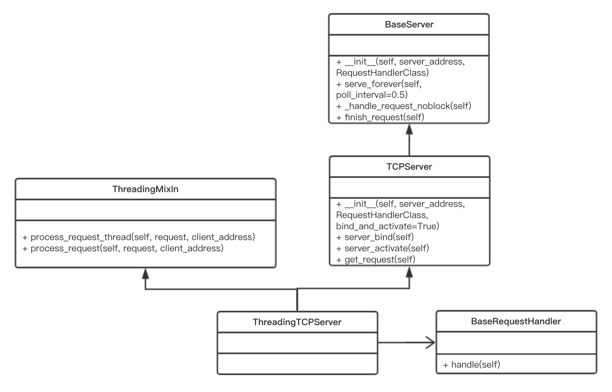

# 网络编程

## socket实现文件上传

- 为了避免TCP粘包导致数据的不完整, 一般有两种做法

### 方式1: 

- 客户端先发送报文长度的数据给服务端, 等待服务端做出回应, 然后发指定长度的数据给服务端. 服务端根据客户端发送的数据长度为标准进行接收

  缺点是需要进行等待回应消息

### 方式2:(推荐)

- 客户端封装报头信息, 报头内部含有报文长度数据, 通过 struct 模块, 生成4字节长度数据发给服务端, 然后客户端依次发送报头数据, 报文数据

  服务端先接收4字节长度数据, 然后解析报头数据, 获取报文长度信息, 然后接收报文数据即可

- 配置文件

- ```python
  # config.py 模块
  
  IP_PORT = ("127.0.0.1", 9002)
  UTF8_ENCODING = "utf-8"
  BUF_SIZE = 1024
  ```

- 服务端

  ```python
  import socket
  import struct
  import json
  import os
  
  from p3 import config
  
  
  def parse_request_body(conn, file_name, file_size):
      """
      解析报文, 保存资源文件
      :param conn:
      :param file_name:
      :param file_size:
      :return:
      """
      print("开始保存文件")
      dst_file_path = os.path.join(os.getcwd(), file_name)
      with open(dst_file_path, "wb") as dst_f:
          current_data_len = 0
          while current_data_len < file_size:
              response_data = conn.recv(config.BUF_SIZE)
              dst_f.write(response_data)
              current_data_len += len(response_data)
      print("文件保存完成")
  
  
  def parse_request_header(conn):
      """
      解析报头数据, 获取文件名及文件大小
      :param conn: 连接对象
      :return:
      """
      header_size = struct.unpack("i", conn.recv(4))[0]
      print(f"报头长度 {header_size}")
  
      header_data = str(conn.recv(header_size), config.UTF8_ENCODING)
      print(f"报头数据 {header_data}")
  
      header_obj = json.loads(header_data)
      file_name = header_obj["file_name"]
      file_size = header_obj["file_size"]
      parse_request_body(conn, file_name, file_size)
  
  
  if __name__ == '__main__':
      sk = socket.socket()
      sk.setsockopt(socket.SOL_SOCKET, socket.SO_REUSEADDR, 1)
      sk.bind(config.IP_PORT)
      sk.listen(5)
      print("服务端已开启")
  
      while 1:
          conn = None
          try:
              conn, addr = sk.accept()
              print(f"客户端连接成功 {addr}")
              parse_request_header(conn)
          except Exception:
              pass
          finally:
              if not conn:
                  conn.close()
  ```

- 客户端

  ```python
  import socket
  import os
  import json
  import struct
  
  from p3 import config
  
  if __name__ == '__main__':
      sk = socket.socket()
      sk.connect(config.IP_PORT)
      print(f"客户端连接成功")
  
      file_dict = {"file_name": "01.png"}
  
      img_src_path = os.path.join(os.getcwd(), "01.png")
      file_dict["file_size"] = os.path.getsize(img_src_path)
  
      request_header_bytes = bytes(json.dumps(file_dict), config.UTF8_ENCODING)
      request_header_len = len(request_header_bytes)
  
      pack_data = struct.pack("i", request_header_len)
  
      sk.send(pack_data)
      sk.send(request_header_bytes)
  
      with open(img_src_path, "rb") as img_src_f:
          for data in img_src_f:
              sk.send(data)
  
      print("发送完成")
      sk.close()
  ```

## hmac 模块

### 概述

- 通过哈希算法，我们可以验证一段数据是否有效，方法就是对比该数据的哈希值，例如，判断用户口令是否正确，我们用保存在数据库中的 `password_md5` 对比计算 `md5(password)` 的结果，如果一致，用户输入的口令就是正确的
- 为了防止黑客通过彩虹表根据哈希值反推原始口令，在计算哈希的时候，不能仅针对原始输入计算，需要增加一个salt来使得相同的输入也能得到不同的哈希，这样，大大增加了黑客破解的难度
- 如果salt是我们自己随机生成的，通常我们计算MD5时采用 `md5(message + salt)` 。但实际上，把salt看做一个“口令”，加salt的哈希就是：计算一段message的哈希时，根据不通口令计算出不同的哈希。要验证哈希值，必须同时提供正确的口令
- 这实际上就是Hmac算法：Keyed-Hashing for Message Authentication。它通过一个标准算法，在计算哈希的过程中，把key混入计算过程中
- 和我们自定义的加salt算法不同，Hmac算法针对所有哈希算法都通用，无论是MD5还是SHA-1。采用Hmac替代我们自己的salt算法，可以使程序算法更标准化，也更安全
- Python自带的hmac模块实现了标准的Hmac算法

### 使用

```python
import hashlib
import hmac


def test_md5():
    """
    md5值的计算
    :return:
    """
    md5obj = hashlib.md5()
    md5obj.update(bytes('123456', 'utf-8'))
    value = md5obj.hexdigest()
    print(f'md5 : {value}')
    # md5 : e10adc3949ba59abbe56e057f20f883e


def test_hmac():
    """
    hmac模块
    :return:
    """
    key = bytes('123', 'utf-8')
    message = bytes('456', 'utf-8')
    h = hmac.new(key, message)
    # 获取加密后的数据
    value = h.hexdigest()
    print(f'hmac : {value}')
    # hmac : eade56028e252b77f7a0b8792e58b9cc

    # 比较加密后的值
    res = hmac.compare_digest(value, 'eade56028e252b77f7a0b8792e58b9cc')
    print(res)
    # True

    res = hmac.compare_digest(value, '111')
    print(res)
    # False


test_md5()
test_hmac()
```

### 验证客户端的合法性

- 主要逻辑:
  1. 客户端和服务端内部保存一份相同的key
  2. 客户端在连接服务端后, 服务端发送一段数据发客户端,
  3. 客户端通过 hmac 进行加密后, 将加密的数据发给服务端
  4. 服务端通过自己计算的 hmac 值与客户端发送的 hmac 值判断是否合法

- 客户端

  ```python
  import socket
  import hmac
  
  ip_port = ('127.0.0.1', 13080)
  encoding = 'utf-8'
  buf = 1024
  
  # 客户端与服务端保存相同的key
  hmac_key = bytes('123456', encoding)
  
  sk = socket.socket()
  sk.connect(ip_port)
  
  # 接收服务端发送的数据
  msg_byte = sk.recv(buf)
  
  # 客户端计算 hmac 值
  h = hmac.new(hmac_key, msg_byte)
  hmac_value = h.hexdigest()
  
  sk.send(bytes(hmac_value, encoding))
  
  while 1:
      input_data = input('请输入数据 : ')
      if not input_data or input_data == 'q':
          break
      sk.send(bytes(input_data, encoding))
  
  sk.close()
  ```

- 服务端

  ```python
  import socket
  import hmac
  import time
  
  ip_port = ('127.0.0.1', 13080)
  encoding = 'utf-8'
  buf = 1024
  
  # 客户端与服务端保存相同的key
  hmac_key = bytes('123456', encoding)
  
  sk = socket.socket()
  sk.setsockopt(socket.SOL_SOCKET, socket.SO_REUSEADDR, 1)
  sk.bind(ip_port)
  sk.listen()
  
  conn, addr = sk.accept()
  print(f'客户端 {addr} 连接成功')
  # 服务端先客户端发送一段数据
  hmac_msg = bytes(str(time.time()), encoding)
  conn.send(hmac_msg)
  
  # 服务端计算 hmac 值
  h = hmac.new(hmac_key, hmac_msg)
  value = bytes(h.hexdigest(), encoding)
  
  # 服务端接收客户端发送的 hmac 值
  client_hmac_value = conn.recv(len(value))
  
  if not hmac.compare_digest(value, client_hmac_value):
      print('客户端不合法')
      conn.close()
  else:
      while 1:
          data = conn.recv(buf)
          if not data or data == 'q':
              conn.close()
              break
          print(data)
  
  sk.close()
  ```

## socketserver

### 概述

- socketserver 是在 socket 上做了一层封装, 支持多客户端同时连接服务端, 并简化了服务端的代码逻辑

### 使用

- 服务端

  ```python
  import socketserver
  
  ip_port = ('127.0.0.1', 13080)
  encoding = 'utf-8'
  buf = 1024
  
  
  class MyServer(socketserver.BaseRequestHandler):
      def handle(self):
          print(f'客户端地址 : {self.client_address}')
  
          while 1:
              data = self.request.recv(buf)
              print(f'服务端接收数据 : {data}')
              self.request.send(data.upper())
  
  
  if __name__ == '__main__':
      # 允许服务端重用地址
      socketserver.TCPServer.allow_reuse_address = True
  
      # 创建 tcp server
      server = socketserver.ThreadingTCPServer(ip_port, MyServer)
      # 开始运行
      server.serve_forever()
  ```

- 客户端

  ```python
  import socket
  
  ip_port = ('127.0.0.1', 13080)
  encoding = 'utf-8'
  buf = 1024
  
  sk = socket.socket()
  sk.connect(ip_port)
  
  while 1:
      data = input(">>> ").strip()
      if data == 'q' or not data:
          break
      sk.send(bytes(data, encoding))
  
      recv_data = sk.recv(buf)
      print(f'客户端接收数据 {recv_data}')
  
  sk.close()
  ```

### socketserver 源码分析

#### 继承结构



#### 流程分析

- 初始化

  - ThreadingTCPServer 没有做初始化工作

    ```python
    class ThreadingTCPServer(ThreadingMixIn, TCPServer): pass
    ```

  - ThreadingMixIn 也没有做初始化工作

    ```python
    class ThreadingMixIn:
        """Mix-in class to handle each request in a new thread."""
    
        # Decides how threads will act upon termination of the
        # main process
        daemon_threads = False
    
        def process_request_thread(self, request, client_address):
            """Same as in BaseServer but as a thread.
    
            In addition, exception handling is done here.
    
            """
            try:
                self.finish_request(request, client_address)
            except Exception:
                self.handle_error(request, client_address)
            finally:
                self.shutdown_request(request)
    
        def process_request(self, request, client_address):
            """Start a new thread to process the request."""
            t = threading.Thread(target = self.process_request_thread,
                                 args = (request, client_address))
            t.daemon = self.daemon_threads
            t.start()
    ```

  - 从 TCPServer 中寻找初始化代码

    ```python
    def __init__(self, server_address, RequestHandlerClass, bind_and_activate=True):
        """Constructor.  May be extended, do not override."""
    
        # 先调用父类 BaseServer 的初始化逻辑
        BaseServer.__init__(self, server_address, RequestHandlerClass)
        
        # 创建 socket 对象
        self.socket = socket.socket(self.address_family,
                                    self.socket_type)
        if bind_and_activate:
            try:
                self.server_bind()
                self.server_activate()
                except:
                    self.server_close()
                    raise
    ```

  - BaseServer 初始化逻辑

    ```python
    def __init__(self, server_address, RequestHandlerClass):
    	"""Constructor.  May be extended, do not override."""
        
        # 设置服务端地址
    	self.server_address = server_address
        # 设置自定义的 RequestHandler 对象
    	self.RequestHandlerClass = RequestHandlerClass
    	self.__is_shut_down = threading.Event()
    	self.__shutdown_request = False
    ```

- socket 的绑定

  - TCPServer 初始化代码

    ```python
    def __init__(self, server_address, RequestHandlerClass, bind_and_activate=True):
        """Constructor.  May be extended, do not override."""
    
        # 先调用父类 BaseServer 的初始化逻辑
        BaseServer.__init__(self, server_address, RequestHandlerClass)
        
        # 创建 socket 对象
        self.socket = socket.socket(self.address_family,
                                    self.socket_type)
        if bind_and_activate:
            try:
                # 绑定
                self.server_bind()
                self.server_activate()
                except:
                    self.server_close()
                    raise
    ```

  - 查找的顺序与上述一致

    顺序 : ThreadingTCPServer -> ThreadingMixIn -> TCPServer -> BaseServer

  - TCPServer

    ```python
    def server_bind(self):
    	"""Called by constructor to bind the socket.
    	May be overridden.
    	"""
        
        # 判断地址是否允许被复用
        if self.allow_reuse_address:
        	self.socket.setsockopt(socket.SOL_SOCKET, socket.SO_REUSEADDR, 1)
            
        # 绑定ip地址和端口
        self.socket.bind(self.server_address)
        # 设置服务端地址
        self.server_address = self.socket.getsockname()
    ```


- socket 设置监听

  - TCPServer 初始化

    ```python
    def __init__(self, server_address, RequestHandlerClass, bind_and_activate=True):
        """Constructor.  May be extended, do not override."""
    
        # 先调用父类 BaseServer 的初始化逻辑
        BaseServer.__init__(self, server_address, RequestHandlerClass)
        
        # 创建 socket 对象
        self.socket = socket.socket(self.address_family,
                                    self.socket_type)
        if bind_and_activate:
            try:
                # 绑定
                self.server_bind()
                # 激活(设置监听)        
                self.server_activate()
                except:
                    self.server_close()
                    raise
    ```

  - TCPServer

    ```python
    def server_activate(self):
        """Called by constructor to activate the server.
            May be overridden.
            """
        
        # 设置监听
        self.socket.listen(self.request_queue_size)
    ```

- 开启服务

  - 自定义的服务端代码

    ```python
    import socketserver
    
    ip_port = ('127.0.0.1', 13080)
    encoding = 'utf-8'
    buf = 1024
    
    
    class MyServer(socketserver.BaseRequestHandler):
        def handle(self):
            print(f'客户端地址 : {self.client_address}')
    
            while 1:
                data = self.request.recv(buf)
                print(f'服务端接收数据 : {data}')
                self.request.send(data.upper())
    
    
    if __name__ == '__main__':
        # 允许服务端重用地址
        socketserver.TCPServer.allow_reuse_address = True
    
        # 创建 tcp server
        server = socketserver.ThreadingTCPServer(ip_port, MyServer)
        # 开始运行
        server.serve_forever()
    ```

  - BaseServer

    ```python
    def serve_forever(self, poll_interval=0.5):
        """Handle one request at a time until shutdown.
    
            Polls for shutdown every poll_interval seconds. Ignores
            self.timeout. If you need to do periodic tasks, do them in
            another thread.
            """
        self.__is_shut_down.clear()
        try:
            # XXX: Consider using another file descriptor or connecting to the
            # socket to wake this up instead of polling. Polling reduces our
            # responsiveness to a shutdown request and wastes cpu at all other
            # times.
            with _ServerSelector() as selector:
                selector.register(self, selectors.EVENT_READ)
    
                # 请求是否关闭
                while not self.__shutdown_request:
                    ready = selector.select(poll_interval)
                    if ready:
                        # 处理请求
                        self._handle_request_noblock()
    
                        self.service_actions()
                        finally:
                            self.__shutdown_request = False
                            self.__is_shut_down.set()
    ```

  - BaseServer

    ```python
    def _handle_request_noblock(self):
        """Handle one request, without blocking.
    
            I assume that selector.select() has returned that the socket is
            readable before this function was called, so there should be no risk of
            blocking in get_request().
            """
        try:
            # 获取连接对象
            request, client_address = self.get_request()
        except OSError:
            return
            
        if self.verify_request(request, client_address):
            try:
                # 处理请求
                self.process_request(request, client_address)
            except Exception:
                self.handle_error(request, client_address)
                self.shutdown_request(request)
            except:
                self.shutdown_request(request)
                raise
        else:
            self.shutdown_request(request)
    ```

  - TCPServer 获取连接对象

    ```python
    def get_request(self):
        """Get the request and client address from the socket.
            May be overridden.
            """
        return self.socket.accept()
    ```

  -  ThreadingMixIn 处理请求 

    ```python
    class ThreadingMixIn:
        """Mix-in class to handle each request in a new thread."""
    
        # Decides how threads will act upon termination of the
        # main process
        daemon_threads = False
    
        def process_request_thread(self, request, client_address):
            """Same as in BaseServer but as a thread.
    
            In addition, exception handling is done here.
    
            """
            try:
                # 调用 finish_request
                self.finish_request(request, client_address)
            except Exception:
                self.handle_error(request, client_address)
            finally:
                self.shutdown_request(request)
    
        def process_request(self, request, client_address):
            """Start a new thread to process the request."""
            
            # 创建一个线程对象, 目标调用 process_request_thread 方法
            t = threading.Thread(target = self.process_request_thread,
                                 args = (request, client_address))
            t.daemon = self.daemon_threads
            # 开启线程
            t.start()
    ```

  - BaseServer

    ```python
    def finish_request(self, request, client_address):
        """Finish one request by instantiating RequestHandlerClass."""
        self.RequestHandlerClass(request, client_address, self)
    ```

  - 初始化自定义的 RequestHandler 对象, 将请求 request 对象和客户端地址作为参数进行传递

  - ReqeustHandler 的初始化

    ```python
    class BaseRequestHandler:
    
        """Base class for request handler classes.
    
        This class is instantiated for each request to be handled.  The
        constructor sets the instance variables request, client_address
        and server, and then calls the handle() method.  To implement a
        specific service, all you need to do is to derive a class which
        defines a handle() method.
    
        The handle() method can find the request as self.request, the
        client address as self.client_address, and the server (in case it
        needs access to per-server information) as self.server.  Since a
        separate instance is created for each request, the handle() method
        can define other arbitrary instance variables.
    
        """
    
        def __init__(self, request, client_address, server):
            # 请求对象
            self.request = request
            # 客户端地址
            self.client_address = client_address
            # 创建的 ThreadingTCPServer 对象
            self.server = server
            self.setup()
            try:
                # 调用 handle 方法
                self.handle()
            finally:
                self.finish()
    
        def setup(self):
            pass
    
        def handle(self):
            pass
    
        def finish(self):
            pass
    ```

