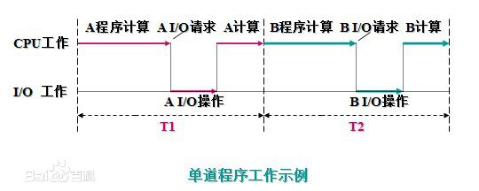
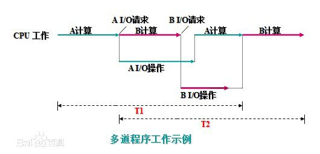
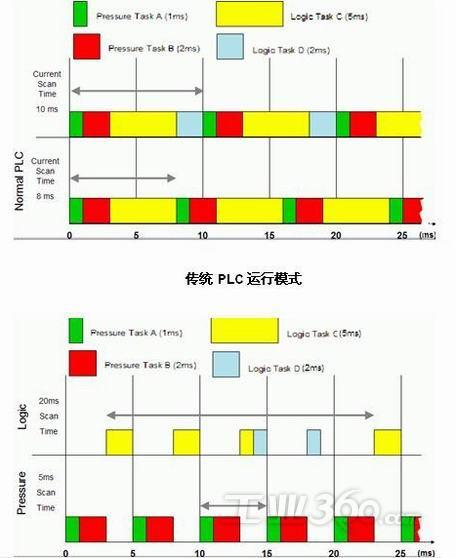
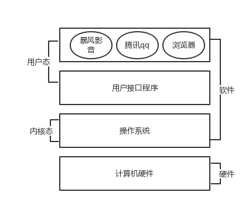
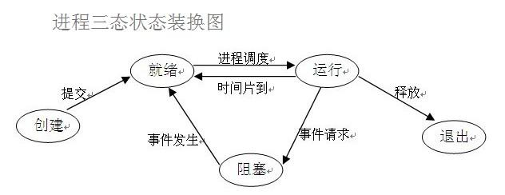
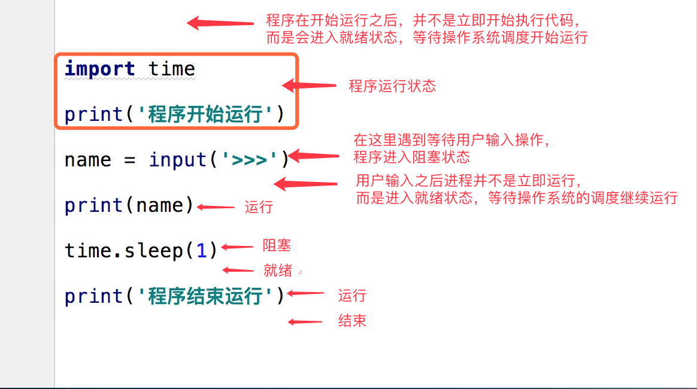

# 网络编程

## 操作系统

### 多道程序设计技术

- 所谓多道程序设计技术，就是指允许多个程序同时进入内存并运行。即同时把多个程序放入内存，并允许它们交替在CPU中运行，它们共享系统中的各种硬、软件资源。当一道程序因I/O请求而暂停运行时，CPU便立即转去运行另一道程序

- 单道程序工作

  

  在A程序计算时，I/O空闲， A程序I/O操作时，CPU空闲（B程序也是同样）；必须A工作完成后，B才能进入内存中开始工作，两者是串行的，全部完成共需时间=T1+T2

- 多道程序工作

  

  将A、B两道程序同时存放在内存中，它们在系统的控制下，可相互穿插、交替地在CPU上运行：当A程序因请求I/O操作而放弃CPU时，B程序就可占用CPU运行，这样 CPU不再空闲，而正进行A I/O操作的I/O设备也不空闲，显然，CPU和I/O设备都处于“忙”状态，大大提高了资源的利用率，从而也提高了系统的效率，A、B全部完成所需时间<<T1+T2

  多道程序设计技术不仅使CPU得到充分利用，同时改善I/O设备和内存的利用率，从而提高了整个系统的资源利用率和系统吞吐量（单位时间内处理作业（程序）的个数），最终提高了整个系统的效率

- 单处理机系统中多道程序运行时的特点

  1. 多道：计算机内存中同时存放几道相互独立的程序
  2. 宏观上并行：同时进入系统的几道程序都处于运行过程中，即它们先后开始了各自的运行，但都未运行完毕
  3. 微观上串行：实际上，各道程序轮流地用CPU，并交替运行

**多道程序系统的出现，标志着操作系统渐趋成熟的阶段，先后出现了作业调度管理、处理机管理、存储器管理、外部设备管理、文件系统管理等功能**

**由于多个程序同时在计算机中运行，开始有了空间隔离的概念，只有内存空间的隔离，才能让数据更加安全、稳定。出了空间隔离之外，多道技术还第一次体现了时空复用的特点，遇到IO操作就切换程序，使得cpu的利用率提高了，计算机的工作效率也随之提高**

### 分时系统

由于CPU速度不断提高和采用分时技术，一台计算机可同时连接多个用户终端，而每个用户可在自己的终端上联机使用计算机，好象自己独占机器一样



- 分时技术：把处理机的运行时间分成很短的时间片，按时间片轮流把处理机分配给各联机作业使用

若某个作业在分配给它的时间片内不能完成其计算，则该作业暂时中断，把处理机让给另一作业使用，等待下一轮时再继续其运行。由于计算机速度很快，作业运行轮转得很快，给每个用户的印象是，好象他独占了一台计算机。而每个用户可以通过自己的终端向系统发出各种操作控制命令，在充分的人机交互情况下，完成作业的运行

- 具有上述特征的计算机系统称为分时系统，它允许多个用户同时联机使用计算机. 特点:

  1. 多路性。若干个用户同时使用一台计算机。微观上看是各用户轮流使用计算机；宏观上看是各用户并行工作
  2. 交互性。用户可根据系统对请求的响应结果，进一步向系统提出新的请求。这种能使用户与系统进行人机对话的工作方式，明显地有别于批处理系统，因而，分时系统又被称为交互式系统
  3. 独立性。用户之间可以相互独立操作，互不干扰。系统保证各用户程序运行的完整性，不会发生相互混淆或破坏现象
  4. 及时性。系统可对用户的输入及时作出响应。分时系统性能的主要指标之一是响应时间，它是指：从终端发出命令到系统予以应答所需的时间

- **分时系统的主要目标**：对用户响应的及时性，即不至于用户等待每一个命令的处理时间过长

分时系统可以同时接纳数十个甚至上百个用户，由于内存空间有限，往往采用对换（又称交换）方式的存储方法。即将未“轮到”的作业放入磁盘，一旦“轮到”，再将其调入内存；而时间片用完后，又将作业存回磁盘（俗称“滚进”、“滚出“法），使同一存储区域轮流为多个用户服务

多用户分时系统是当今计算机操作系统中最普遍使用的一类操作系统

**注意：分时系统的分时间片工作，在没有遇到IO操作的时候就用完了自己的时间片被切走了，这样的切换工作其实并没有提高cpu的效率，反而使得计算机的效率降低了。但是我们牺牲了一点效率，却实现了多个程序共同执行的效果，这样你就可以在计算机上一边听音乐一边聊qq了**

### 实时系统

虽然多道批处理系统和分时系统能获得较令人满意的资源利用率和系统响应时间，但却不能满足实时控制与实时信息处理两个应用领域的需求。于是就产生了实时系统，即系统能够及时响应随机发生的外部事件，并在严格的时间范围内完成对该事件的处理

- 实时系统可分成两类:

  1. 实时控制系统。当用于飞机飞行、导弹发射等的自动控制时，要求计算机能尽快处理测量系统测得的数据，及时地对飞机或导弹进行控制，或将有关信息通过显示终端提供给决策人员。当用于轧钢、石化等工业生产过程控制时，也要求计算机能及时处理由各类传感器送来的数据，然后控制相应的执行机构
  2. 实时信息处理系统。当用于预定飞机票、查询有关航班、航线、票价等事宜时，或当用于银行系统、情报检索系统时，都要求计算机能对终端设备发来的服务请求及时予以正确的回答。此类对响应及时性的要求稍弱于第一类
- **实时操作系统的主要特点**

  1. 及时响应。每一个信息接收、分析处理和发送的过程必须在严格的时间限制内完成
  2. 高可靠性。需采取冗余措施，双机系统前后台工作，也包括必要的保密措施等
- 实时和分时系统应用的场景
  - 分时现在流行的PC，服务器都是采用这种运行模式，即把CPU的运行分成若干时间片分别处理不同的运算请求 linux系统
  - 实时一般用于单片机上、PLC等，比如电梯的上下控制中，对于按键等动作要求进行实时处理 

### 操作系统的作用

- 现代的计算机系统主要是由一个或者多个处理器，主存，硬盘，键盘，鼠标，显示器，打印机，网络接口及其他输入输出设备组成

- 一般而言，现代计算机系统是一个复杂的系统
  1. 如果每位应用程序员都必须掌握该系统所有的细节，那就不可能再编写代码了（严重影响了程序员的开发效率：全部掌握这些细节可能需要一万年....）
  2. 并且管理这些部件并加以优化使用，是一件极富挑战性的工作，于是，计算安装了一层软件（系统软件），称为操作系统。它的任务就是为用户程序提供一个更好、更简单、更清晰的计算机模型，并管理刚才提到的所有设备

**程序员无法把所有的硬件操作细节都了解到，管理这些硬件并且加以优化使用是非常繁琐的工作，这个繁琐的工作就是操作系统来干的，有了他，程序员就从这些繁琐的工作中解脱了出来，只需要考虑自己的应用软件的编写就可以了，应用软件直接使用操作系统提供的功能来间接使用硬件**

**精简的说的话，操作系统就是一个协调、管理和控制计算机硬件资源和软件资源的控制程序**



**细说的话，操作系统应该分成两部分功能**

1. 隐藏了丑陋的硬件调用接口，为应用程序员提供调用硬件资源的更好，更简单，更清晰的模型（系统调用接口）。应用程序员有了这些接口后，就不用再考虑操作硬件的细节，专心开发自己的应用程序即可。
   例如：操作系统提供了文件这个抽象概念，对文件的操作就是对磁盘的操作，有了文件我们无需再去考虑关于磁盘的读写控制（比如控制磁盘转动，移动磁头读写数据等细节）
2. 将应用程序对硬件资源的竞态请求变得有序化
   例如：很多应用软件其实是共享一套计算机硬件，比方说有可能有三个应用程序同时需要申请打印机来输出内容，那么a程序竞争到了打印机资源就打印，然后可能是b竞争到打印机资源，也可能是c，这就导致了无序，打印机可能打印一段a的内容然后又去打印c...,操作系统的一个功能就是将这种无序变得有序

## 进程知识

### 理论知识

- **顾名思义，进程即正在执行的一个过程。进程是对正在运行程序的一个抽象**

- **进程的概念起源于操作系统，是操作系统最核心的概念，也是操作系统提供的最古老也是最重要的抽象概念之一。操作系统的其他所有内容都是围绕进程的概念展开的**

- 即使可以利用的cpu只有一个（早期的计算机确实如此），也能保证支持（伪）并发的能力。将一个单独的cpu变成多个虚拟的cpu（多道技术：时间多路复用和空间多路复用+硬件上支持隔离），没有进程的抽象，现代计算机将不复存在

```
一 操作系统的作用：
    1：隐藏丑陋复杂的硬件接口，提供良好的抽象接口
    2：管理、调度进程，并且将多个进程对硬件的竞争变得有序

二 多道技术：
    1.产生背景：针对单核，实现并发
    ps：
    现在的主机一般是多核，那么每个核都会利用多道技术
    有4个cpu，运行于cpu1的某个程序遇到io阻塞，会等到io结束再重新调度，会被调度到4个
    cpu中的任意一个，具体由操作系统调度算法决定。
    
    2.空间上的复用：如内存中同时有多道程序
    3.时间上的复用：复用一个cpu的时间片
       强调：遇到io切，占用cpu时间过长也切，核心在于切之前将进程的状态保存下来，这样
            才能保证下次切换回来时，能基于上次切走的位置继续运行
```

### 进程定义

- 进程（Process）是计算机中的程序关于某数据集合上的一次运行活动，是系统进行资源分配和调度的基本单位，是操作系统)结构的基础。在早期面向进程设计的计算机结构中，进程是程序的基本执行实体；在当代面向线程设计的计算机结构中，进程是线程的容器。程序是指令、数据及其组织形式的描述，进程是程序的实体

- 狭义定义：进程是正在运行的程序的实例

- 广义定义：进程是一个具有一定独立功能的程序关于某个数据集合的一次运行活动。它是操作系统动态执行的基本单元，在传统的操作系统中，进程既是基本的分配单元，也是基本的执行单元

- 进程的概念

  ```
  第一，进程是一个实体。每一个进程都有它自己的地址空间，一般情况下，包括文本区域（text region）、数据区域（data region）和堆栈（stack region）。文本区域存储处理器执行的代码；数据区域存储变量和进程执行期间使用的动态分配的内存；堆栈区域存储着活动过程调用的指令和本地变量。
  第二，进程是一个“执行中的程序”。程序是一个没有生命的实体，只有处理器赋予程序生命时（操作系统执行之），它才能成为一个活动的实体，我们称其为进程。
  进程是操作系统中最基本、重要的概念。是多道程序系统出现后，为了刻画系统内部出现的动态情况，描述系统内部各道程序的活动规律引进的一个概念,所有多道程序设计操作系统都建立在进程的基础上
  ```

- 操作系统引入进程的原因

  ```
  从理论角度看，是对正在运行的程序过程的抽象；
  从实现角度看，是一种数据结构，目的在于清晰地刻画动态系统的内在规律，有效管理和调度进入计算机系统主存储器运行的程序
  ```

- 进程的特征

  ```
  动态性：进程的实质是程序在多道程序系统中的一次执行过程，进程是动态产生，动态消亡的。
  并发性：任何进程都可以同其他进程一起并发执行
  独立性：进程是一个能独立运行的基本单位，同时也是系统分配资源和调度的独立单位；
  异步性：由于进程间的相互制约，使进程具有执行的间断性，即进程按各自独立的、不可预知的速度向前推进
  结构特征：进程由程序、数据和进程控制块三部分组成。
  多个不同的进程可以包含相同的程序：一个程序在不同的数据集里就构成不同的进程，能得到不同的结果；但是执行过程中，程序不能发生改变。
  ```

- 进程与程序的区别

  ```
  程序是指令和数据的有序集合，其本身没有任何运行的含义，是一个静态的概念。
  而进程是程序在处理机上的一次执行过程，它是一个动态的概念。
  程序可以作为一种软件资料长期存在，而进程是有一定生命期的。
  程序是永久的，进程是暂时的
  ```

- **注意：同一个程序执行两次，就会在操作系统中出现两个进程，所以我们可以同时运行一个软件，分别做不同的事情也不会混乱**

### 进程调度

要想多个进程交替运行，操作系统必须对这些进程进行调度，这个调度也不是随即进行的，而是需要遵循一定的法则，由此就有了进程的调度算法

- 先来先服务调度算法

  ```
  先来先服务（FCFS）调度算法是一种最简单的调度算法，该算法既可用于作业调度，也可用于进程调度。FCFS算法比较有利于长作业（进程），而不利于短作业（进程）。由此可知，本算法适合于CPU繁忙型作业，而不利于I/O繁忙型的作业（进程）
  ```

- 短作业优先调度算法

  ```
  短作业（进程）优先调度算法（SJ/PF）是指对短作业或短进程优先调度的算法，该算法既可用于作业调度，也可用于进程调度。但其对长作业不利；不能保证紧迫性作业（进程）被及时处理；作业的长短只是被估算出来的
  ```

- 时间片轮转法

  ```
  时间片轮转(Round Robin，RR)法的基本思路是让每个进程在就绪队列中的等待时间与享受服务的时间成比例。在时间片轮转法中，需要将CPU的处理时间分成固定大小的时间片，例如，几十毫秒至几百毫秒。如果一个进程在被调度选中之后用完了系统规定的时间片，但又未完成要求的任务，则它自行释放自己所占有的CPU而排到就绪队列的末尾，等待下一次调度。同时，进程调度程序又去调度当前就绪队列中的第一个进程。
  
  显然，轮转法只能用来调度分配一些可以抢占的资源。这些可以抢占的资源可以随时被剥夺，而且可以将它们再分配给别的进程。CPU是可抢占资源的一种。但打印机等资源是不可抢占的。由于作业调度是对除了CPU之外的所有系统硬件资源的分配，其中包含有不可抢占资源，所以作业调度不使用轮转法。
  
  在轮转法中，时间片长度的选取非常重要。首先，时间片长度的选择会直接影响到系统的开销和响应时间。如果时间片长度过短，则调度程序抢占处理机的次数增多。这将使进程上下文切换次数也大大增加，从而加重系统开销。反过来，如果时间片长度选择过长，例如，一个时间片能保证就绪队列中所需执行时间最长的进程能执行完毕，则轮转法变成了先来先服务法。时间片长度的选择是根据系统对响应时间的要求和就绪队列中所允许最大的进程数来确定的。
  
  在轮转法中，加入到就绪队列的进程有3种情况：
  一种是分给它的时间片用完，但进程还未完成，回到就绪队列的末尾等待下次调度去继续执行。
  另一种情况是分给该进程的时间片并未用完，只是因为请求I/O或由于进程的互斥与同步关系而被阻塞。当阻塞解除之后再回到就绪队列。
  第三种情况就是新创建进程进入就绪队列。
  
  如果对这些进程区别对待，给予不同的优先级和时间片从直观上看，可以进一步改善系统服务质量和效率。例如，我们可把就绪队列按照进程到达就绪队列的类型和进程被阻塞时的阻塞原因分成不同的就绪队列，每个队列按FCFS原则排列，各队列之间的进程享有不同的优先级，但同一队列内优先级相同。这样，当一个进程在执行完它的时间片之后，或从睡眠中被唤醒以及被创建之后，将进入不同的就绪队列
  ```

- 多级反馈队列

  ```
  前面介绍的各种用作进程调度的算法都有一定的局限性。如短进程优先的调度算法，仅照顾了短进程而忽略了长进程，而且如果并未指明进程的长度，则短进程优先和基于进程长度的抢占式调度算法都将无法使用。
  而多级反馈队列调度算法则不必事先知道各种进程所需的执行时间，而且还可以满足各种类型进程的需要，因而它是目前被公认的一种较好的进程调度算法。在采用多级反馈队列调度算法的系统中，调度算法的实施过程如下所述。
  (1) 应设置多个就绪队列，并为各个队列赋予不同的优先级。第一个队列的优先级最高，第二个队列次之，其余各队列的优先权逐个降低。该算法赋予各个队列中进程执行时间片的大小也各不相同，在优先权愈高的队列中，为每个进程所规定的执行时间片就愈小。例如，第二个队列的时间片要比第一个队列的时间片长一倍，……，第i+1个队列的时间片要比第i个队列的时间片长一倍。
  (2) 当一个新进程进入内存后，首先将它放入第一队列的末尾，按FCFS原则排队等待调度。当轮到该进程执行时，如它能在该时间片内完成，便可准备撤离系统；如果它在一个时间片结束时尚未完成，调度程序便将该进程转入第二队列的末尾，再同样地按FCFS原则等待调度执行；如果它在第二队列中运行一个时间片后仍未完成，再依次将它放入第三队列，……，如此下去，当一个长作业(进程)从第一队列依次降到第n队列后，在第n 队列便采取按时间片轮转的方式运行。
  (3) 仅当第一队列空闲时，调度程序才调度第二队列中的进程运行；仅当第1～(i-1)队列均空时，才会调度第i队列中的进程运行。如果处理机正在第i队列中为某进程服务时，又有新进程进入优先权较高的队列(第1～(i-1)中的任何一个队列)，则此时新进程将抢占正在运行进程的处理机，即由调度程序把正在运行的进程放回到第i队列的末尾，把处理机分配给新到的高优先权进程
  ```

### 并行与并发

**并行** : 并行是指两者同时执行，比如赛跑，两个人都在不停的往前跑；（资源够用，比如三个线程，四核的CPU ）

**并发** : 并发是指资源有限的情况下，两者交替轮流使用资源，比如一段路(单核CPU资源)同时只能过一个人，A走一段后，让给B，B用完继续给A ，交替使用，目的是提高效率

```
区别:
并行是从微观上,在一个精确的时间片刻,有不同的程序在执行,这就要求必须有多个处理器。
并发是从宏观上，在一个时间段上可以看出是同时执行的，比如一个服务器同时处理多个session
```

### 进程的状态



在了解其他概念之前，我们首先要了解进程的几个状态。在程序运行的过程中，由于被操作系统的调度算法控制，程序会进入几个状态：就绪，运行和阻塞

1. 就绪(Ready)状态

   当进程已分配到除CPU以外的所有必要的资源，只要获得处理机便可立即执行，这时的进程状态称为就绪状态

2. 执行/运行(Running)状态

   当进程已获得处理机，其程序正在处理机上执行，此时的进程状态称为执行状态

3. 阻塞(Blocked)状态

   正在执行的进程，由于等待某个事件发生而无法执行时，便放弃处理机而处于阻塞状态。引起进程阻塞的事件可有多种，例如，等待I/O完成、申请缓冲区不能满足、等待信件(信号)等



### 同步与异步

- 所谓同步就是一个任务的完成需要依赖另外一个任务时，只有等待被依赖的任务完成后，依赖的任务才能算完成，这是一种可靠的任务序列。**要么成功都成功，失败都失败，两个任务的状态可以保持一致**
- 所谓异步是不需要等待被依赖的任务完成，只是通知被依赖的任务要完成什么工作，依赖的任务也立即执行，只要自己完成了整个任务就算完成了。**至于被依赖的任务最终是否真正完成，依赖它的任务无法确定**, 所以它是不可靠的任务序列

```
比如我去银行办理业务，可能会有两种方式：
第一种 ：选择排队等候；
第二种 ：选择取一个小纸条上面有我的号码，等到排到我这一号时由柜台的人通知我轮到我去办理业务了；

第一种：前者(排队等候)就是同步等待消息通知，也就是我要一直在等待银行办理业务情况；
第二种：后者(等待别人通知)就是异步等待消息通知。在异步消息处理中，等待消息通知者(在这个例子中就是等待办理业务的人)往往注册一个回调机制，在所等待的事件被触发时由触发机制(在这里是柜台的人)通过某种机制(在这里是写在小纸条上的号码，喊号)找到等待该事件的人
```

### 阻塞与非阻塞

阻塞和非阻塞这两个概念与程序（线程）等待消息通知(无所谓同步或者异步)时的状态有关。也就是说阻塞与非阻塞主要是程序（线程）等待消息通知时的状态角度来说的

```
继续上面的那个例子，不论是排队还是使用号码等待通知，如果在这个等待的过程中，等待者除了等待消息通知之外不能做其它的事情，那么该机制就是阻塞的，表现在程序中,也就是该程序一直阻塞在该函数调用处不能继续往下执行。
相反，有的人喜欢在银行办理这些业务的时候一边打打电话发发短信一边等待，这样的状态就是非阻塞的，因为他(等待者)没有阻塞在这个消息通知上，而是一边做自己的事情一边等待。

注意：同步非阻塞形式实际上是效率低下的，想象一下你一边打着电话一边还需要抬头看到底队伍排到你了没有。如果把打电话和观察排队的位置看成是程序的两个操作的话，这个程序需要在这两种不同的行为之间来回的切换，效率可想而知是低下的；而异步非阻塞形式却没有这样的问题，因为打电话是你(等待者)的事情，而通知你则是柜台(消息触发机制)的事情，程序没有在两种不同的操作中来回切换
```

### 同步/异步与阻塞/非阻塞

1. **同步阻塞形式**

   效率最低。拿上面的例子来说，就是你专心排队，什么别的事都不做

2. **异步阻塞形式**

   如果在银行等待办理业务的人`采用的是异步的方式去等待消息被触发（通知）`，也就是领了一张小纸条，假如在这段时间里他不能离开银行做其它的事情，那么很显然，这个人被阻塞在了这个等待的操作上面

   异步操作是可以被阻塞住的，只不过它不是在处理消息时阻塞，而是在等待消息通知时被阻塞

3. **同步非阻塞形式**

   实际上是效率低下的。

   想象一下你一边打着电话一边还需要抬头看到底队伍排到你了没有，如果把打电话和观察排队的位置看成是程序的两个操作的话，`这个程序需要在这两种不同的行为之间来回的切换`，效率可想而知是低下的

4. **异步非阻塞形式**

   效率更高，

   因为打电话是你(等待者)的事情，而通知你则是柜台(消息触发机制)的事情，`程序没有在两种不同的操作中来回切换`。

   比如说，这个人突然发觉自己烟瘾犯了，需要出去抽根烟，于是他告诉大堂经理说，排到我这个号码的时候麻烦到外面通知我一下，那么他就没有被阻塞在这个等待的操作上面，自然这个就是异步+非阻塞的方式了

**很多人会把同步和阻塞混淆，是因为很多时候同步操作会以阻塞的形式表现出来，同样的，很多人也会把异步和非阻塞混淆，因为异步操作一般都不会在真正的IO操作处被阻塞**

### 进程的创建

但凡是硬件，都需要有操作系统去管理，只要有操作系统，就有进程的概念，就需要有创建进程的方式，一些操作系统只为一个应用程序设计，比如微波炉中的控制器，一旦启动微波炉，所有的进程都已经存在。

而对于通用系统（跑很多应用程序），需要有系统运行过程中创建或撤销进程的能力，主要分为4中形式创建新的进程：

1. 系统初始化（查看进程linux中用ps命令，windows中用任务管理器，前台进程负责与用户交互，后台运行的进程与用户无关，运行在后台并且只在需要时才唤醒的进程，称为守护进程，如电子邮件、web页面、新闻、打印）

2. 一个进程在运行过程中开启了子进程（如nginx开启多进程，os.fork,subprocess.Popen等）

3. 用户的交互式请求，而创建一个新进程（如用户双击暴风影音）

4. 一个批处理作业的初始化（只在大型机的批处理系统中应用）

无论哪一种，新进程的创建都是由一个已经存在的进程执行了一个用于创建进程的系统调用而创建的

```
1. 在UNIX中该系统调用是：fork，fork会创建一个与父进程一模一样的副本，二者有相同的存储映像、同样的环境字符串和同样的打开文件（在shell解释器进程中，执行一个命令就会创建一个子进程）
2. 在windows中该系统调用是：CreateProcess，CreateProcess既处理进程的创建，也负责把正确的程序装入新进程。

关于创建子进程，UNIX和windows
1.相同的是：进程创建后，父进程和子进程有各自不同的地址空间（多道技术要求物理层面实现进程之间内存的隔离），任何一个进程的在其地址空间中的修改都不会影响到另外一个进程。
2.不同的是：在UNIX中，子进程的初始地址空间是父进程的一个副本，提示：子进程和父进程是可以有只读的共享内存区的。但是对于windows系统来说，从一开始父进程与子进程的地址空间就是不同的
```

### 进程的结束

1. 正常退出（自愿，如用户点击交互式页面的叉号，或程序执行完毕调用发起系统调用正常退出，在linux中用exit，在windows中用ExitProcess）

2. 出错退出（自愿，python a.py中a.py不存在）

3. 严重错误（非自愿，执行非法指令，如引用不存在的内存，1/0等，可以捕捉异常，try...except...）

4. 被其他进程杀死（非自愿，如kill -9）

## multiprocess模块

- 仔细说来，multiprocess不是一个模块而是python中一个操作、管理进程的包。 之所以叫multi是取自multiple的多功能的意思,在这个包中几乎包含了和进程有关的所有子模块。由于提供的子模块非常多，为了方便大家归类记忆，我将这部分大致分为四个部分：创建进程部分，进程同步部分，进程池部分，进程之间数据共享

### multiprocess.process模块

process模块是一个创建进程的模块，借助这个模块，就可以完成进程的创建

- 初始化参数

  ```
  Process([group [, target [, name [, args [, kwargs]]]]])，由该类实例化得到的对象，表示一个子进程中的任务（尚未启动）
  
  强调：
  1. 需要使用关键字的方式来指定参数
  2. args指定的为传给target函数的位置参数，是一个元组形式，必须有逗号
  
  参数介绍：
  1 group参数未使用，值始终为None
  2 target表示调用对象，即子进程要执行的任务
  3 args表示调用对象的位置参数元组，args=(1,2,'egon',)
  4 kwargs表示调用对象的字典,kwargs={'name':'egon','age':18}
  5 name为子进程的名称
  ```

- 方法介绍

  ```
  p.start()：启动进程，并调用该子进程中的p.run() 
  
  p.run():进程启动时运行的方法，正是它去调用target指定的函数，我们自定义类的类中一定要实现该方法  
  
  p.terminate():强制终止进程p，不会进行任何清理操作，如果p创建了子进程，该子进程就成了僵尸进程，使用该方法需要特别小心这种情况。如果p还保存了一个锁那么也将不会被释放，进而导致死锁
  
  p.is_alive():如果p仍然运行，返回True
  
  p.join([timeout]):主线程等待p终止（强调：是主线程处于等的状态，而p是处于运行的状态）。timeout是可选的超时时间，需要强调的是，p.join只能join住start开启的进程，而不能join住run开启的进程 
  ```

- 属性介绍

  ```
  p.daemon：默认值为False，如果设为True，代表p为后台运行的守护进程，当p的父进程终止时，p也随之终止，并且设定为True后，p不能创建自己的新进程，必须在p.start()之前设置
  
  p.name:进程的名称
  
  p.pid：进程的pid
  
  p.exitcode:进程在运行时为None、如果为–N，表示被信号N结束(了解即可)
  
  p.authkey:进程的身份验证键,默认是由os.urandom()随机生成的32字符的字符串。这个键的用途是为涉及网络连接的底层进程间通信提供安全性，这类连接只有在具有相同的身份验证键时才能成功（了解即可）
  ```

- windows使用 process 的注意事项

  ```
  在Windows操作系统中由于没有fork(linux操作系统中创建进程的机制)，在创建子进程的时候会自动 import 启动它的这个文件，而在 import 的时候又执行了整个文件。
  
  因此如果将process()直接写在文件中就会无限递归创建子进程报错。所以必须把创建子进程的部分使用if __name__ ==‘__main__’ 判断保护起来，import 的时候  ，就不会递归运行了
  ```

## 进程操作

- 在python中启动的第一个子进程

  ```python
  import time
  from multiprocessing import Process
  
  def f(name):
      print('hello', name)
      print('我是子进程')
  
  if __name__ == '__main__':
      p = Process(target=f, args=('bob',))
      p.start()
      time.sleep(1)
      print('执行主进程的内容了')
  ```

- join方法

  ```python
  import time
  from multiprocessing import Process
  
  def f(name):
      print('hello', name)
      time.sleep(1)
      print('我是子进程')
  
  
  if __name__ == '__main__':
      p = Process(target=f, args=('bob',))
      p.start()
      #p.join()
      print('我是父进程')
  ```

- 查看主进程和子进程的进程号

  ```python
  import os
  from multiprocessing import Process
  
  def f(x):
      print('子进程id ：',os.getpid(),'父进程id ：',os.getppid())
      return x*x
  
  if __name__ == '__main__':
      print('主进程id ：', os.getpid())
      p_lst = []
      for i in range(5):
          p = Process(target=f, args=(i,))
          p.start()
  ```

- 多个进程同时运行

  ```python
  import time
  from multiprocessing import Process
  
  
  def f(name):
      print('hello', name)
      time.sleep(1)
  
  
  if __name__ == '__main__':
      p_lst = []
      for i in range(5):
          p = Process(target=f, args=('bob',))
          p.start()
          p_lst.append(p)
  ```

- 多个进程同时运行，再谈join方法

  ```python
  import time
  from multiprocessing import Process
  
  
  def f(name):
      print('hello', name)
      time.sleep(1)
  
  
  if __name__ == '__main__':
      p_lst = []
      for i in range(5):
          p = Process(target=f, args=('bob',))
          p.start()
          p_lst.append(p)
          p.join()
      # [p.join() for p in p_lst]
      print('父进程在执行')
  ```

  ```python
  import time
  from multiprocessing import Process
  
  def f(name):
      print('hello', name)
      time.sleep(1)
  
  if __name__ == '__main__':
      p_lst = []
      for i in range(5):
          p = Process(target=f, args=('bob',))
          p.start()
          p_lst.append(p)
      # [p.join() for p in p_lst]
      print('父进程在执行')
  ```

- 通过继承Process类开启进程

  ```python
  import os
  from multiprocessing import Process
  
  
  class MyProcess(Process):
      def __init__(self,name):
          super().__init__()
          self.name=name
          
      def run(self):
          print(os.getpid())
          print('%s 正在和女主播聊天' %self.name)
  
  p1=MyProcess('wupeiqi')
  p2=MyProcess('yuanhao')
  p3=MyProcess('nezha')
  
  p1.start() #start会自动调用run
  p2.start()
  # p2.run()
  p3.start()
  
  
  p1.join()
  p2.join()
  p3.join()
  
  print('主线程')
  ```

- 进程之间的数据隔离问题

  ```python
  from multiprocessing import Process
  
  def work():
      global n
      n=0
      print('子进程内: ',n)
  
  
  if __name__ == '__main__':
      n = 100
      p=Process(target=work)
      p.start()
      print('主进程内: ',n)
  ```

## 线程

### 概念

- 进程

  之前我们已经了解了操作系统中进程的概念，程序并不能单独运行，只有将程序装载到内存中，系统为它分配资源才能运行，而这种执行的程序就称之为进程。程序和进程的区别就在于：程序是指令的集合，它是进程运行的静态描述文本；进程是程序的一次执行活动，属于动态概念。在多道编程中，我们允许多个程序同时加载到内存中，在操作系统的调度下，可以实现并发地执行。这是这样的设计，大大提高了CPU的利用率。进程的出现让每个用户感觉到自己独享CPU，因此，进程就是为了在CPU上实现多道编程而提出的

- 有了进程为什么要有线程

  进程有很多优点，它提供了多道编程，让我们感觉我们每个人都拥有自己的CPU和其他资源，可以提高计算机的利用率。很多人就不理解了，既然进程这么优秀，为什么还要线程呢？其实，仔细观察就会发现进程还是有很多缺陷的，主要体现在两点上：

  - 进程只能在一个时间干一件事，如果想同时干两件事或多件事，进程就无能为力了。
  - 进程在执行的过程中如果阻塞，例如等待输入，整个进程就会挂起，即使进程中有些工作不依赖于输入的数据，也将无法执行。

  　　如果这两个缺点理解比较困难的话，举个现实的例子也许你就清楚了：如果把我们上课的过程看成一个进程的话，那么我们要做的是耳朵听老师讲课，手上还要记笔记，脑子还要思考问题，这样才能高效的完成听课的任务。而如果只提供进程这个机制的话，上面这三件事将不能同时执行，同一时间只能做一件事，听的时候就不能记笔记，也不能用脑子思考，这是其一；如果老师在黑板上写演算过程，我们开始记笔记，而老师突然有一步推不下去了，阻塞住了，他在那边思考着，而我们呢，也不能干其他事，即使你想趁此时思考一下刚才没听懂的一个问题都不行，这是其二。

  　　现在你应该明白了进程的缺陷了，而解决的办法很简单，我们完全可以让听、写、思三个独立的过程，并行起来，这样很明显可以提高听课的效率。而实际的操作系统中，也同样引入了这种类似的机制——线程

- 进程的弊端

  进程出现了很多弊端，一是由于进程是资源拥有者，创建、撤消与切换存在较大的时空开销，因此需要引入**轻型进程**；二是由于对称多处理机（SMP）出现，**可以满足多个运行单位**，而多个进程并行开销过大. 在80年代，出现了**能独立运行的基本单位**——线程（Threads）

- **进程是资源分配的最小单位,线程是CPU调度的最小单位**

- **每一个进程中至少有一个线程**

### 进程和线程的关系

**线程与进程的区别**可以归纳为以下4点：

1.  地址空间和其它资源（如打开文件）：进程间相互独立，同一进程的各线程间共享。某进程内的线程在其它进程不可见
2.  通信：进程间通信IPC,线程间可以直接读写进程数据段（如全局变量）来进行通信——需要进程同步和互斥手段的辅助，以保证数据的一致性
3.  调度和切换：线程上下文切换比进程上下文切换要快得多
4.  在多线程操作系统中，进程不是一个可执行的实体

### 线程特点

在多线程的操作系统中，通常是在一个进程中包括多个线程，每个线程都是作为利用CPU的基本单位，是花费最小开销的实体。线程具有以下属性

1. 轻型实体

   线程中的实体基本上不拥有系统资源，只是有一点必不可少的、能保证独立运行的资源。

   线程的实体包括程序、数据和TCB。线程是动态概念，它的动态特性由线程控制块TCB（Thread Control Block）描述

2. 独立调度和分派的基本单位

   在多线程OS中，线程是能独立运行的基本单位，因而也是独立调度和分派的基本单位。由于线程很“轻”，故线程的切换非常迅速且开销小（在同一进程中的）

3. 共享进程资源

   线程在同一进程中的各个线程，都可以共享该进程所拥有的资源，这首先表现在：所有线程都具有相同的进程id，这意味着，线程可以访问该进程的每一个内存资源；此外，还可以访问进程所拥有的已打开文件、定时器、信号量机构等。由于同一个进程内的线程共享内存和文件，所以线程之间互相通信不必调用内核

4. 可并发执行

   在一个进程中的多个线程之间，可以并发执行，甚至允许在一个进程中所有线程都能并发执行；同样，不同进程中的线程也能并发执行，充分利用和发挥了处理机与外围设备并行工作的能力

   **对于Python而言, 由于全局解释器锁GIL的存在, 在任意时刻只有一个线程在解释器中运行**

### 全局解释器锁GIL

Python代码的执行由Python虚拟机(也叫解释器主循环)来控制。Python在设计之初就考虑到要在主循环中，同时只有一个线程在执行。虽然 Python 解释器中可以“运行”多个线程，但在任意时刻只有一个线程在解释器中运行。
对Python虚拟机的访问由全局解释器锁(GIL)来控制，正是这个锁能保证同一时刻只有一个线程在运行

- 在多线程环境中，Python 虚拟机按以下方式执行

  1. 设置 GIL
  2. 切换到一个线程去运行
  3. 运行指定数量的字节码指令或者线程主动让出控制(可以调用 time.sleep(0))；
  4. 把线程设置为睡眠状态
  5. 解锁 GIL
  6. 再次重复以上所有步骤

  在调用外部代码(如 C/C++扩展函数)的时候，GIL将会被锁定，直到这个函数结束为止(由于在这期间没有Python的字节码被运行，所以不会做线程切换)编写扩展的程序员可以主动解锁GIL

### 线程模块的选择

Python提供了几个用于多线程编程的模块，包括thread、threading和Queue等。thread和threading模块允许程序员创建和管理线程。thread模块提供了基本的线程和锁的支持，threading提供了更高级别、功能更强的线程管理的功能。Queue模块允许用户创建一个可以用于多个线程之间共享数据的队列数据结构

避免使用thread模块，因为更高级别的threading模块更为先进，对线程的支持更为完善，而且使用thread模块里的属性有可能会与threading出现冲突；其次低级别的thread模块的同步原语很少(实际上只有一个)，而threading模块则有很多；再者，thread模块中当主线程结束时，所有的线程都会被强制结束掉，没有警告也不会有正常的清除工作，至少threading模块能确保重要的子线程退出后进程才退出

thread模块不支持守护线程，当主线程退出时，所有的子线程不论它们是否还在工作，都会被强行退出。而threading模块支持守护线程，守护线程一般是一个等待客户请求的服务器，如果没有客户提出请求它就在那等着，如果设定一个线程为守护线程，就表示这个线程是不重要的，在进程退出的时候，不用等待这个线程退出

### 线程的创建

- 方式1

  ```python
  from threading import Thread
  
  
  def func(data):
      print(f'子线程运行 {data}')
  
  
  if __name__ == '__main__':
      th = Thread(target=func, args=(1,))
      th.start()
  ```

- 方式2

  ```python
  from threading import Thread
  
  
  class MyThread(Thread):
  
      def __init__(self, data):
          super().__init__()
          self.data = data
  
      def run(self):
          print(f'子线程运行 {self.data}')
  
  
  if __name__ == '__main__':
      th = MyThread(1)
      th.start()
  ```

### 进程和线程效率的比较

```python
from threading import Thread
from multiprocessing import Process
import time


def time_wrapper(func):
    def wrapper(*args, **kwargs):
        start_time = time.time()
        res = func(*args, **kwargs)
        end_time = time.time()
        print(f'执行时间 {end_time-start_time}')
        return res

    return wrapper


def func():
    print('func')


@time_wrapper
def test_thread():
    th = Thread(target=func)
    th.start()
    print(f'线程执行')
    th.join()


@time_wrapper
def test_progress():
    p = Process(target=func)
    p.start()
    print(f'进程执行')
    p.join()


if __name__ == '__main__':
    test_thread()
    test_progress()

# func
# 线程执行
# 执行时间 0.0
# 进程执行
# func
# 执行时间 0.27083325386047363
```

### 数据的共享问题

- 同一个进程的不同线程对于进程的资源是共享的

  ```python
  from threading import Thread
  from multiprocessing import Process
  import time
  
  data = 0
  
  
  def func(name):
      global data
      data += 1
      print(f'{name} : {data}')
  
  
  def test_thread():
      for item in range(10):
          th = Thread(target=func, args=(f'线程{item}',))
          th.start()
  
  
  if __name__ == '__main__':
      test_thread()
  
  # 线程0 : 1
  # 线程1 : 2
  # 线程2 : 3
  # 线程3 : 4
  # 线程4 : 5
  # 线程5 : 6
  # 线程6 : 7
  # 线程7 : 8
  # 线程8 : 9
  # 线程9 : 10
  ```

- 不同的进程资源不共享

  ```python
  from threading import Thread
  from multiprocessing import Process
  import time
  
  data = 0
  
  
  def func(name):
      global data
      data += 1
      print(f'{name} : {data}')
  
  
  def test_thread():
      for item in range(10):
          th = Process(target=func, args=(f'进程{item}',))
          th.start()
  
  
  if __name__ == '__main__':
      test_thread()
  
  # 进程3 : 1
  # 进程2 : 1
  # 进程0 : 1
  # 进程1 : 1
  # 进程6 : 1
  # 进程5 : 1
  # 进程7 : 1
  # 进程8 : 1
  # 进程9 : 1
  # 进程4 : 1
  ```

~~~python
## Thread类的其他方法

- Thread实例对象的方法
  - isAlive(): 返回线程是否活动的
  - getName(): 返回线程名
  - setName(): 设置线程名
- threading模块提供的一些方法
  - threading.currentThread(): 返回当前的线程变量
  - threading.enumerate(): 返回一个包含正在运行的线程的list。正在运行指线程启动后、结束前，不包括启动前和终止后的线程
  - threading.activeCount(): 返回正在运行的线程数量，与len(threading.enumerate())有相同的结果

```python
from threading import Thread
import threading


def func():
    th = threading.currentThread()
    # 获取线程名称
    print(th.name)

    # 获取线程的标识符
    # 线程标识符是一个非零整数
    print(th.ident)

    # 是否处于活动中
    print(th.isAlive())

    # 是否为守护线程
    print(th.isDaemon())


if __name__ == '__main__':
    th = Thread(target=func, name=f'子线程1')
    th.start()
```

## 守护线程

- **无论是进程还是线程，都遵循：守护xx会等待主xx运行完毕后被销毁。需要强调的是：运行完毕并非终止运行**
  1. 对主进程来说，运行完毕指的是主进程代码运行完毕
  2. 对主线程来说，运行完毕指的是主线程所在的进程内所有非守护线程统统运行完毕，主线程才算运行完毕

```python
from threading import Thread
import time


def func():
    time.sleep(2)
    print('子线程执行代码')


if __name__ == '__main__':
    th = Thread(target=func, name=f'子线程1')
    th.start()
    print('主线程执行代码')


# 未设置守护线程的情况:
# 主线程执行代码
# 子线程执行代码
```

```python
from threading import Thread
import time


def func():
    time.sleep(2)
    print('子线程执行代码')


if __name__ == '__main__':
    th = Thread(target=func, name=f'子线程1')
    # 设置为守护线程
    th.setDaemon(True)
    th.start()
    print('主线程执行代码')

# 守护线程的情况:
# 主线程执行代码
```

```python
from threading import Thread
import time


def func():
    time.sleep(2)
    print('子线程执行代码')


if __name__ == '__main__':
    th = Thread(target=func, name=f'子线程1')
    # 设置为守护线程
    th.setDaemon(True)
    th.start()

    # 等待子线程执行完毕
    th.join()

    print('主线程执行代码')

# 子线程执行代码
# 主线程执行代码
```
~~~

