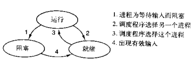
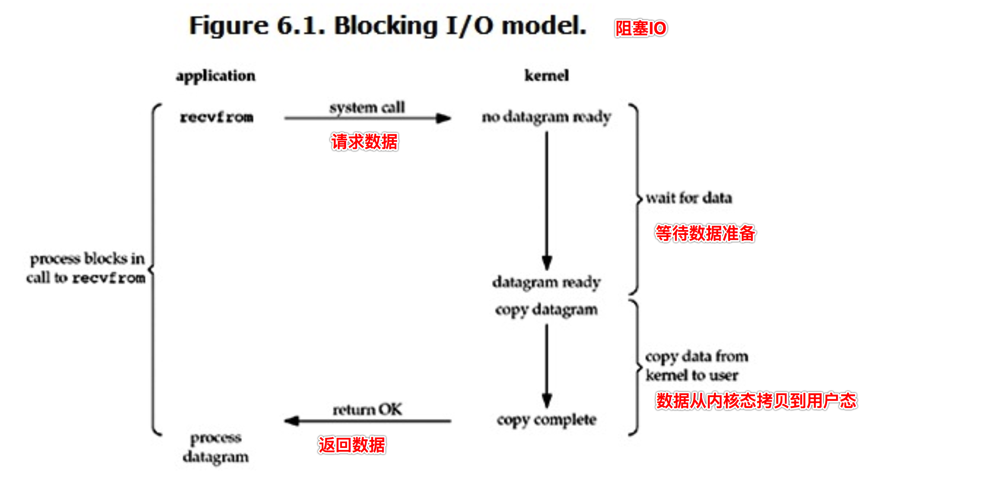
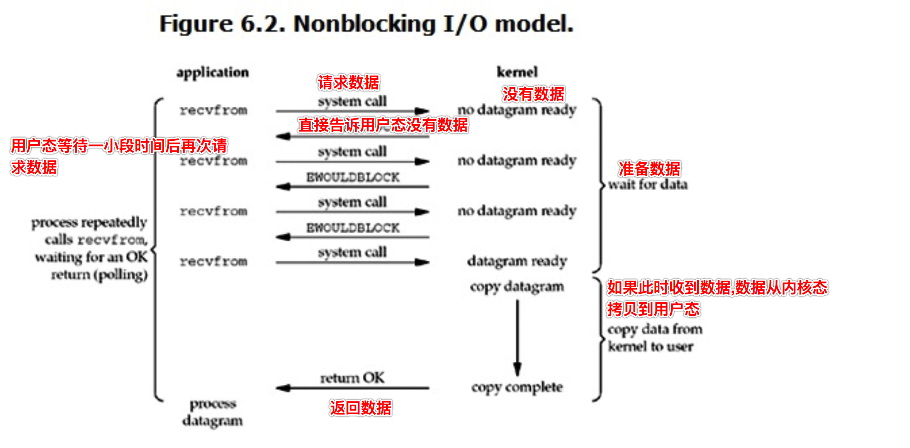
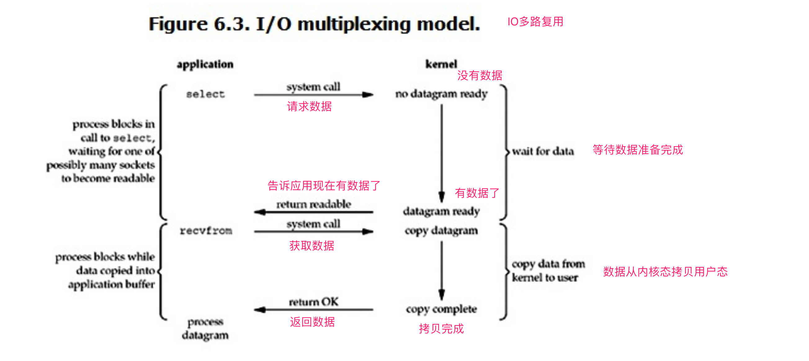
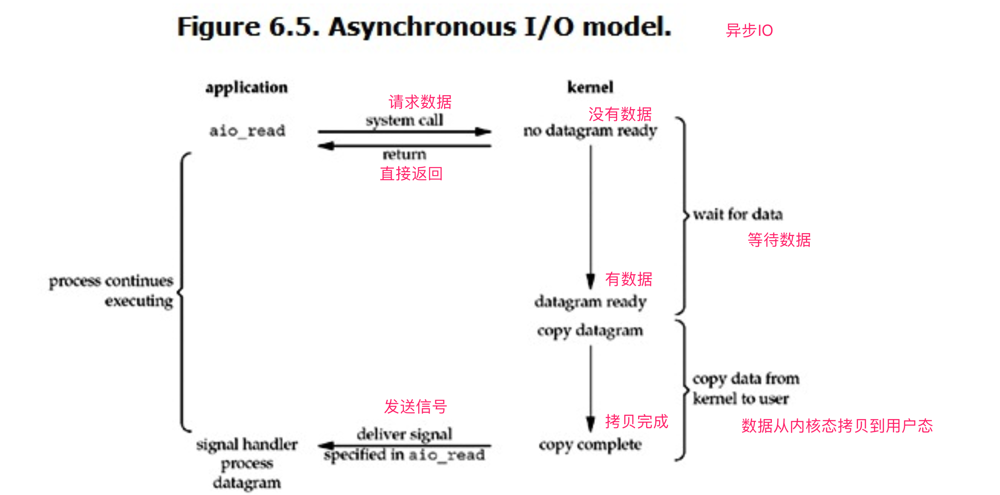

# 网络编程

## 并行/并发 阻塞/非阻塞 同步/异步

### 并行与并发

- **并行** : 并行是指两者同时执行，比如赛跑，两个人都在不停的往前跑；（资源够用，比如三个线程，四核的CPU ）

- **并发** : 并发是指资源有限的情况下，两者交替轮流使用资源，比如一段路(单核CPU资源)同时只能过一个人，A走一段后，让给B，B用完继续给A ，交替使用，目的是提高效率

```
区别:
并行是从微观上,在一个精确的时间片刻,有不同的程序在执行,这就要求必须有多个处理器。
并发是从宏观上，在一个时间段上可以看出是同时执行的，比如一个服务器同时处理多个session
```

### 同步与异步

- 所谓同步就是一个任务的完成需要依赖另外一个任务时，只有等待被依赖的任务完成后，依赖的任务才能算完成，这是一种可靠的任务序列。**要么成功都成功，失败都失败，两个任务的状态可以保持一致**
- 所谓异步是不需要等待被依赖的任务完成，只是通知被依赖的任务要完成什么工作，依赖的任务也立即执行，只要自己完成了整个任务就算完成了。**至于被依赖的任务最终是否真正完成，依赖它的任务无法确定**, 所以它是不可靠的任务序列

```
比如我去银行办理业务，可能会有两种方式：
第一种 ：选择排队等候；
第二种 ：选择取一个小纸条上面有我的号码，等到排到我这一号时由柜台的人通知我轮到我去办理业务了；

第一种：前者(排队等候)就是同步等待消息通知，也就是我要一直在等待银行办理业务情况；
第二种：后者(等待别人通知)就是异步等待消息通知。在异步消息处理中，等待消息通知者(在这个例子中就是等待办理业务的人)往往注册一个回调机制，在所等待的事件被触发时由触发机制(在这里是柜台的人)通过某种机制(在这里是写在小纸条上的号码，喊号)找到等待该事件的人
```

### 阻塞与非阻塞

阻塞和非阻塞这两个概念与程序（线程）等待消息通知(无所谓同步或者异步)时的状态有关。也就是说阻塞与非阻塞主要是程序（线程）等待消息通知时的状态角度来说的

```
继续上面的那个例子，不论是排队还是使用号码等待通知，如果在这个等待的过程中，等待者除了等待消息通知之外不能做其它的事情，那么该机制就是阻塞的，表现在程序中,也就是该程序一直阻塞在该函数调用处不能继续往下执行。
相反，有的人喜欢在银行办理这些业务的时候一边打打电话发发短信一边等待，这样的状态就是非阻塞的，因为他(等待者)没有阻塞在这个消息通知上，而是一边做自己的事情一边等待。

注意：同步非阻塞形式实际上是效率低下的，想象一下你一边打着电话一边还需要抬头看到底队伍排到你了没有。如果把打电话和观察排队的位置看成是程序的两个操作的话，这个程序需要在这两种不同的行为之间来回的切换，效率可想而知是低下的；而异步非阻塞形式却没有这样的问题，因为打电话是你(等待者)的事情，而通知你则是柜台(消息触发机制)的事情，程序没有在两种不同的操作中来回切换
```

### 同步/异步与阻塞/非阻塞

1. **同步阻塞形式**

   效率最低。拿上面的例子来说，就是你专心排队，什么别的事都不做

2. **异步阻塞形式**

   如果在银行等待办理业务的人`采用的是异步的方式去等待消息被触发（通知）`，也就是领了一张小纸条，假如在这段时间里他不能离开银行做其它的事情，那么很显然，这个人被阻塞在了这个等待的操作上面

   异步操作是可以被阻塞住的，只不过它不是在处理消息时阻塞，而是在等待消息通知时被阻塞

3. **同步非阻塞形式**

   实际上是效率低下的。

   想象一下你一边打着电话一边还需要抬头看到底队伍排到你了没有，如果把打电话和观察排队的位置看成是程序的两个操作的话，`这个程序需要在这两种不同的行为之间来回的切换`，效率可想而知是低下的

4. **异步非阻塞形式**

   效率更高，

   因为打电话是你(等待者)的事情，而通知你则是柜台(消息触发机制)的事情，`程序没有在两种不同的操作中来回切换`。

   比如说，这个人突然发觉自己烟瘾犯了，需要出去抽根烟，于是他告诉大堂经理说，排到我这个号码的时候麻烦到外面通知我一下，那么他就没有被阻塞在这个等待的操作上面，自然这个就是异步+非阻塞的方式了

**很多人会把同步和阻塞混淆，是因为很多时候同步操作会以阻塞的形式表现出来，同样的，很多人也会把异步和非阻塞混淆，因为异步操作一般都不会在真正的IO操作处被阻塞**

## 协程前篇

- 操作系统中**进程是资源分配的最小单位,线程是CPU调度的最小单位。**按道理来说我们已经算是把cpu的利用率提高很多了。但是我们知道无论是创建多进程还是创建多线程来解决问题，都要消耗一定的时间来创建进程、创建线程、以及管理他们之间的切换
- 随着我们对于效率的追求不断提高，**基于单线程来实现并发**又成为一个新的课题，即只用一个主线程（很明显可利用的cpu只有一个）情况下实现并发。这样就可以节省创建线进程所消耗的时间。
- **并发的本质：切换+保存状态**
- cpu正在运行一个任务，会在两种情况下切走去执行其他的任务（切换由操作系统强制控制），一种情况是该任务发生了阻塞，另外一种情况是该任务计算的时间过长



- 在介绍进程理论时，提及进程的三种执行状态，而线程才是执行单位，所以也可以将上图理解为线程的三种状态 

  - 其中第二种情况并不能提升效率，只是为了让cpu能够雨露均沾，实现看起来所有任务都被“同时”执行的效果，如果多个任务都是纯计算的，这种切换反而会降低效率

  - 为此我们可以基于yield来验证。yield本身就是一种在单线程下可以保存任务运行状态的方法

    1. yiled可以保存状态，yield的状态保存与操作系统的保存线程状态很像，但是yield是代码级别控制的，更轻量级
    2. send可以把一个函数的结果传给另外一个函数，以此实现单线程内程序之间的切换

  - 通过 yield 模拟方法之间的切换

    ```python
    def func1():
        print(1)
        yield
        print(3)
        yield
    
    
    def func2():
        gen = func1()
        next(gen)
        print(2)
        next(gen)
        print(4)
    
    
    if __name__ == '__main__':
        func2()
    
    # 1
    # 2
    # 3
    # 4
    ```

  - 通过yield模拟生产者消费者模型

    ```python
    import time
    
    
    def time_wrappter(func):
        def wrapper(*args, **kwargs):
            start_time = time.time()
            res = func(*args, **kwargs)
            end_time = time.time()
            print(f'时间消耗 {end_time - start_time}')
            return res
    
        return wrapper
    
    
    def consumer(data_list):
        for item in data_list:
            print(f'消费 {item}')
    
    
    @time_wrappter
    def producer():
        data_list = []
        for item in range(5):
            data_list.append(item)
    
        consumer(data_list)
    
    
    if __name__ == '__main__':
        producer()
    
    # 消费 0
    # 消费 1
    # 消费 2
    # 消费 3
    # 消费 4
    # 时间消耗 3.695487976074219e-05
    ```

    ```python
    import time
    
    
    def time_wrappter(func):
        def wrapper(*args, **kwargs):
            start_time = time.time()
            res = func(*args, **kwargs)
            end_time = time.time()
            print(f'时间消耗 {end_time - start_time}')
            return res
    
        return wrapper
    
    
    def consumer():
        while 1:
            res = yield
            print(f'消费 {res}')
    
    
    @time_wrappter
    def producer():
        gen = consumer()
        next(gen)
    
        for item in range(5):
            print(f'生产 {item}')
            gen.send(item)
    
    
    if __name__ == '__main__':
        producer()
    
    # 生产 0
    # 消费 0
    # 生产 1
    # 消费 1
    # 生产 2
    # 消费 2
    # 生产 3
    # 消费 3
    # 生产 4
    # 消费 4
    # 时间消耗 5.412101745605469e-05
    ```

    从上面的例子来看, 如果只是单纯的切换反而会影响效率

  - 在任务一遇到io情况下，切到任务二去执行，这样就可以利用任务一阻塞的时间完成任务二的计算，效率的提升就在于此. **对于yield来说,遇到io操作,程序会阻塞,并不会切换到该线程的其他任务去执行**

    ```python
    import time
    
    
    def time_wrappter(func):
        def wrapper(*args, **kwargs):
            start_time = time.time()
            res = func(*args, **kwargs)
            end_time = time.time()
            print(f'时间消耗 {end_time - start_time}')
            return res
    
        return wrapper
    
    
    def get_current_time():
        return time.strftime('%X')
    
    
    def consumer():
        while 1:
            res = yield
            time.sleep(2)
    
    
    @time_wrappter
    def producer():
        gen = consumer()
        next(gen)
    
        for item in range(5):
            print(f'生产者在 {get_current_time()} 生产 {item}')
            gen.send(item)
    
    
    if __name__ == '__main__':
        producer()
    
    # 生产者在 10:31:08 生产 0
    # 生产者在 10:31:10 生产 1
    # 生产者在 10:31:12 生产 2
    # 生产者在 10:31:14 生产 3
    # 生产者在 10:31:16 生产 4
    # 时间消耗 10.015597105026245
    ```
    
  - socket的非阻塞

    默认情况下, 服务端socket, 有两处地方会使当前线程处于阻塞状态, accept 与 recv . 而对于客户端 socket, 同样有两处地方会使当前线程处于阻塞状态, connect 与 recv

    如果需要将 socket 设置为非阻塞情况, 需要额外调用 setblocking(False)

    ```python
    import socket
    
    from p2 import config
    
    # 如果需要实现单线程实现并发, 首先就必须保证 socket 必须是非阻塞状态
    # 在设置非阻塞状态后, 又发现在 accept() 时出现了 BlockingIOError 异常
    # 那么在 Python 中有没有办法可以解决这种问题呢 ?
    
    sk = socket.socket()
    
    # 设置socket为非阻塞状态
    sk.setblocking(False)
    
    sk.setsockopt(socket.SOL_SOCKET, socket.SO_REUSEADDR, 1)
    sk.bind(config.IP_PORT)
    sk.listen(5)
    print("服务端开启")
    
    try:
        # 由于当前的 sk 是非阻塞状态, 所以不会等待客户端的连接, 但这个时候运行会报一个错误 BlockingIOError
        conn, addr = sk.accept()
        print(f"客户端连接成功 : {addr}")
    
        recv_bytes = conn.recv(config.BUF_SIZE)
    
        print(f"接收客户端发送的数据 : {str(recv_bytes, config.UTF8_ENCODING)}")
        conn.sendall(recv_bytes.upper())
    except BlockingIOError:
        print("程序报 BlockingIOError 异常")
    finally:
        conn.close()
        sk.close()
    
    """
    Traceback (most recent call last):
      File "/Users/chenjiawei/code/study/python/Demos/Demo1/p2/server.py", line 15, in <module>
        conn, addr = sk.accept()
      File "/Users/chenjiawei/anaconda3/lib/python3.7/socket.py", line 212, in accept
        fd, addr = self._accept()
    BlockingIOError: [Errno 35] Resource temporarily unavailable
    """
    ```

- **对于单线程下，我们不可避免程序中出现io操作，但如果我们能在自己的程序中（即用户程序级别，而非操作系统级别）控制单线程下的多个任务能在一个任务遇到io阻塞时就切换到另外一个任务去计算，这样就保证了该线程能够最大限度地处于就绪态，即随时都可以被cpu执行的状态，相当于我们在用户程序级别将自己的io操作最大限度地隐藏起来，从而可以迷惑操作系统，让其看到：该线程好像是一直在计算，io比较少，从而更多的将cpu的执行权限分配给我们的线程**
- 协程的本质就是在单线程下，由用户自己控制一个任务遇到io阻塞了就切换另外一个任务去执行，以此来提升效率。为了实现它，我们需要找寻一种可以同时满足以下条件的解决方案
  1. 可以控制多个任务之间的切换，切换之前将任务的状态保存下来，以便重新运行时，可以基于暂停的位置继续执行
  2. 作为1的补充：可以检测io操作，在遇到io操作的情况下才发生切换

## 协程

### 定义

- 是单线程下的并发，又称微线程，纤程。英文名Coroutine
- **协程是一种用户态的轻量级线程，即协程是由用户程序自己控制调度的**
- python的线程属于内核级别的，即由操作系统控制调度（如单线程遇到io或执行时间过长就会被迫交出cpu执行权限，切换其他线程运行）
- 单线程内开启协程，一旦遇到io，就会从应用程序级别（而非操作系统）控制切换，以此来提升效率（非io操作的切换与效率无关）

- 对比操作系统控制线程的切换，用户在单线程内控制协程的切换
  - 优点
    1. 协程的切换开销更小，属于程序级别的切换，操作系统完全感知不到，因而更加轻量级
    2. 单线程内就可以实现并发的效果，最大限度地利用cpu
  - 缺点
    1. 协程的本质是单线程下，无法利用多核，可以是一个程序开启多个进程，每个进程内开启多个线程，每个线程内开启协程
    2. 协程指的是单个线程，因而一旦协程出现阻塞，将会阻塞整个线程

### 特点

1. **必须在只有一个单线程里实现并发**
2. **修改共享数据不需要加锁**
3. **用户程序里自己保持多个控制流的上下文栈**
4. **一个协程遇到IO操作会自动切换到其他协程**

## Greenlet模块

- 模块安装 pip3 install greenlet

- 实现任务的切换

  ```python
  import greenlet
  
  
  def func1():
      print(1)
      g2.switch()
      print(3)
      g2.switch()
  
  
  def func2():
      print(2)
      g1.switch()
      print(4)
  
  
  if __name__ == '__main__':
      g1 = greenlet.greenlet(run=func1)
      g2 = greenlet.greenlet(run=func2)
  
      g1.switch()
  
  # 1
  # 2
  # 3
  # 4
  ```

- **单纯的切换(在没有io的情况下或者没有重复开辟内存空间的操作), 反而会降低程序的执行速度**

- greenlet只是提供了一种比generator更加便捷的切换方式，当切到一个任务执行时如果遇到io，那就原地阻塞，仍然是没有解决遇到IO自动切换来提升效率的问题

- 单线程里的这20个任务的代码通常会既有计算操作又有阻塞操作，我们完全可以在执行任务1时遇到阻塞，就利用阻塞的时间去执行任务2。。。。如此，才能提高效率，这就用到了Gevent模块

## Gevent模块

- 模块安装 pip3 install gevent
- Gevent 是一个第三方库，可以轻松通过gevent实现并发同步或异步编程，在gevent中用到的主要模式是**Greenlet** (底层使用了 greenlet), 它是以C扩展模块形式接入Python的轻量级协程。 Greenlet全部运行在主程序操作系统进程的内部，但它们被协作式地调度

### 用法

```
# 创建一个协程对象g1，spawn括号内第一个参数是函数名，如eat，后面可以有多个参数，可以是位置实参或关键字实参，都是传给函数eat的
g1 = gevent.spawn(func, 1, 2, 3, x=4, y=5)

g2 = gevent.spawn(func2)

g1.join()  # 等待g1结束
g2.join()  # 等待g2结束
# 或者上述两步合作一步：gevent.joinall([g1,g2])

g1.value  # 拿到func1的返回值
```

- 案例: 对IO操作进行自动切换

  ```python
  import gevent
  from gevent import monkey
  
  # 必须写在导包的前面
  # 作用:
  # 对于io阻塞, gevent只识别内部方法的io操作 (如 gevent.sleep)
  # 如果要对一些内部模块的io操作进行识别, 就需要添加这行代码 (如 time.sleep() , conn.recv() , socket.accept() , requests.get(url)等)
  monkey.patch_all()
  
  import time
  
  
  def func1(a, b):
      print(f'接收参数 a = {a} , b = {b}')
      time.sleep(2)
  
  
  def func2():
      time.sleep(3)
  
  
  if __name__ == '__main__':
      start_time = time.time()
      g1 = gevent.spawn(func1, 1, 2)
      g2 = gevent.spawn(func2)
  
      print(type(g1))
      # <class 'gevent._greenlet.Greenlet'>
  
      # 可以使用 joinall 替代下面的两步
      # g1.join()
      # g2.join()
  
      gevent.joinall((g1, g2))
  
      print(f'消耗时间 {time.time() - start_time}')
  
  # <class 'gevent._greenlet.Greenlet'>
  # 接收参数 a = 1 , b = 2
  # 消耗时间 3.0027689933776855
  ```

  如果不设置 monkey.patch_all() , gevent 可能不会识别

  ```python
  import gevent
  from gevent import monkey
  
  # 必须写在导包的前面
  # 作用:
  # 对于io阻塞, gevent只识别内部方法的io操作 (如 gevent.sleep)
  # 如果要对一些内部模块的io操作进行识别, 就需要添加这行代码 (如 time.sleep() , conn.recv() , socket.accept() , requests.get(url)等)
  # monkey.patch_all()
  
  import time
  
  
  def func1(a, b):
      print(f'接收参数 a = {a} , b = {b}')
      time.sleep(2)
  
  
  def func2():
      time.sleep(3)
  
  
  if __name__ == '__main__':
      start_time = time.time()
      g1 = gevent.spawn(func1, 1, 2)
      g2 = gevent.spawn(func2)
  
      print(type(g1))
      # <class 'gevent._greenlet.Greenlet'>
  
      # 可以使用 joinall 替代下面的两步
      # g1.join()
      # g2.join()
  
      gevent.joinall((g1, g2))
  
      print(f'消耗时间 {time.time() - start_time}')
  
  # <class 'gevent._greenlet.Greenlet'>
  # 接收参数 a = 1 , b = 2
  # 消耗时间 5.00868034362793
  ```

### dummy thread 虚拟的线程

```python
from gevent import monkey

monkey.patch_all()

import gevent
import time
from threading import current_thread


def func1():
    print(f'func1 当前线程 {current_thread().name}')
    time.sleep(2)


def func2():
    print(f'func2 当前线程 {current_thread().name}')
    time.sleep(3)


if __name__ == '__main__':
    print(f'主线程 {current_thread().name}')
    start_time = time.time()
    g1 = gevent.spawn(func1)
    g2 = gevent.spawn(func2)

    gevent.joinall((g1, g2))

# 主线程 MainThread
# func1 当前线程 DummyThread-1
# func2 当前线程 DummyThread-2
```

### 案例:爬取网页信息

```python
from gevent import monkey

monkey.patch_all()
import requests
from gevent import spawn
from gevent import joinall
import time


def get_response(url):
    time.sleep(1)
    response = requests.get(url)
    return {
        'url': response.url,
        'status_code': response.status_code,
        'content_length': len(response.content)
    }


if __name__ == '__main__':
    url_list = [
        'http://www.baidu.com',
        'http://www.qq.com',
        'http://www.taobao.com',
        'http://www.jd.com',
        'http://www.python.org'
    ]

    greenlet_list = []

    start_time = time.time()

    for item in url_list:
        let = spawn(get_response, item)
        greenlet_list.append(let)

    joinall(greenlet_list)

    for item in greenlet_list:
        print(item.value)

    end_time = time.time()
    print(f'消耗时间 : {end_time - start_time}')

# {'url': 'http://www.baidu.com/', 'status_code': 200, 'content_length': 2381}
# {'url': 'http://www.qq.com/', 'status_code': 200, 'content_length': 245600}
# {'url': 'http://www.taobao.com/market/global/index_new.php', 'status_code': 200, 'content_length': 167440}
# {'url': 'https://www.jd.com/', 'status_code': 200, 'content_length': 113043}
# {'url': 'https://www.python.org/', 'status_code': 200, 'content_length': 49385}
# 消耗时间 : 2.759645938873291
```

### 案例:通过协程实现socket通信

- 服务端

  ```python
  from gevent import monkey
  
  monkey.patch_all()
  
  import socket
  
  from config import common
  from gevent import spawn
  
  
  def handle_conn(conn, addr):
      print(f'客户端 {addr} 已经连接')
  
      try:
          while 1:
              recv_data = conn.recv(common.BUF)
              if not recv_data:
                  break
  
              data = recv_data.decode(common.ENCODING)
              print(f'服务端接收数据 {data}')
  
              conn.send(bytes(data.upper(), common.ENCODING))
      finally:
          if conn:
              conn.close()
  
  
  if __name__ == '__main__':
      sk = socket.socket()
      sk.setsockopt(socket.SOL_SOCKET, socket.SO_REUSEADDR, 1)
      sk.bind(common.IP_PORT)
      sk.listen()
      print(f'服务器已启动')
  
      try:
          while 1:
              conn, addr = sk.accept()
              spawn(handle_conn, conn, addr)
      finally:
          sk.close()
  ```

- 客户端

  ```python
  from gevent import monkey
  
  monkey.patch_all()
  
  import socket
  
  from config import common
  
  if __name__ == '__main__':
      sk = socket.socket()
      sk.connect(common.IP_PORT)
  
      while 1:
          data = input(">>> ").strip()
  
          if not data or data == 'q':
              break
  
          sk.send(bytes(data, common.ENCODING))
  
          data_recv = sk.recv(common.BUF)
          if not data_recv:
              break
  
          recv_data = data_recv.decode(common.ENCODING)
          print(f'客户端接收数据 {recv_data}')
  
      sk.close()
  ```

## IO模型

### 五种IO模型

- blocking IO --- 阻塞IO
- nonblocking IO --- 非阻塞IO
- IO multiplexing --- IO多路复用
- signal driven IO --- 信号驱动IO (使用的比较少)
- asynchronous IO --- 异步IO

IO发生时涉及的对象和步骤。对于一个network IO (这里我们以read举例)，它会涉及到两个系统对象，一个是调用这个IO的process (or thread)，另一个就是系统内核(kernel)。当一个read操作发生时，该操作会经历两个阶段

1. 等待数据准备
2. 将数据从内核拷贝到进程中

### 阻塞IO (blocking IO)



#### 示例代码 socket通信

- 服务端

  ```python
  import socket
  from config import common
  import random
  import time
  
  if __name__ == '__main__':
      sk = socket.socket()
      sk.setsockopt(socket.SOL_SOCKET, socket.SO_REUSEADDR, 1)
      sk.bind(common.IP_PORT)
      sk.listen()
  
      conn, addr = sk.accept()
  
      time.sleep(2)
  
      data = str(random.randint(1, 100))
      print(f'服务端发送数据 {data}')
      conn.send(bytes(data, common.ENCODING))
  
      conn.close()
      sk.close()
  ```

- 客户端

  ```python
  import socket
  import time
  
  from config import common
  
  
  def get_current_time():
      return time.strftime('%X')
  
  
  if __name__ == '__main__':
      sk = socket.socket()
      sk.connect(common.IP_PORT)
  
      print(f'等待接收数据, 时间 {get_current_time()}')
  
      data = sk.recv(common.BUF).decode(common.ENCODING)
  
      print(f'客户端接收到数据 {data} , 时间 {get_current_time()}')
  
      sk.close()
  
  # 等待接收数据, 时间 15:29:29
  # 客户端接收到数据 3 , 时间 15:29:31
  ```

- 当用户进程调用了recvfrom这个系统调用，kernel就开始了IO的第一个阶段：准备数据。对于network io来说，很多时候数据在一开始还没有到达（比如，还没有收到一个完整的UDP包），这个时候kernel就要等待足够的数据到来

- 而在用户进程这边，整个进程会被阻塞。当kernel一直等到数据准备好了，它就会将数据从kernel中拷贝到用户内存，然后kernel返回结果，用户进程才解除block的状态，重新运行起来

- **blocking IO的特点就是在IO执行的两个阶段（等待数据和拷贝数据两个阶段）都被block了**

- 网络编程都是从listen()、send()、recv() 等接口开始的，使用这些接口可以很方便的构建服务器/客户机的模型。然而大部分的socket接口都是阻塞型的

  所谓阻塞型接口是指系统调用（一般是IO接口）不返回调用结果并让当前线程一直阻塞，只有当该系统调用获得结果或者超时出错时才返回

- 实际上，除非特别指定，几乎所有的IO接口 ( 包括socket接口 ) 都是阻塞型的。这给网络编程带来了一个很大的问题，如在调用recv(1024)的同时，线程将被阻塞，在此期间，线程将无法执行任何运算或响应任何的网络请求

#### 阻塞IO的解决方案

- 在服务器端使用多线程（或多进程）。多线程（或多进程）的目的是让每个连接都拥有独立的线程（或进程），这样任何一个连接的阻塞都不会影响其他的连接

#### 该解决方案问题

- 开启多进程或都线程的方式，在遇到要同时响应成百上千路的连接请求，则无论多线程还是多进程都会严重占据系统资源，降低系统对外界响应效率，而且线程与进程本身也更容易进入假死状态

#### 改进方案

- 很多程序员可能会考虑使用“线程池”或“连接池”。“线程池”旨在减少创建和销毁线程的频率，其维持一定合理数量的线程，并让空闲的线程重新承担新的执行任务。“连接池”维持连接的缓存池，尽量重用已有的连接、减少创建和关闭连接的频率。这两种技术都可以很好的降低系统开销，都被广泛应用很多大型系统，如websphere、tomcat和各种数据库等

#### 改进方案存在的问题

- “线程池”和“连接池”技术也只是在一定程度上缓解了频繁调用IO接口带来的资源占用。而且，所谓“池”始终有其上限，当请求大大超过上限时，“池”构成的系统对外界的响应并不比没有池的时候效果好多少。所以使用“池”必须考虑其面临的响应规模，并根据响应规模调整“池”的大小

### 非阻塞IO (non-blocking IO)



#### 示例代码 socket通信

- 服务端

  ```python
  import socket
  from config import common
  
  if __name__ == '__main__':
      sk = socket.socket()
      sk.setsockopt(socket.SOL_SOCKET, socket.SO_REUSEADDR, 1)
      sk.bind(common.IP_PORT)
      sk.listen()
      # 设置为非阻塞IO
      sk.setblocking(False)
  
      # 已经连接成功的 conn 列表
      conn_l = []
      # 待删除的 conn 列表
      del_l = []
      while True:
          try:
              conn, addr = sk.accept()
              conn_l.append(conn)
          except BlockingIOError:
              for conn in conn_l:
                  try:
                      data = conn.recv(1024)
                      if not data:
                          del_l.append(conn)
                          continue
                      conn.send(data.upper())
                  except BlockingIOError:
                      pass
                  except ConnectionResetError:
                      del_l.append(conn)
  
              for conn in del_l:
                  conn_l.remove(conn)
                  conn.close()
              del_l = []
  ```

- 客户端

  ```python
  import socket
  import time
  
  from config import common
  
  
  def get_current_time():
      return time.strftime('%X')
  
  
  if __name__ == '__main__':
      sk = socket.socket()
      sk.connect(common.IP_PORT)
  
      sk.send(b'hello')
  
      print(f'等待接收数据, 时间 {get_current_time()}')
  
      data = sk.recv(common.BUF).decode(common.ENCODING)
  
      print(f'客户端接收到数据 {data} , 时间 {get_current_time()}')
  
      sk.close()
  
  # 等待接收数据, 时间 17:13:37
  # 客户端接收到数据 HELLO , 时间 17:13:37
  ```

#### 非阻塞IO的优缺点

- 优点

  能够在等待任务完成的时间里干其他活了, 包括提交其他任务，也就是 “后台” 可以有多个任务在“”同时“”执行

- 缺点

  1. 循环调用recv()将大幅度推高CPU占用率；这也是我们在代码中留一句time.sleep(2)的原因,否则在低配主机下极容易出现卡机情况

  2. 任务完成的响应延迟增大了，因为每过一段时间才去轮询一次read操作，而任务可能在两次轮询之间的任意时间完成。这会导致整体数据吞吐量的降低

此外，在这个方案中recv()更多的是起到检测“操作是否完成”的作用，实际操作系统提供了更为高效的检测“操作是否完成“作用的接口，例如select()多路复用模式，可以一次检测多个连接是否活跃

### 多路复用IO (IO multiplexing)

IO multiplexing这个词可能有点陌生，但是如果我说select/epoll，大概就都能明白了。有些地方也称这种IO方式为**事件驱动IO**(event driven IO)。我们都知道，select/epoll的好处就在于单个process就可以同时处理多个网络连接的IO。它的基本原理就是select/epoll这个function会不断的轮询所负责的所有socket，当某个socket有数据到达了，就通知用户进程



### 异步IO (Asynchronous I/O)

- Linux下的asynchronous IO其实用得不多，从内核2.6版本才开始引入



## 网络IO模型

### 多路复用IO


- 当用户进程调用了select，那么整个进程会被block，而同时，kernel会“监视”所有select负责的socket，当任何一个socket中的数据准备好了，select就会返回。这个时候用户进程再调用read操作，将数据从kernel拷贝到用户进程
- 这个图和blocking IO的图其实并没有太大的不同，事实上还更差一些。因为这里需要使用两个系统调用(select和recvfrom)，而blocking IO只调用了一个系统调用(recvfrom)。但是，用select的优势在于它可以同时处理多个connection

#### 总结

- **如果处理的连接数不是很高的话，使用select/epoll的web server不一定比使用multi-threading + blocking IO的web server性能更好，可能延迟还更大。select/epoll的优势并不是对于单个连接能处理得更快，而是在于能处理更多的连接**
- **在多路复用模型中，对于每一个socket，一般都设置成为non-blocking，但是，如上图所示，整个用户的process其实是一直被block的。只不过process是被select这个函数block，而不是被socket IO给block**
- **结论: select的优势在于可以处理多个连接，不适用于单个连接** 

#### 使用select的网络IO多路复用模型

- 服务端

  ```python
  import socket
  from config import common
  import select
  
  sk = socket.socket()
  sk.setsockopt(socket.SOL_SOCKET, socket.SO_REUSEADDR, 1)
  sk.bind(common.IP_PORT)
  sk.listen()
  # 设置为非阻塞
  sk.setblocking(False)
  print(f'服务端已经开启')
  
  # 这里存储 sk 对象及所有连接成功的 conn 对象
  read_list = [sk, ]
  
  
  def handle_sk():
      # 此时的accept不是阻塞的,因为只有新的客户端连接过来才能回调这个 handle_sk 方法
      conn, addr = sk.accept()
      print(f'客户端 {addr} 连接成功')
      read_list.append(conn)
  
  
  def handle_conn(conn):
      try:
          recv_data = conn.recv(common.BUF).decode(common.ENCODING)
          if not recv_data:
              conn.close()
              read_list.remove(conn)
              return
  
          print(f'服务端接收数据 {recv_data}')
          conn.send(bytes(recv_data.upper(), common.ENCODING))
  
      except ConnectionResetError:
          conn.close()
          read_list.remove(conn)
  
  
  if __name__ == '__main__':
      while 1:
          # 使用select模块进行监听
          r_list, w_list, x_list = select.select(read_list, [], [])
  
          for item in r_list:
              if item == sk:
                  # 有新的客户端进行连接
                  handle_sk()
              else:
                  # conn收到了数据
                  handle_conn(item)
  ```

- 客户端

  ```python
  import socket
  from config import common
  
  if __name__ == '__main__':
      sk = socket.socket()
      sk.connect(common.IP_PORT)
  
      while 1:
          data = input(">>> ").strip()
          if not data:
              break
  
          sk.send(bytes(data, common.ENCODING))
  
          data_recv = sk.recv(common.BUF).decode(common.ENCODING)
          print(f'客户端接收数据 {data_recv}')
  
      sk.close()
  ```

#### 使用 select 模块实现单线程的并发操作

- 单线程并发请求多个链接

  ```python
  import socket
  import select
  import datetime
  
  
  class Request:
  
      def __init__(self, sk, request_url, func):
          self.sk = sk
          self.request_url = request_url
          self.func = func
  
      def fileno(self):
          return self.sk.fileno()
  
  
  class Client:
  
      def __init__(self):
          # 所有的 socket 发送/接收数据 对象
          self.sk_list = list()
          # 所有的 socket 连接对象
          self.conn_list = list()
  
      def add(self, url, func):
          sk = socket.socket()
          # socket 为非阻塞状态
          sk.setblocking(False)
  
          try:
              sk.connect((url, 80))
          except BlockingIOError:
              pass
  
          req = Request(sk, url, func)
          self.sk_list.append(req)
          self.conn_list.append(req)
  
      def run(self):
          while 1:
              # rlist, wlist, elist = select.select(list1, list2, list3, time)
              # 内部会对 list1, list2, list3 中的每个对象调用对象的 fileno 方法, 获取一个值进行保存
              # 当 time 时间后, 如果这个值发生了改变, 会将变化的对象返回到对应的列表参数中
              # 例如: 当 list1 中的对象发生改变后, rlist 的列表中会有这个被改变的成员
  
              # rlist 中保存已经可以读取数据的 socket 对象
              # wlist 中保存已经连接成功的 socket 对象
              # elist 中保存发生错误的对象, 示例中此处这里没有设置
              # 最后一个参数为时间, 代表每隔一段时间检查一次数据是否发生变化, 单位为秒
              rlist, wlist, elist = select.select(self.sk_list, self.conn_list, [], 0.005)
  
              # 当连接成功后, 发送网络请求
              for item_write_socket in wlist:
                  # item_write_socket 是上方 Request 对象
                  request_data = f'GET /s?wd=alex HTTP/1.0\r\nhost:{item_write_socket.request_url}\r\n\r\n'
                  item_write_socket.sk.sendall(bytes(request_data, 'utf-8'))
                  self.conn_list.remove(item_write_socket)
  
              # 当响应数据返回时, 调用对应的回调方法
              for item_read_socket in rlist:
                  # item_read_socket 是上方 Request 对象
  
                  # 保存所有的响应数据
                  response_list = list()
                  while 1:
                      try:
                          item_response_data = item_read_socket.sk.recv(8096)
                          if not item_response_data:
                              break
  
                          response_list.append(item_response_data)
                      except BlockingIOError:
                          pass
  
                  response = b''.join(response_list)
                  # 调用 Request 对象的回调函数 func
                  item_read_socket.func(response)
  
                  # 关闭socket
                  item_read_socket.sk.close()
                  self.sk_list.remove(item_read_socket)
  
              # 当 self.sk_list 的数据为空时, 代表所有的请求都已经接收到对应的数据
              if not self.sk_list:
                  break
  
  
  def handle_response(response):
      time_str = datetime.datetime.now().strftime('%Y-%m-%d %X')
      print(f'{time_str} 收到数据 : {response}')
  
  
  if __name__ == '__main__':
      client = Client()
      client.add('www.baidu.com', handle_response)
      client.add('www.qq.com', handle_response)
      client.add('www.163.com', handle_response)
      client.run()
  ```

#### select 监听fd变化过程分析

- 用户进程创建socket对象，拷贝监听的fd到内核空间，每一个fd会对应一张系统文件表，内核空间的fd响应到数据后，就会发送信号给用户进程数据已到；
- 用户进程再发送系统调用，比如（accept）将内核空间的数据copy到用户空间，同时作为接受数据端内核空间的数据清除，这样重新监听时fd再有新的数据又可以响应到了（发送端因为基于TCP协议所以需要收到应答后才会清除）。

- 优点

  相比其他模型，使用select() 的事件驱动模型只用单线程（进程）执行，占用资源少，不消耗太多 CPU，同时能够为多客户端提供服务。如果试图建立一个简单的事件驱动的服务器程序，这个模型有一定的参考价值

- 缺点

  1. 首先select()接口并不是实现“事件驱动”的最好选择。因为当需要探测的句柄值较大时，select()接口本身需要消耗大量时间去轮询各个句柄
  2. 很多操作系统提供了更为高效的接口，如linux提供了epoll，BSD提供了kqueue，Solaris提供了/dev/poll
  3. 如果需要实现更高效的服务器程序，类似epoll这样的接口更被推荐。遗憾的是不同的操作系统特供的epoll接口有很大差异. 所以使用类似于epoll的接口实现具有较好跨平台能力的服务器会比较困难
  4. 其次，该模型将事件探测和事件响应夹杂在一起，一旦事件响应的执行体庞大，则对整个模型是灾难性的

## 五种IO模型的比较


## selectors模块

IO复用：为了解释这个名词，首先来理解下复用这个概念，复用也就是共用的意思，这样理解还是有些抽象，为此，咱们来理解下复用在通信领域的使用，在通信领域中为了充分利用网络连接的物理介质，往往在同一条网络链路上采用时分复用或频分复用的技术使其在同一链路上传输多路信号，到这里我们就基本上理解了复用的含义，即公用某个“介质”来尽可能多的做同一类(性质)的事

IO复用的“介质”是什么呢？为此我们首先来看看服务器编程的模型，客户端发来的请求服务端会产生一个进程来对其进行服务，每当来一个客户请求就产生一个进程来服务，然而进程不可能无限制的产生，因此为了解决大量客户端访问的问题，引入了IO复用技术，即：一个进程可以同时对多个客户请求进行服务。也就是说IO复用的“介质”是进程(准确的说复用的是select和poll，因为进程也是靠调用select和poll来实现的)，复用一个进程(select和poll)来对多个IO进行服务，虽然客户端发来的IO是并发的但是IO所需的读写数据多数情况下是没有准备好的，因此就可以利用一个函数(select和poll)来监听IO所需的这些数据的状态，一旦IO有数据可以进行读写了，进程就来对这样的IO进行服务

### IO复用中的三个API(select、poll和epoll)的区别和联系

select，poll，epoll都是IO多路复用的机制，I/O多路复用就是通过一种机制，可以监视多个描述符，一旦某个描述符就绪（一般是读就绪或者写就绪），能够通知应用程序进行相应的读写操作。但select，poll，epoll本质上都是同步I/O，因为他们都需要在读写事件就绪后自己负责进行读写，也就是说这个读写过程是阻塞的，而异步I/O则无需自己负责进行读写，异步I/O的实现会负责把数据从内核拷贝到用户空间

```
三者的原型如下所示：

int select(int nfds, fd_set *readfds, fd_set *writefds, fd_set *exceptfds, struct timeval *timeout);

int poll(struct pollfd *fds, nfds_t nfds, int timeout);

int epoll_wait(int epfd, struct epoll_event *events, int maxevents, int timeout);
```

#### select

select的第一个参数nfds为fdset集合中最大描述符值加1，fdset是一个位数组，其大小限制为__FD_SETSIZE（1024），位数组的每一位代表其对应的描述符是否需要被检查。第二三四参数表示需要关注读、写、错误事件的文件描述符位数组，这些参数既是输入参数也是输出参数，可能会被内核修改用于标示哪些描述符上发生了关注的事件，所以每次调用select前都需要重新初始化fdset。timeout参数为超时时间，该结构会被内核修改，其值为超时剩余的时间

- select的调用步骤
  1. 使用copy_from_user从用户空间拷贝fdset到内核空间
  2. 注册回调函数__pollwait
  3. 遍历所有fd，调用其对应的poll方法（对于socket，这个poll方法是sock_poll，sock_poll根据情况会调用到tcp_poll,udp_poll或者datagram_poll）
  4. 以tcp_poll为例，其核心实现就是__pollwait，也就是上面注册的回调函数
  5. __pollwait的主要工作就是把current（当前进程）挂到设备的等待队列中，不同的设备有不同的等待队列，对于tcp_poll 来说，其等待队列是sk->sk_sleep（注意把进程挂到等待队列中并不代表进程已经睡眠了）。在设备收到一条消息（网络设备）或填写完文件数 据（磁盘设备）后，会唤醒设备等待队列上睡眠的进程，这时current便被唤醒了
  6. poll方法返回时会返回一个描述读写操作是否就绪的mask掩码，根据这个mask掩码给fd_set赋值
  7. 如果遍历完所有的fd，还没有返回一个可读写的mask掩码，则会调用schedule_timeout是调用select的进程（也就是 current）进入睡眠。当设备驱动发生自身资源可读写后，会唤醒其等待队列上睡眠的进程。如果超过一定的超时时间（schedule_timeout 指定），还是没人唤醒，则调用select的进程会重新被唤醒获得CPU，进而重新遍历fd，判断有没有就绪的fd
  8. 把fd_set从内核空间拷贝到用户空间
- select的几大缺点
  1. 每次调用select，都需要把fd集合从用户态拷贝到内核态，这个开销在fd很多时会很大
  2. 同时每次调用select都需要在内核遍历传递进来的所有fd，这个开销在fd很多时也很大
  3. select支持的文件描述符数量太小了，默认是1024

#### poll

poll与select不同，通过一个pollfd数组向内核传递需要关注的事件，故没有描述符个数的限制，pollfd中的events字段和revents分别用于标示关注的事件和发生的事件，故pollfd数组只需要被初始化一次

poll的实现机制与select类似，其对应内核中的sys_poll，只不过poll向内核传递pollfd数组，然后对pollfd中的每个描述符进行poll，相比处理fdset来说，poll效率更高。poll返回后，需要对pollfd中的每个元素检查其revents值，来得指事件是否发生

#### epoll

直到Linux2.6才出现了由内核直接支持的实现方法，那就是epoll，被公认为Linux2.6下性能最好的多路I/O就绪通知方法。epoll可以同时支持水平触发和边缘触发（Edge Triggered，只告诉进程哪些文件描述符刚刚变为就绪状态，它只说一遍，如果我们没有采取行动，那么它将不会再次告知，这种方式称为边缘触发），理论上边缘触发的性能要更高一些，但是代码实现相当复杂。epoll同样只告知那些就绪的文件描述符，而且当我们调用epoll_wait()获得就绪文件描述符时，返回的不是实际的描述符，而是一个代表就绪描述符数量的值，你只需要去epoll指定的一个数组中依次取得相应数量的文件描述符即可，这里也使用了内存映射（mmap）技术，这样便彻底省掉了这些文件描述符在系统调用时复制的开销。另一个本质的改进在于epoll采用基于事件的就绪通知方式。在select/poll中，进程只有在调用一定的方法后，内核才对所有监视的文件描述符进行扫描，而epoll事先通过epoll_ctl()来注册一个文件描述符，一旦基于某个文件描述符就绪时，内核会采用类似callback的回调机制，迅速激活这个文件描述符，当进程调用epoll_wait()时便得到通知

epoll既然是对select和poll的改进，就应该能避免上述的三个缺点。那epoll都是怎么解决的呢？在此之前，我们先看一下epoll 和select和poll的调用接口上的不同，select和poll都只提供了一个函数——select或者poll函数。而epoll提供了三个函 数，epoll_create,epoll_ctl和epoll_wait，epoll_create是创建一个epoll句柄；epoll_ctl是注 册要监听的事件类型；epoll_wait则是等待事件的产生

对于第一个缺点，epoll的解决方案在epoll_ctl函数中。每次注册新的事件到epoll句柄中时（在epoll_ctl中指定 EPOLL_CTL_ADD），会把所有的fd拷贝进内核，而不是在epoll_wait的时候重复拷贝。epoll保证了每个fd在整个过程中只会拷贝 一次

对于第二个缺点，epoll的解决方案不像select或poll一样每次都把current轮流加入fd对应的设备等待队列中，而只在 epoll_ctl时把current挂一遍（这一遍必不可少）并为每个fd指定一个回调函数，当设备就绪，唤醒等待队列上的等待者时，就会调用这个回调 函数，而这个回调函数会把就绪的fd加入一个就绪链表）。epoll_wait的工作实际上就是在这个就绪链表中查看有没有就绪的fd（利用 schedule_timeout()实现睡一会，判断一会的效果，和select实现中的第7步是类似的）

对于第三个缺点，epoll没有这个限制，它所支持的FD上限是最大可以打开文件的数目，这个数字一般远大于2048,举个例子, 在1GB内存的机器上大约是10万左右，具体数目可以cat /proc/sys/fs/file-max察看,一般来说这个数目和系统内存关系很大

### 总结

- select，poll实现需要自己不断轮询所有fd集合，直到设备就绪，期间可能要睡眠和唤醒多次交替。而epoll其实也需要调用 epoll_wait不断轮询就绪链表，期间也可能多次睡眠和唤醒交替，但是它是设备就绪时，调用回调函数，把就绪fd放入就绪链表中，并唤醒在 epoll_wait中进入睡眠的进程。虽然都要睡眠和交替，但是select和poll在“醒着”的时候要遍历整个fd集合，而epoll在“醒着”的 时候只要判断一下就绪链表是否为空就行了，这节省了大量的CPU时间，这就是回调机制带来的性能提升
- select，poll每次调用都要把fd集合从用户态往内核态拷贝一次，并且要把current往设备等待队列中挂一次，而epoll只要 一次拷贝，而且把current往等待队列上挂也只挂一次（在epoll_wait的开始，注意这里的等待队列并不是设备等待队列，只是一个epoll内 部定义的等待队列），这也能节省不少的开销
- select 最多1024个socket, 循环去检测 (水平触发)
- pool 不限制socket的个数, 循环去检测 (水平触发)
- epool 不限制socket的个数, 通过回调方式进行触发 (边缘触发)

**这三种IO多路复用模型在不同的平台有着不同的支持，而epoll在windows下就不支持，好在我们有selectors模块，帮我们默认选择当前平台下最合适的**

### 案例: socket通信

- 服务端

  ```python
  from socket import *
  import selectors
  
  # 获取当前平台下最适用的 selector
  sel = selectors.DefaultSelector()
  
  
  def accept(server_fileobj, mask):
      conn, addr = server_fileobj.accept()
      sel.register(conn, selectors.EVENT_READ, read)
  
  
  def read(conn, mask):
      try:
          data = conn.recv(1024)
          if not data:
              print('closing', conn)
              sel.unregister(conn)
              conn.close()
              return
          conn.send(data.upper() + b'_SB')
      except Exception:
          print('closing', conn)
          sel.unregister(conn)
          conn.close()
  
  
  sk = socket(AF_INET, SOCK_STREAM)
  sk.setsockopt(SOL_SOCKET, SO_REUSEADDR, 1)
  sk.bind(('127.0.0.1', 8088))
  sk.listen(5)
  # 设置socket的接口为非阻塞
  sk.setblocking(False)
  # 相当于网select的读列表里append了一个文件句柄server_fileobj,并且绑定了一个回调函数accept
  sel.register(sk, selectors.EVENT_READ, accept)
  
  while True:
      # 检测所有的sk，是否有完成wait data的
      events = sel.select()
      for sel_obj, mask in events:
          # 对于对象的回调函数调用回调方法
          callback = sel_obj.data  # callback = accpet
          callback(sel_obj.fileobj, mask)  # accpet(server_fileobj, 1)
  ```

- 客户端

  ```python
  from socket import *
  
  c = socket(AF_INET, SOCK_STREAM)
  c.connect(('127.0.0.1', 8088))
  
  while True:
      msg = input('>>: ')
      if not msg:
          continue
      c.send(msg.encode('utf-8'))
      data = c.recv(1024)
      print(data.decode('utf-8'))
  ```


