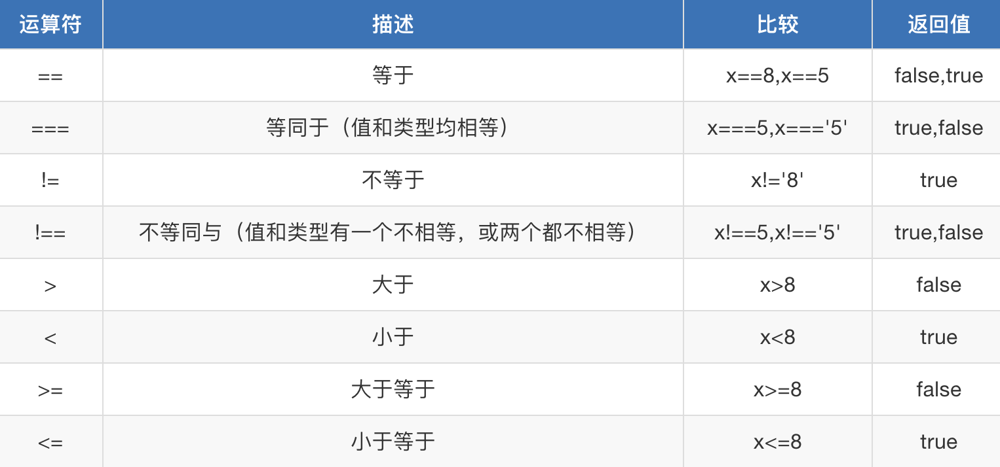

# Javascript, DOM

## 概述

### 组成

JavaScript基础分为三个部分：

- ECMAScript：JavaScript的语法标准。包括变量、表达式、运算符、函数、if语句、for语句等
- **DOM**：操作**网页上的元素**的API。比如让盒子移动、变色、轮播图等
- **BOM**：操作**浏览器部分功能**的API。比如让浏览器自动滚动

### 特点

- 简单易用：可以使用任何文本编辑工具编写，只需要浏览器就可以执行程序。
- 解释执行（**解释语言**）：事先不编译、逐行执行、无需进行严格的变量声明。
- 基于对象：内置大量现成对象，编写少量程序可以完成目标

## 第一个js代码

### 标签

```html
<!DOCTYPE html>
<html lang="en">
<head>
    <meta charset="UTF-8">
    <title>Title</title>
    
    <script type="text/javascript">
        // js代码
    </script>

</head>
<body>

</body>
</html>
```

### alert语句

**弹出“警告框”**

```html
<script type="text/javascript">
	alert("hello js");
</script>
```

### 语法规则

- JavaScript对换行、缩进、空格不敏感。

  备注：每一条语句末尾要加上分号，虽然分号不是必须加的，但是为了程序今后要压缩，如果不加分号，压缩之后将不能运行。

- 所有的符号，都是英语的。比如**括号**、引号、分号

- 注释

  ```html
  <script type="text/javascript">
    // 单行注释
  
    /*
    多行注释
    */
  </script>
  ```

### 控制台输出

`console.log("")`表示在控制台中输出。console表示“控制台”，log表示“输出”

### 用户输入

`prompt()`就是专门用来弹出能够让用户输入的对话框

**prompt()语句中，用户不管输入什么内容，都是字符串**

```html
<!DOCTYPE html>
<html lang="en">
<head>
    <meta charset="UTF-8">
    <title>Title</title>

    <script type="text/javascript">
        // let 接收的 age 不可进行更改
        let age = prompt("请输入年龄:");
        alert(age);
    </script>

</head>
<body>

</body>
</html>
```

### 常量

- const定义常量，只能在块作用域里访问，也不能跨函数访问，使用时必须初始化(即必须赋值)，而且不能修改

```html
<!DOCTYPE html>
<html lang="en">
<head>
    <meta charset="UTF-8">
    <title>Title</title>

    <script type="text/javascript">
        // 常量
        const num1 = 10;
    </script>

</head>
<body>

</body>
</html>
```

### 变量

- var定义变量，没有块的概念，可以跨块访问，不能跨函数访问，不初始化出现undefined，不会报错
- let定义变量，只能在块作用域里访问，也不能跨函数访问，对函数外部无影响

```html
<script type="text/javascript">
    // 块作用域
    {
　　　　 var a = 1;
        let b = 2;
        const c = 3;
        // c = 4; // 报错，const不能修改

        var aa;
        let bb;
        // const cc; // 报错，必须初始化(即必须赋值)

        console.log(a); // 1
        console.log(b); // 2
        console.log(c); // 3
    }
  
    console.log(a); // 1
    // console.log(b); // 报错，只能在块作用域里访问
    // console.log(c); // 报错，只能在块作用域里访问

    // 函数作用域
    (function A() {

        var d = 5;
        let e = 6;
        const f = 7;

        console.log(d); // 5
        console.log(e); // 6  (在同一个{ }中,也属于同一个块，可以正常访问到)
        console.log(f); // 7  (在同一个{ }中,也属于同一个块，可以正常访问到)

    })();
　　
　　// console.log(d); // 报错，不能跨函数访问 
　　// console.log(e); // 报错，不能跨函数访问 
　　// console.log(f); // 报错，不能跨函数访问 
</script>
```

### 命名规范

- 变量名有命名规范：只能由英语字母、数字、下划线、美元符号$构成，且不能以数字开头，并且不能是JavaScript关键字

- 关键字

  ```
  abstract、boolean、byte、char、class、const、debugger、double、enum、export、extends、final、float、goto
  implements、import、int、interface、long、native、package、private、protected、public、short、static、super、synchronized、throws、transient、volatile
  ```

### 变量的类型

#### 数值型: number

```html
<!DOCTYPE html>
<html lang="en">
<head>
    <meta charset="UTF-8">
    <title>Title</title>

    <script type="text/javascript">
        var num1 = 10;
        console.log(num1);
        
        // typeof 获取变量的类型, 类似于 Python 中的 type()
        console.log(typeof num1);
    </script>

</head>
<body></body>
</html>
```

#### 字符串: string

```html
<!DOCTYPE html>
<html lang="en">
<head>
    <meta charset="UTF-8">
    <title>Title</title>

    <script type="text/javascript">
        var numString = "10";
        console.log(numString);

        // typeof 获取变量的类型, 类似于 Python 中的 type()
        console.log(typeof numString);
    </script>

</head>
<body></body>
</html>
```

#### 布尔型: boolean

```html
<!DOCTYPE html>
<html lang="en">
<head>
    <meta charset="UTF-8">
    <title>Title</title>

    <script type="text/javascript">
        var b1 = true;
        console.log(b1);
        console.log(typeof b1);

        // 取相反的结果
        var b2 = !b1;
        console.log(b2);
    </script>

</head>
<body></body>
</html>
```

#### 空对象: null

```html
<!DOCTYPE html>
<html lang="en">
<head>
    <meta charset="UTF-8">
    <title>Title</title>

    <script type="text/javascript">
        // 空对象
        var obj1 = null;
        console.log(obj1);
        console.log(typeof obj1);
    </script>

</head>
<body></body>
</html>
```

#### 未定义: undefined

```html
<!DOCTYPE html>
<html lang="en">
<head>
    <meta charset="UTF-8">
    <title>Title</title>

    <script type="text/javascript">
        // 空对象
        var obj1 = undefined;
        var obj2;

        console.log(obj1);
        console.log(typeof obj1);

        console.log(obj2);
        console.log(typeof obj2);
    </script>

</head>
<body></body>
</html>
```

### 类型转换

#### 字符串转换为数值型

```html
<!DOCTYPE html>
<html lang="en">
<head>
    <meta charset="UTF-8">
    <title>Title</title>

    <script type="text/javascript">
        // 字符串转换为整型
        console.log(parseInt("10") + 10);
        // 字符串转换为浮点型
        console.log(parseFloat("10.5") + 10);
    </script>

</head>
<body></body>
</html>
```

#### 数值型转换为字符串

- 隐式转换

  ```html
  <!DOCTYPE html>
  <html lang="en">
  <head>
      <meta charset="UTF-8">
      <title>Title</title>
  
      <script type="text/javascript">
          var age = 20;
  
          // 转换为字符串类型
          var ageString = age + "";
          console.log(ageString);
          console.log(typeof ageString);
      </script>
  
  </head>
  <body></body>
  </html>
  ```

- 强制类型转换

  ```html
  <!DOCTYPE html>
  <html lang="en">
  <head>
      <meta charset="UTF-8">
      <title>Title</title>
  
      <script type="text/javascript">
          var age = 20;
  
          // 转换为字符串类型
  
          // 方式1 : String()
          var ageString1 = String(age);
          console.log(ageString1);
          console.log(typeof ageString1);
  
          // 方式2 : toString
          var ageString2 = age.toString()
          console.log(ageString2);
      </script>
  
  </head>
  <body></body>
  </html>
  ```

- 格式化输出

  ```html
  <!DOCTYPE html>
  <html lang="en">
  <head>
      <meta charset="UTF-8">
      <title>Title</title>
  
      <script type="text/javascript">
          var age = 20;
  
          // 注意符号, 使用 `
          var value1 = `今年${age}岁了`;
          console.log(value1);
      </script>
  
  </head>
  <body></body>
  </html>
  ```
  
- 布尔类型的转换

  ```html
  <!DOCTYPE html>
  <html lang="en">
  <head>
      <meta charset="UTF-8">
      <title>Title</title>
  
      <script type="text/javascript">
          // 以下均为 false
          console.log(Boolean(undefined))
          console.log(Boolean(0))
          console.log(Boolean(null))
          console.log(Boolean(NaN))
          console.log(Boolean(""))
      </script>
  
  </head>
  <body></body>
  </html>
  ```

### 运算符

- 赋值运算符

  x = 12

  y = 5

  

- 算数运算符

  a = 5

  b = 2

  

- 比较运算符

  x = 5

  

### 流程控制

#### if

```html
<!DOCTYPE html>
<html lang="en">
<head>
    <meta charset="UTF-8">
    <title>Title</title>

    <script type="text/javascript">
        let value = 10;
        
        if (value > 0) {
            console.log(">0");
        } else if (value === 0) {
            console.log("=0");
        } else {
            console.log("<0");
        }
    </script>

</head>
<body></body>
</html>
```

#### && ||

```html
<!DOCTYPE html>
<html lang="en">
<head>
    <meta charset="UTF-8">
    <title>Title</title>

    <script type="text/javascript">
        let value = 10;

        if (value > 0 && value < 100) {
            console.log("条件均成立");
        }

        if (value < 0 || value > 100) {
            console.log("至少一条件成立");
        }
    </script>

</head>
<body></body>
</html>
```

#### switch

```html
<!DOCTYPE html>
<html lang="en">
<head>
    <meta charset="UTF-8">
    <title>Title</title>

    <script type="text/javascript">
        let level = "A";
        switch (level) {
            case "A":
                console.log("优秀");
                break;
            case "B":
                console.log("及格");
                break;
            default:
                console.log("不及格");
        }
    </script>

</head>
<body></body>
</html>
```

#### while

```html
<!DOCTYPE html>
<html lang="en">
<head>
    <meta charset="UTF-8">
    <title>Title</title>

    <script type="text/javascript">
        let sum = 0;
        let index = 0;
        while (index <= 100) {
            sum += index;
            index++;
        }
        console.log(`sum = ${sum}`);
    </script>

</head>
<body></body>
</html>
```

#### do..while

```html
<!DOCTYPE html>
<html lang="en">
<head>
    <meta charset="UTF-8">
    <title>Title</title>

    <script type="text/javascript">
        let sum = 0;
        let index = 0;
        do {
            sum += index;
            index++;
        } while (index <= 100);
        console.log(`sum = ${sum}`);
    </script>

</head>
<body></body>
</html>
```

#### for

```html
<!DOCTYPE html>
<html lang="en">
<head>
    <meta charset="UTF-8">
    <title>Title</title>

    <script type="text/javascript">
        let sum = 0;
        for (let index = 0; index <= 100; index++) {
            sum += index;
        }
        console.log(`sum = ${sum}`);
    </script>

</head>
<body></body>
</html>
```

### 函数

```html
<!DOCTYPE html>
<html lang="en">
<head>
    <meta charset="UTF-8">
    <title>Title</title>

    <script type="text/javascript">

        // 定义函数
        function test1(x, y) {
            return x + y;
        }

        function test2() {
            // 可以通过 arguments 获取函数的实参
            console.log(`实参的个数 : ${arguments.length}`)
            return arguments[0] + arguments[1];
        }

        // 调用函数
        console.log(test1(10, 20));
        console.log(test2(10, 30));
    </script>

</head>
<body></body>
</html>
```

## DOM

### js的组成

JavaScript基础分为三个部分：

- ECMAScript：JavaScript的语法标准。包括变量、表达式、运算符、函数、if语句、for语句等。
- **DOM**：文档对象模型，操作**网页上的元素**的API。比如让盒子移动、变色、轮播图等。
- **BOM**：浏览器对象模型，操作**浏览器部分功能**的API。比如让浏览器自动滚动。

### 事件

- JS是以事件驱动为核心的一门语言

- 三要素

  - 事件源：引发后续事件的html标签
  - 事件：js已经定义好了
  - 事件驱动程序：对样式和html的操作。也就是DOM

- 常见事件

  

#### 事件源的获取

```html
<!DOCTYPE html>
<html lang="en">
<head>
    <meta charset="UTF-8">
    <title>Title</title>

    <style type="text/css">
        #div1 {
            width: 200px;
            height: 200px;
            background-color: red;
        }
    </style>

</head>
<body>

<div id="div1" class="div1"></div>

<script type="text/javascript">

    // 获取事件源

    // 根据 id 获取
    let divElement1 = document.getElementById("div1");
    // 根据 class 获取
    let divElement2 = document.getElementsByClassName("div1")[0];
    // 根据 标签 获取
    let divElement3 = document.getElementsByTagName("div")[0];

</script>

</body>
</html>
```

#### 事件绑定

```html
<!DOCTYPE html>
<html lang="en">
<head>
    <meta charset="UTF-8">
    <title>Title</title>

    <style type="text/css">
        #div1 {
            width: 200px;
            height: 200px;
            background-color: red;
        }
    </style>

</head>
<body>

<div id="div1" class="div1"></div>

<script type="text/javascript">

    // 获取事件源
    // 根据 id 获取
    let divElement1 = document.getElementById("div1");

    // 绑定点击事件
    divElement1.onclick = function () {
        console.log("发生点击事件")
    };
</script>

</body>
</html>
```

#### 事件驱动程序

```html
<!DOCTYPE html>
<html lang="en">
<head>
    <meta charset="UTF-8">
    <title>Title</title>

    <style type="text/css">
        #div1 {
            width: 200px;
            height: 200px;
            background-color: red;
        }
    </style>

</head>
<body>

<div id="div1" class="div1"></div>

<script type="text/javascript">

    // 获取事件源
    // 根据 id 获取
    let divElement1 = document.getElementById("div1");

    // 绑定点击事件
    divElement1.onclick = function () {
        // 修改 div 的样式, 背景颜色修改为绿色
        divElement1.style.backgroundColor = "green";
    };
</script>

</body>
</html>
```

### onload事件

**当页面加载（文本和图片）完毕的时候，触发onload事件**

**js的加载是和html同步加载的**。因此，如果使用元素在定义元素之前，容易报错。这个时候，onload事件就能派上用场了，我们可以把使用元素的代码放在onload里，就能保证这段代码是最后执行。

建议是：整个页面上所有元素加载完毕在执行js内容。所以，window.onload可以预防使用标签在定义标签之前

```html
<!DOCTYPE html>
<html lang="en">
<head>
    <meta charset="UTF-8">
    <title>Title</title>

    <style type="text/css">
        #div1 {
            width: 200px;
            height: 200px;
            background-color: red;
        }
    </style>

    <script type="text/javascript">
        let element1 = document.getElementById("div1");
        console.log(element1);  // null

        window.onload = function () {
            // 窗口加载完毕
            console.log("window onload");

            let element2 = document.getElementById("div1");
            console.log(element2); // id 为 div1 的标签

            // 可以操作样式
            element2.style.backgroundColor = "green";
        };
    </script>

</head>
<body>
<div id="div1" class="div1"></div>
</body>
</html>
```

- 案例: 鼠标悬停/移出修改图片

  ```html
  <!DOCTYPE html>
  <html lang="en">
  <head>
      <meta charset="UTF-8">
      <title>Title</title>
  
      <style type="text/css">
          #div1 {
              width: 200px;
              height: 200px;
              background-color: red;
          }
      </style>
  
  </head>
  <body>
  <div id="div1" class="div1"></div>
  
  <script type="text/javascript">
      let element = document.getElementById("div1");
  
      // 悬浮
      element.onmouseover = function () {
          element.style.backgroundColor = "green";
      };
  
      // 移出
      element.onmouseout = function () {
          element.style.backgroundColor = "red";
      };
  
  </script>
  
  </body>
  </html>
  ```

