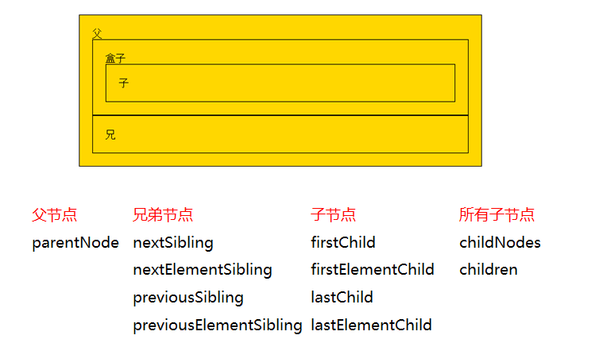

# DOM

## 访问关系的获取



### 兄弟节点

- nextSibling

  指的是下一个节点（包括标签、空文档和换行节点）

  火狐、谷歌、IE9+版本：都指的是下一个节点（包括标签、空文档和换行节点）

  IE678版本：指下一个元素节点（标签）

- nextElementSibling

  火狐、谷歌、IE9+版本：都指的是下一个元素节点（标签）

- previousSibling

  火狐、谷歌、IE9+版本：都指的是前一个节点（包括标签、空文档和换行节点）。

  IE678版本：指前一个元素节点（标签）

- previousElementSibling

  火狐、谷歌、IE9+版本：都指的是前一个元素节点（标签）

- 获得任意一个兄弟节点

  节点自己.parentNode.children[index]

#### 子节点

- firstChild

  火狐、谷歌、IE9+版本：都指的是第一个子节点（包括标签、空文档和换行节点）

  IE678版本：指第一个子元素节点（标签）

- firstElementChild

  火狐、谷歌、IE9+版本：都指的是第一个子元素节点（标签）

- lastChild

  火狐、谷歌、IE9+版本：都指的是最后一个子节点（包括标签、空文档和换行节点）

  IE678版本：指最后一个子元素节点（标签）

- lastElementChild

  火狐、谷歌、IE9+版本：都指的是最后一个子元素节点（标签）

#### 所有子节点

- **childNodes**：标准属性。返回的是指定元素的**子节点**的集合（包括元素节点、所有属性、文本节点）

  火狐 谷歌等高本版会把换行也看做是子节点

- **children**：非标准属性。返回的是指定元素的**子元素节点**的集合

  它只返回HTML节点，甚至不返回文本节点

  在IE6/7/8中包含注释节点（在IE678中，注释节点不要写在里面）

#### nodeType

- **nodeType == 1 表示的是元素节点**（标签）
- nodeType == 2 表示是属性节点
- nodeType == 3 是文本节点 

## 节点操作

### 创建节点

- 格式

  ```
  新的标签(元素节点) = document.createElement("标签名")
  ```

- 案例

  ```html
  <!DOCTYPE html>
  <html lang="en">
  <head>
      <meta charset="UTF-8">
      <title>Title</title>
  
  </head>
  <body>
  <button id="btn_add">添加</button>
  <div class="div1"></div>
  
  <script type="text/javascript">
      let btnNode = document.getElementById("btn_add");
      let divNode = document.getElementsByClassName("div1")[0];
      let index = 0;
  
      // 点击按钮, 向 div 中添加元素
      btnNode.onclick = function () {
          index++;
          let pElement = document.createElement("p");
          let textNode = document.createTextNode(`文本 ${index}`);
          pElement.append(textNode);
          divNode.append(pElement);
      };
  </script>
  
  </body>
  </html>
  ```

### 插入节点

- appendChild

  父节点的最后插入一个新的子节点

  ```
  父节点.appendChild(新的子节点);
  ```

- insertBefore

  在参考节点前插入一个新的节点

  如果参考节点为null，那么他将在父节点最后插入一个子节点

  ```
  父节点.insertBefore(新的子节点,作为参考的子节点);
  ```

### 删除节点

- 格式

  ```
  父节点.removeChild(子节点)
  ```
  
  **用父节点删除子节点**。必须要指定是删除哪个子节点

### 复制节点

- 格式

  ```
  // 括号里不带参数和带参数false，效果是一样的
  要复制的节点.cloneNode();       
  
  要复制的节点.cloneNode(true);
  ```

  不带参数/带参数false：只复制节点本身，不复制子节点

  带参数true：既复制节点本身，也复制其所有的子节点

## 节点的属性操作

### 获取属性值

- 方式1

  ```
  元素节点.属性;
  元素节点[属性];
  ```

- 方式2

  ```
  素节点.getAttribute("属性名称");
  ```

  方式1和方式2的区别在于：前者是直接操作标签，后者是把标签作为DOM节点。推荐方式2

- 案例

  ```html
  <body>
  
  
  <script type="text/javascript">
      var myNode = document.getElementsByTagName("img")[0];
  
      console.log(myNode.src);
      console.log(myNode.className);    //注意，是className，不是class
      console.log(myNode.title);
  
      console.log("------------");
  
      console.log(myNode["src"]);
      console.log(myNode["className"]); //注意，是className，不是class
      console.log(myNode["title"]);
  </script>
  </body>
  ```

  ```
  console.log(myNode.getAttribute("src"));
  console.log(myNode.getAttribute("class"));   //注意是class，不是className
  console.log(myNode.getAttribute("title"));
  ```

### 设置属性值

- 方式1

  ```
  myNode.src = "images/2.jpg"   //修改src的属性值
  myNode.className = "image2-box";  //修改class的name
  ```

- 方式2

  ```
  元素节点.setAttribute(属性名, 新的属性值);
  ```

  ```
  myNode.setAttribute("src","images/3.jpg");
  myNode.setAttribute("class","image3-box");
  myNode.setAttribute("id","你好");
  ```

### 删除属性值

- 格式

  ```
  元素节点.removeAttribute(属性名)
  ```

  ```
  myNode.removeAttribute("class");
  myNode.removeAttribute("id");
  ```

## innerHTML innerText value

- innerHTML

  ```html
  <!DOCTYPE html>
  <html lang="en">
  <head>
      <meta charset="UTF-8">
      <title>Title</title>
  
  </head>
  <body>
  <button id="btn_add">添加</button>
  <div class="div1"></div>
  
  <script type="text/javascript">
      let btnNode = document.getElementById("btn_add");
      let divNode = document.getElementsByClassName("div1")[0];
  
      // 点击后, 向 div 中加入链接
      btnNode.onclick = function () {
          divNode.innerHTML = "<a href='htt://www.qq.com'>这是一个跳转链接</a>"
      };
  </script>
  
  </body>
  </html>
  ```

- innerText

  ```html
  <!DOCTYPE html>
  <html lang="en">
  <head>
      <meta charset="UTF-8">
      <title>Title</title>
  
  </head>
  <body>
  <button id="btn_add">添加</button>
  <div class="div1"></div>
  
  <script type="text/javascript">
      let btnNode = document.getElementById("btn_add");
      let divNode = document.getElementsByClassName("div1")[0];
  
      // 点击后, 向 div 中文本数据
      btnNode.onclick = function () {
          // a 不是一个标签, 而是一个普通的文本
          divNode.innerText = "<a href='htt://www.qq.com'>这是普通的文本</a>"
      };
  </script>
  
  </body>
  </html>
  ```

- value

  ```html
  <!DOCTYPE html>
  <html lang="en">
  <head>
      <meta charset="UTF-8">
      <title>Title</title>
  
  </head>
  <body>
  <button id="btn_add">添加</button>
  <input name="user" id="user"/>
  
  <script type="text/javascript">
      let btnNode = document.getElementById("btn_add");
      let userNode = document.getElementById("user");
  
      btnNode.onclick = function () {
          // 对于 input 标签可以设置默认值
          userNode.value = "默认用户";
      };
  </script>
  
  </body>
  </html>
  ```

  